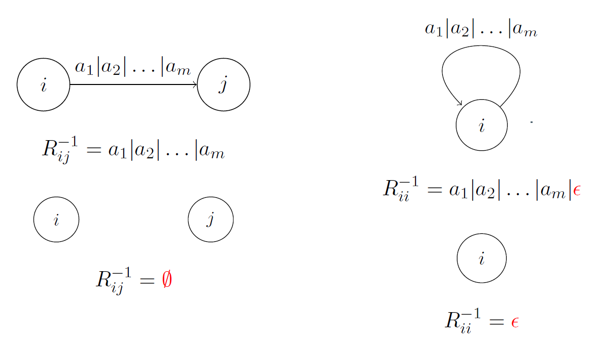
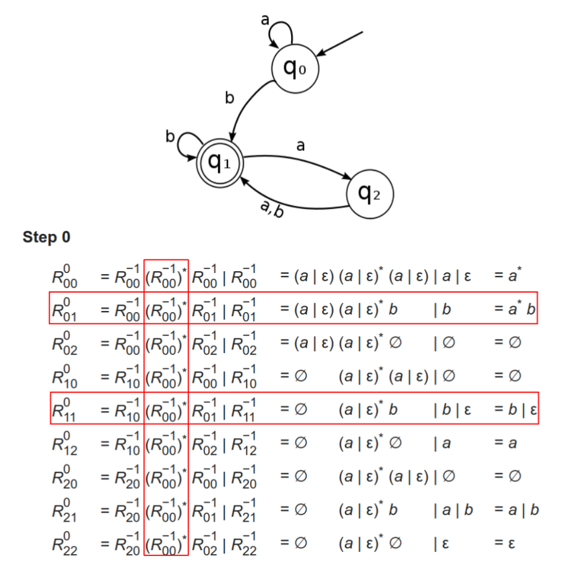
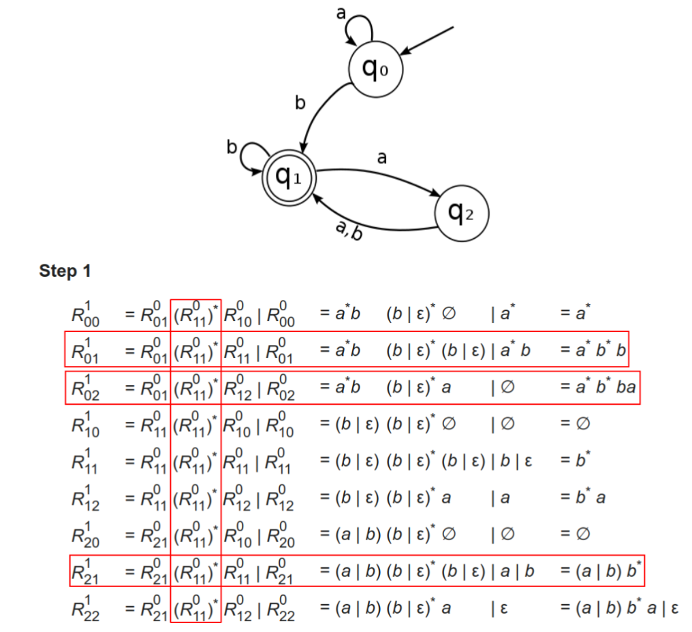
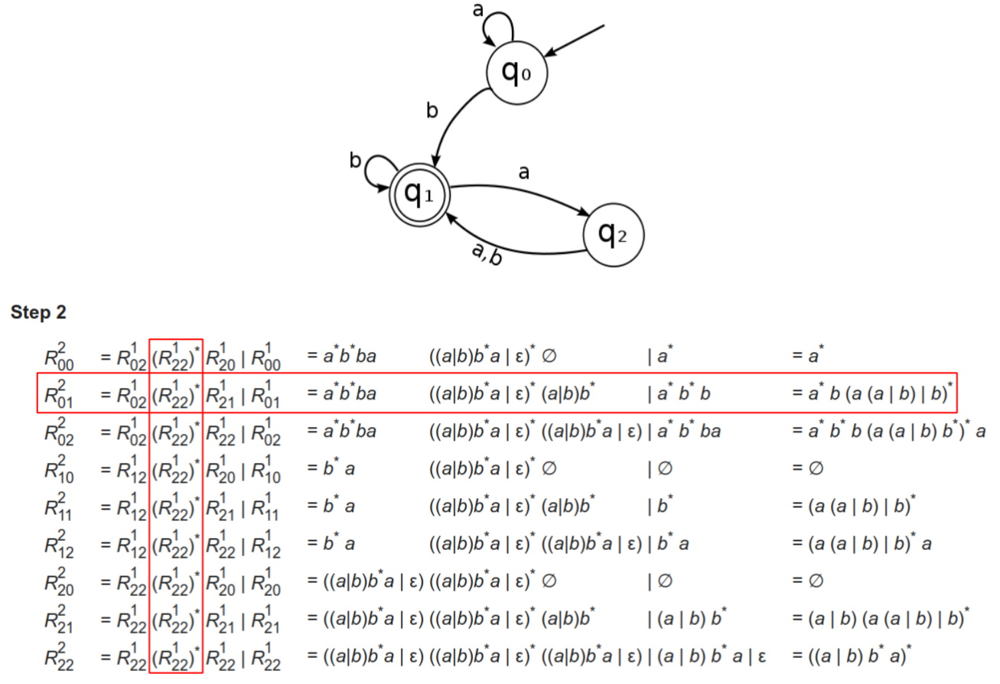
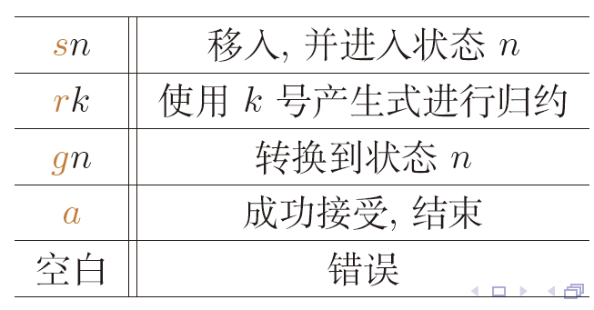
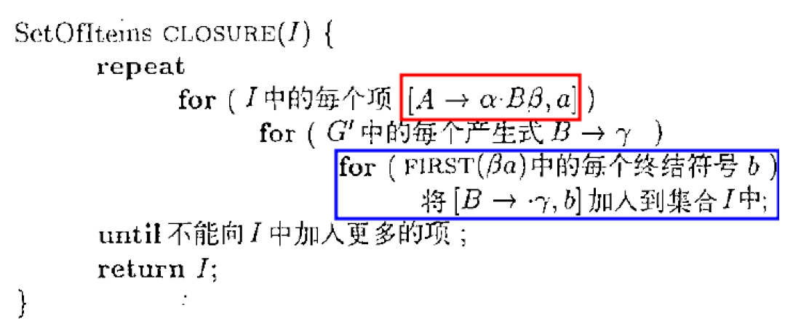

Exam
---

# 1. 正则表达式与自动机
1. 结合RE，使用Thompson构造法构造等价NFA，状态的合并需要体现出来(比如状态1和状态8)，使用0-n进行编号

2. 使用子集构造法构造等价的DFA：使用A-Z进行编号

$$
step1: A = \{0, 1, 2, 4, 7\} \Leftrightarrow \epsilon-closure(0) \\
step2: B = \{1, 2, 3, 4, 6, 7, 8\} \\
note: A \xrightarrow[NFA]{a} \{3, 8\} \xrightarrow[move]{\epsilon-closure} B \\
... \\
$$

3. 最小化DFA：识别等价状态，使用划分的方法，首先分离终止状态，使用0-n进行编号

$$
s \not\sim t \Leftrightarrow \exist a \in \Sigma. (s \xrightarrow{a} s')\wedge(t \xrightarrow{a} t') \wedge (s' \not\sim t')
$$

4. 最小DFA转换为RE：一共做**状态数**次

|  |  |
| -------------------- | -------------------- |
|  |  |

5. 别忘了画终止状态标识

# 2. First、Follow集合与LL(1)文法
1. 计算First集合

2. 计算Follow集合：注意开始符号的含义是第一条表达式的左侧元素

3. 得到文法分析表

> 按照以下规则, 在表格[A, t] 中填入生成式$A \rightarrow \alpha(编号)$

$$
\begin{array}{l}
   t \in First(\alpha) & (1)\\
   \alpha \xRightarrow{*} \epsilon \wedge t \in Follow(A) & (2)\\
\end{array}
$$

> 对于每一个生成式只要满足上面一条规则即可(或关系)，首先，在下单元格中可以填写$A \rightarrow \alpha$，则可以推导出$\alpha \xRightarrow{*} \epsilon \wedge t \in Follow(A)$(必要条件)，但是由于是LL(1)文法的**唯一性**，那么必要条件等价于充分条件，也就是这是一个充要条件。

|     | $t$                    |
| --- | ---------------------- |
| $A$ | $A \rightarrow \alpha$ |

4. 判断是否为LL(1)文法：是否无冲突，检查是否有一个单元格中有超过一个表达式
5. 得到LL(1)语法分析器的伪代码

# 3. LR语法分析器

## 3.1. LR(0)
1. 增广文法：增加生成式$L' \rightarrow L$
2. 使用`·`来代表栈顶
3. 非acc的栈顶执行规约操作
4. 闭包计算

4. 表中没有冲突项则LR(0)文法是无二义的

## 3.2. SLR(1)
1. 规约:$(3) [k:A \rightarrow \alpha·] \in I_i \wedge A \neq S' \Rightarrow \forall t \in Follow(A) \cup {\$}. ACTION[i, t] = rk$，要规约就是我们发现了完整的右部($A \rightarrow \alpha$，并且当前符号为$t$)，如果t不在Follow(A)中，那么不可能有一个句型包含t。
2. 只需要在LR(0)的基础上检查follow集合：检查规约的表达式的具体情况($L\rightarrow P·$)

3. 规约过程见例题：要仔细注意规约表达式的使用。

## 3.3. LR(1)
1. $[A \rightarrow \alpha·\beta, a] (a \in T \cup {\$})$，此处, a是向前看符号, 数量为1，使用a来记住$\gamma$
2. 闭包计算(务必注意)

## 3.4. LALR(1)
1. 将相同的状态进行合并

# 4. 中间代码生成
1. 添加语句的语义规则：注意label、goto和code即可
2. 为代码片段生成中间代码
3. 基于布尔表达式与控制流语句回填翻译方法为语句设计回填方案：引入非终结符
4. 使用回填方案为以下代码片段生成中间代码