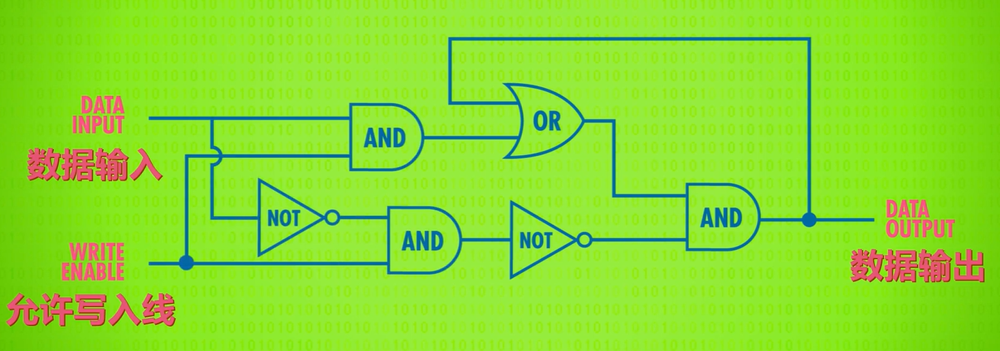

Crash Course Computer Science
---

# 1. 第五讲：算数逻辑单元-ALU
1. 计算机目标是计算，有意义的处理数字。
2. ALU负责完成计算，基本其他所有的部件都会用到它。
3. Eg.ALU Intel 74181:1970年发布时，是第一个封装在单个芯片内的完整的ALU，只可以进行4位计算
4. ALU：使用AND、OR、NOT和XOR逻辑门
   1. 1个算术单元：负责所有数字操作，例如增量计算
   2. 1个逻辑单元：计算AND、OR或NOT操作

## 1.1. 算术单元

### 1.1.1. 半加器
1. XOR可以作为一位加法器
2. 1+1是特殊的
3. 我们使用AND来进行检查进位
4. 得到两个门的电路是半加器

### 1.1.2. 全加器
1. 增加一个输入(进位)

### 1.1.3. 制作：8位行波加法器
1. overflow：最后一位溢出

### 1.1.4. 超前进位加法器

### 1.1.5. ALU可以做基本操作

## 1.2. 逻辑单元

> 检查是否为全0

## 1.3. ALU的代表

# 2. 寄存器&内存
1. RAM:随机存储器，在有电的时候存储信息
2. 持久存储，电源关闭，数据也不会丢失

## 2.1. 存储1位的单元

- 永久记录1

- 锁存：可以读写

## 2.2. 门锁

## 2.3. 多位存储
1. 寄存器位宽：可以存储多长数据

2. 存储256位只需要513根线
3. 5:40