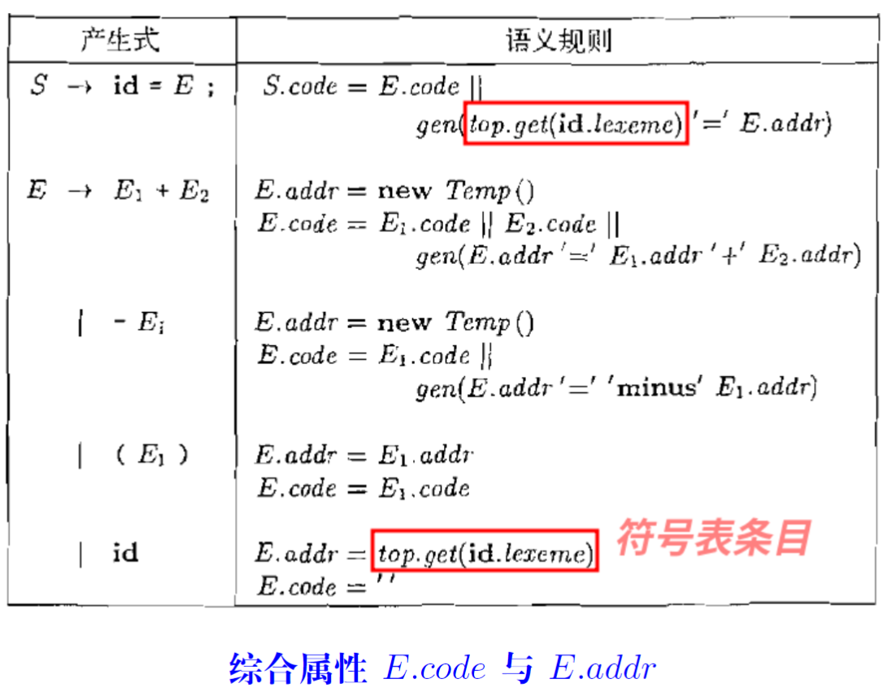

IR1-中间代码生成概述
---

# 1. Intermediate Representation (IR)

1. **精确**:不能丢失源程序的信息
2. **独立**:不依赖特定的源语言与目标语言(如,没有复杂的寻址方式)
3. 图(抽象语法树)、三地址代码、C语言：C语言也可以作为中间代码，比如Haskel和早期的C++

# 2. 表达式的有向无环图

> 针对生成的有向无环图来生成中间表示是合适的。

1. 在创建节点之前,先判断是否已存在(哈希表)，如果已经常见直接用指针指向即可。

# 3. Definition (三地址代码(Three-Address Code (TAC; 3AC)))
> 每个TAC指令最多包含三个操作数。

1. 三地址代码指令

2. 调用p函数，有n个参数，返回值为y

3. 数组则要涉及到地址距离计算

4. do i = i + 1;while(a[i] < v);
5. 由于三地址代码，所以我们会引入大量的中间代码

# 4. 三地址代码的四元式表示
> 代码优化暂时不考虑

## 4.1. Definition (四元式(Quadruple))
> 一个四元式包含四个字段,分别为op、arg1、arg2与result。

1. =[] 和 []= 都是我们约定好的操作符号。

## 4.2. 表达式的中间代码翻译

1. E.code是生成的中间代码
2. E.addr是地址
3. 得到E之前，要先知道E1和E2的三地址代码，然后并且赋值给E3
4. id则是仅仅获得地址即可

5. 只需要E.addr，我们使用全局缓冲区解决传递拷贝三地址代码的问题。

## 4.3. 表达式的中间代码翻译(增量式)

## 4.4. 数组引用的中间代码翻译
1. 声明:$int\ a[2][3]$
2. 数组引用:$x=a[1][2];a[1][2] =x$
3. 需要计算$a[1][2]$的相对于数组基地址a的偏移地址

> 语法分析格式分析

> 存储空间推导

> 复杂的SDT实现

### 4.4.1. 和L相关的综合属性
1. 综合属性L.array.base:数组基地址(即,数组名)，符号表可以查找到
2. 综合属性L.addr:偏移地址

### 4.4.2. 和L相关的产生式

1. 综合属性L.array:数组名id对应的符号表条目

1. 综合属性L.type:(当前)元素类型

1. 综合属性L.addr:(当前)偏移地址

# 5. 控制流语句的中间代码翻译

1. 继承属性S.next:S的下一条指令
2. S.next为语句S指明了“跳出”S的目标

3. 表达式语句的翻译,包括数组引用

# 6. 短路求值

