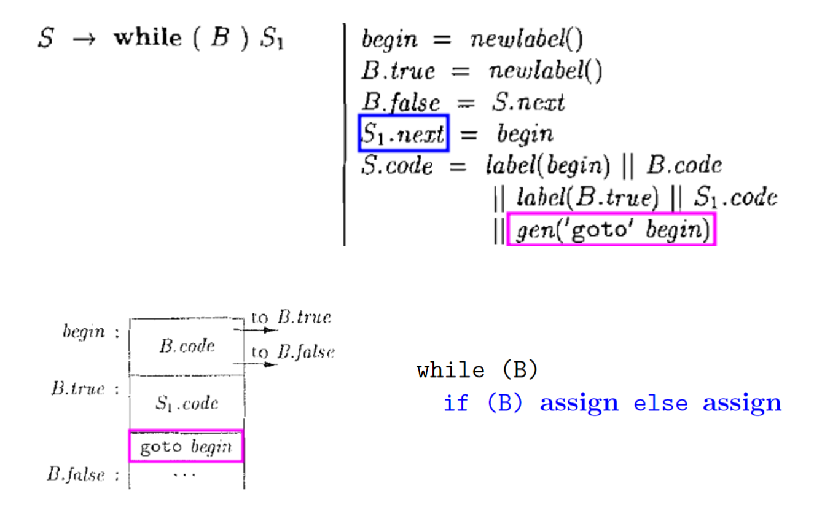

IR1-中间代码生成概述
---

# 1. Intermediate Representation (IR)

1. **精确**:不能丢失源程序的信息
2. **独立**:不依赖特定的源语言与目标语言(如,没有复杂的寻址方式)
3. 图(抽象语法树)、三地址代码、C语言：C语言也可以作为中间代码，比如Haskel和早期的C++

# 2. 表达式的有向无环图

> 针对生成的有向无环图来生成中间表示是合适的。

> 在创建节点之前,先判断是否已存在(哈希表)，如果已经常见直接用指针指向即可。

# 3. Definition (三地址代码(Three-Address Code (TAC; 3AC)))
> 每个TAC指令最多包含三个操作数。

1. 三地址代码指令

2. 调用p函数，有n个参数，返回值为y

3. 数组则要涉及到地址距离计算

$$
\begin{aligned}
  &do \\
  &\qquad i = i + 1;\\
  &while(a[i] < v);
\end{aligned}
$$

> 由于三地址代码，所以我们会引入大量的中间代码

# 4. 三地址代码的四元式表示
> 代码优化暂时不考虑

## 4.1. Definition (四元式(Quadruple))
> 一个四元式包含四个字段,分别为op、arg1、arg2与result。

1. =[] 和 []= 都是我们约定好的操作符号。

## 4.2. 表达式的中间代码翻译

1. $E.code$是生成的中间代码
2. $E.addr$是地址
3. 得到$E$之前，要先知道$E_1$和$E_2$的三地址代码，然后并且赋值给$E_3$
4. $id$则是仅仅获得地址即可
5. 重难点

5. 只需要$E.addr$，我们使用全局缓冲区解决传递拷贝三地址代码的问题。

## 4.3. 表达式的中间代码翻译(增量式)

## 4.4. 数组引用的中间代码翻译
1. 声明:$int\ a[2][3]$
2. 数组引用:$x=a[1][2];a[1][2] =x$
3. 需要计算$a[1][2]$的相对于数组基地址a的偏移地址

> 语法分析格式分析

> 存储空间推导

> 复杂的SDT实现

### 4.4.1. 和L相关的综合属性
1. 综合属性$L.array.base$:数组基地址(即,数组名)，符号表可以查找到
2. 综合属性$L.addr$:偏移地址

### 4.4.2. 和L相关的产生式

> 综合属性$L.array$:数组名id对应的符号表条目

> 综合属性$L.type$:(当前)元素类型

> 综合属性$L.addr$:(当前)偏移地址

$$
\begin{array}{l}
  t_1 = i * 12 \\
  t_2 = j * 4 \\
  t_3 = t_1 + t_2 \\
  t_4 = a[t_3] \\
  t_5 = c + t_4 \\
  \\
  int\ a[2][3]\\
\end{array}
$$

# 5. 控制流语句与布尔表达式的中间代码继承
> label(xxx)表示名为xxx的标签

$$
\begin{array}{l}
  S \rightarrow if\ (B)\ S_1 \\
  S \rightarrow if\ (B)\ S_1\ else\ S_2\\
  S \rightarrow while\ (B)\ S_1 \\
\end{array}
$$

## 5.1. 生成式转化为语义规则示例

## 5.2. 一些语句得到的中间代码示例
> 继承属性S.next:S的下一条指令

> S.next为语句S指明了"跳出"S的目标
$$
\begin{aligned}
  &S.code \\
  &S.next: \\
\end{aligned}
$$

> 代表了表达式的翻译,包括数组引用
$$
\begin{aligned}
  &assign.code \\
\end{aligned}
$$

> $B$为真，则$newlabel$，否则跳出$S_1$，上面写法不好，会给人在属性的类型上带来歧义，第二行应该是如下两行：
$$
\begin{array}{l}
  B.false = S.next \\
  S_1.next = S.next \\
\end{array}
$$
> 翻译为中间代码如下
$$
\begin{aligned}
  &B.code\\
  &B.true:\ S_1.code\\
  &B.false(S.next):\\
\end{aligned}
$$

1. 左侧的`goto S.next`代表了执行完S1后，跳过else S2继续执行
2. 由此右侧的代码可以翻译为如下的伪代码，其中第一行代表$S$，$true$的位置为$B$，第二行为$S_1$，$true$的位置为$B$，第一个$assign$为$S_{11}$，第二个$assign$为$S_{12}$，剩下的一个$assign$所在行为$S_2$。

$$
\begin{aligned}
  &B.code \\
  &B.true: S_1.code \\
  &\qquad\qquad goto\ S.next \\
  &B.false: S_2.code \\
  &S.next:\\
\end{aligned}
$$

1. 继续进行翻译，同样的规定，其中第一行代表S，true的位置为B，第二行为S1，true的位置为B，第一个assign为S11，第二个assign为S12。
2. 中间代码格式

$$
\begin{aligned}
  &begin: B.code \\
  &B.true: S_1.code \\
  &\qquad\qquad goto\ begin\\
  &B.false: \\
\end{aligned}
$$

> 中间代码如下
$$
\begin{aligned}
  &S_1.code \\
  &S_1.next: S_2.code \\
\end{aligned}
$$

## 5.3. 生成式与语义规则对应表
|                      |                      |
| -------------------- | -------------------- |
|  |  |

# 6. 短路求值

> 中间代码示例
$$
\begin{aligned}
  &B_1.code \\
  &B_1.false: B2.code \\
  &B_1.true(B.true/B_2.true):\\
  &B_2.false:\\
\end{aligned}
$$

> 中间代码示例
$$
\begin{aligned}
  &B_1.code \\
  &B_1.true: B2.code \\
  &B_2.true(B.true):\\
  &B_1.false(B_2.false/B.false):\\
\end{aligned}
$$

> rel是比较符号，得到的中间代码如下
> 中间代码示例
$$
\begin{aligned}
  &E_1.code \\
  &E_2.code \\
  &if\ E_1.addr\ rel.op\ E_2.addr\ goto\ B.true \\
  &\qquad goto\ B.false\\
  &B.true:\\
  &B.false:\\
\end{aligned}
$$

1. 对于这个例子:$E_1.code$是空，但是$E_1.addr$是非空的
2. 拆开分别分析，慢慢深入

# 7. 布尔表达式的作用: 布尔值vs. 控制流跳转

1. 函数$jump(t, f)$: 生成控制流代码
2. 函数$rvalue()$: 生成计算布尔值的代码, 并将结果存储在临时变量中

1. 为E 生成跳转代码, 在真假出口处将true 或false 存储到临时变量

