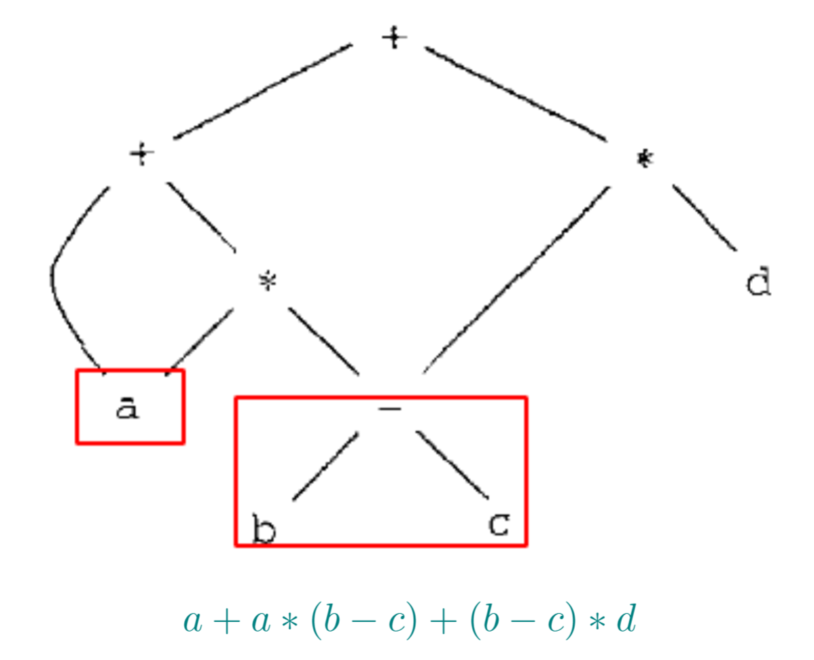
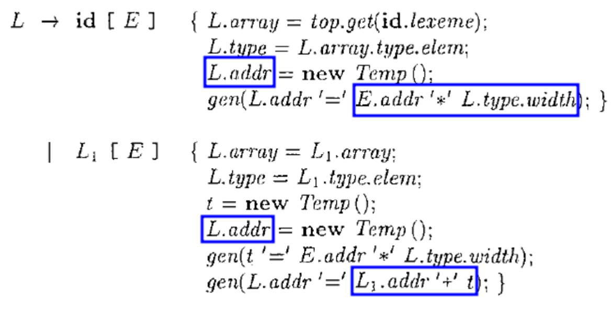

IR1-中间代码生成概述
---

# 1. Intermediate Representation (IR)

1. 精确:不能丢失源程序的信息
2. 独立:不依赖特定的源语言与目标语言(如,没有复杂的寻址方式)
3. 图(抽象语法树)、三地址代码、C语言

# 2. 表达式的有向无环图

1. 在创建节点之前,先判断是否已存在(哈希表)

# 3. Definition (三地址代码(Three-Address Code (TAC; 3AC)))
> 每个TAC指令最多包含三个操作数。

- do i = i + 1;while(a[i] < v);

# 4. 三地址代码的四元式表示

## 4.1. Definition (四元式(Quadruple))
> 一个四元式包含四个字段,分别为op、arg1、arg2与result。

## 4.2. 表达式的中间代码翻译

## 4.3. 表达式的中间代码翻译(增量式)

## 4.4. 数组引用的中间代码翻译
1. 声明:inta[2][3]
2. 数组引用:x=a[1][2];a[1][2] =x
3. 需要计算a[1][2]的相对于数组基地址a的偏移地址

> 1. 综合属性L.array.base:数组基地址(即,数组名)
> 2. 综合属性L.addr:偏移地址

1. 综合属性L.array:数组名id对应的符号表条目

1. 综合属性L.type:(当前)元素类型

1. 综合属性L.addr:(当前)偏移地址

# 5. 控制流语句的中间代码翻译

1. 继承属性S.next:S的下一条指令
2. S.next为语句S指明了“跳出”S的目标

3. 表达式语句的翻译,包括数组引用

# 6. 短路求值

