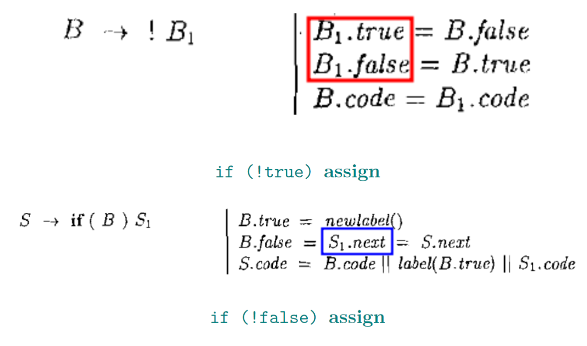

IR2-中间代码继承
---

# 1. 控制流语句与布尔表达式的中间代码继承
> label(xxx)表示名为xxx的标签

$$
\begin{array}{l}
  S \rightarrow if\ (B)\ S_1 \\
  S \rightarrow if\ (B)\ S_1\ else\ S_2\\
  S \rightarrow while\ (B)\ S_1 \\
\end{array}
$$

## 1.1. 生成式转化为语义规则示例

## 1.2. 一些语句得到的中间代码示例
> 继承属性S.next:S的下一条指令

> S.next为语句S指明了"跳出"S的目标
$$
\begin{aligned}
  &S.code \\
  &S.next: \\
\end{aligned}
$$

> 代表了表达式的翻译,包括数组引用
$$
\begin{aligned}
  &assign.code \\
\end{aligned}
$$

> $B$为真，则$newlabel$，否则跳出$S_1$，上面写法不好，会给人在属性的类型上带来歧义，第二行应该是如下两行：
$$
\begin{array}{l}
  B.false = S.next \\
  S_1.next = S.next \\
\end{array}
$$
> 翻译为中间代码如下
$$
\begin{aligned}
  &B.code\\
  &B.true:\ S_1.code\\
  &B.false(S.next):\\
\end{aligned}
$$

1. 左侧的`goto S.next`代表了执行完S1后，跳过else S2继续执行
2. 由此右侧的代码可以翻译为如下的伪代码，其中第一行代表$S$，$true$的位置为$B$，第二行为$S_1$，$true$的位置为$B$，第一个$assign$为$S_{11}$，第二个$assign$为$S_{12}$，剩下的一个$assign$所在行为$S_2$。

$$
\begin{aligned}
  &B.code \\
  &B.true: S_1.code \\
  &\qquad\qquad goto\ S.next \\
  &B.false: S_2.code \\
  &S.next:\\
\end{aligned}
$$

1. 继续进行翻译，同样的规定，其中第一行代表S，true的位置为B，第二行为S1，true的位置为B，第一个assign为S11，第二个assign为S12。
2. 中间代码格式

$$
\begin{aligned}
  &begin: B.code \\
  &B.true: S_1.code \\
  &\qquad\qquad goto\ begin\\
  &B.false: \\
\end{aligned}
$$

> 中间代码如下
$$
\begin{aligned}
  &S_1.code \\
  &S_1.next: S_2.code \\
\end{aligned}
$$

## 1.3. 生成式与语义规则对应表
|                      |                      |
| -------------------- | -------------------- |
|  |  |

# 2. 短路求值

> 中间代码示例
$$
\begin{aligned}
  &B_1.code \\
  &B_1.false: B2.code \\
  &B_1.true(B.true/B_2.true):\\
  &B_2.false:\\
\end{aligned}
$$

> 中间代码示例
$$
\begin{aligned}
  &B_1.code \\
  &B_1.true: B2.code \\
  &B_2.true(B.true):\\
  &B_1.false(B_2.false/B.false):\\
\end{aligned}
$$

> rel是比较符号，得到的中间代码如下
> 中间代码示例
$$
\begin{aligned}
  &E_1.code \\
  &E_2.code \\
  &if\ E_1.addr\ rel.op\ E_2.addr\ goto\ B.true \\
  &\qquad goto\ B.false\\
  &B.true:\\
  &B.false:\\
\end{aligned}
$$

1. 对于这个例子:$E_1.code$是空，但是$E_1.addr$是非空的
2. 拆开分别分析，慢慢深入

# 3. 布尔表达式的作用: 布尔值vs. 控制流跳转

1. 函数$jump(t, f)$: 生成控制流代码
2. 函数$rvalue()$: 生成计算布尔值的代码, 并将结果存储在临时变量中

1. 为E生成**跳转代码**, 在**真假出口处**将true或false存储到临时变量

