Lecture1-Overview
---

# 1. 源起
1. Donald E. Knuth (1938 ∼) Turing Award, 1974
2. LR Parser (语法) Attribute Grammar (语义)：ALGOL 58 Compiler

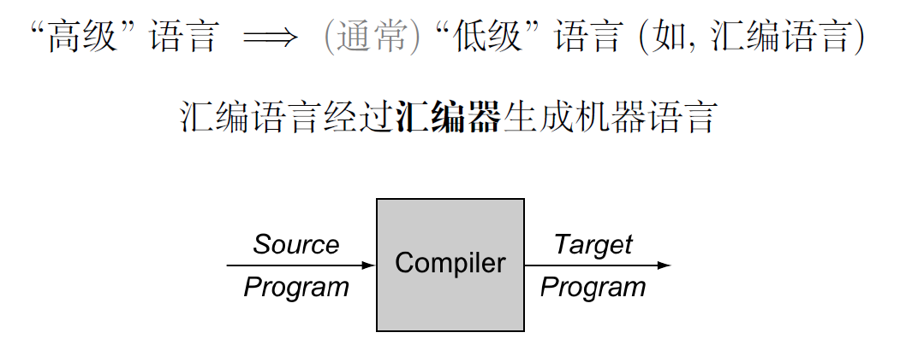

# 2. 机器语言是如何跑起来的
<a href = "https://www.bilibili.com/video/BV1EW411u7th">参考视频</a>

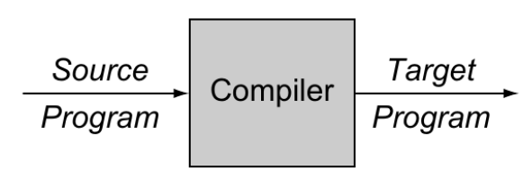

# 3. IR(Intermediate Representation) 中间表示
1. 前端(分析阶段): 分析源语言程序, 收集所有必要的信息
2. 后端(综合阶段): 利用收集到的信息, 生成目标语言程序

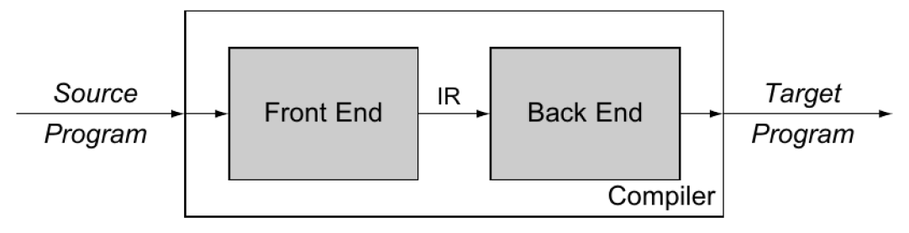
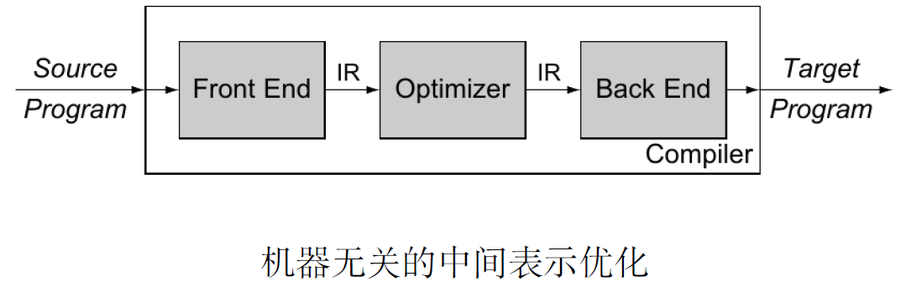

## 3.1. 编译器前端:分析阶段
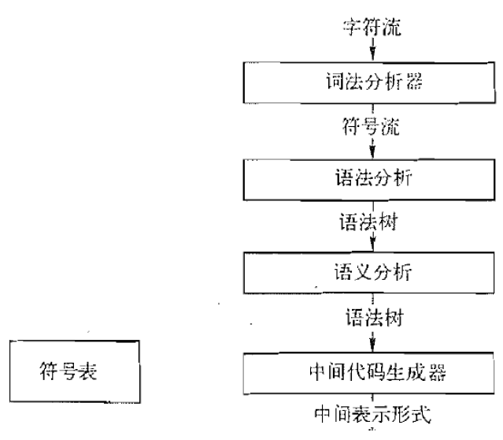

## 3.2. 编译器后端:综合阶段
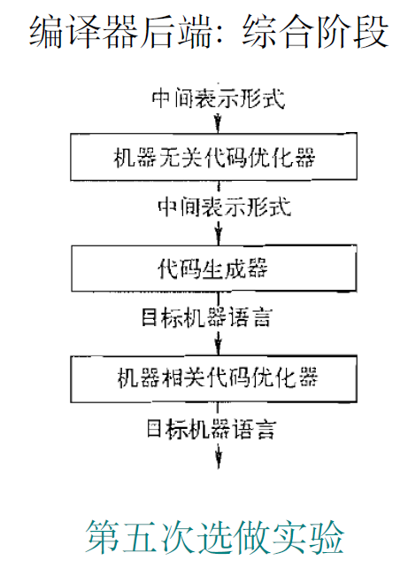

## 3.3. 词法、语法、语义和物理定律
> 作为一名程序员，你看到了什么？

`position = initial + rat * 60`

1. 词法: 标识符、数字、运算符
2. 语法: 包含算术运算的赋值语句
3. 语义: position, initial, rate 是数值类型
4. 物理定律: 当前位置= 初始位置+ 速度× 时间
5. 但是, 作为编译器, 它仅仅看到了一个字符串

### 3.3.1. 词法分析器(Lexer/Scanner)
> 将**字符**流转化为**词法单元(token)**流。

`token:<token-class, attribute-value>`

1. 原形式:`position = initial + rat * 60`
2. 词法解析后结果:`⟨id, 1⟩ ⟨ws⟩ ⟨assign⟩ ⟨ws⟩ ⟨id, 2⟩ ⟨ws⟩ ⟨+⟩ ⟨ws⟩ ⟨id, 3⟩ ⟨ws⟩ ⟨∗⟩ ⟨ws⟩ ⟨num, 4⟩`(这里，1，2，3，4是指向**符号表**的指针)

### 3.3.2. 语法分析器(Parser)
> 构建**词法单元**之间的语法结构, 生成**语法树**

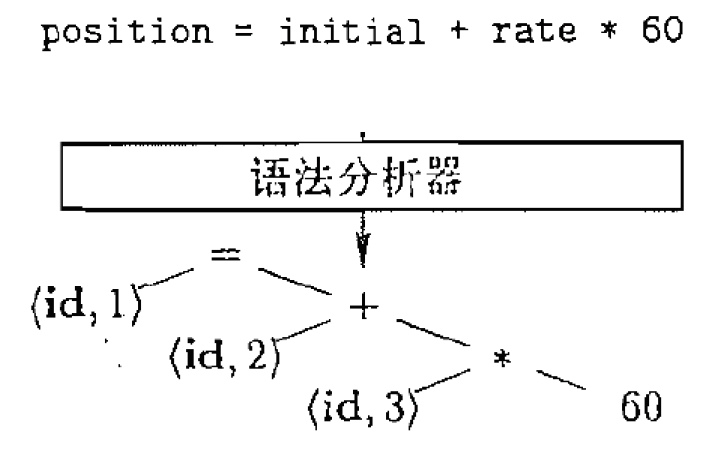

### 3.3.3. 语义分析器
> 语义检查, 如**类型检查、“先声明后使用” 约束检查**

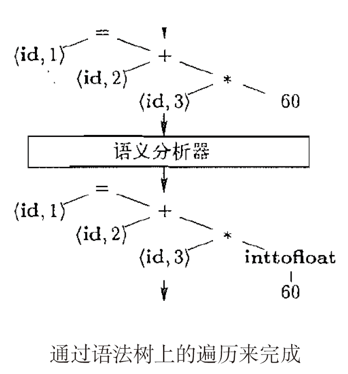

### 3.3.4. 中间代码生成器
> 生成中间代码, 如**三地址代码**

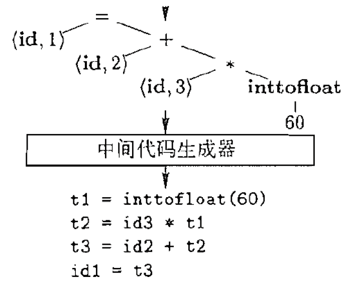

- 中间代码类似目标代码, 但不含有机器相关信息(如寄存器、指令格式)

### 3.3.5. 中间代码优化器
> 编译时计算、消除冗余临时变量

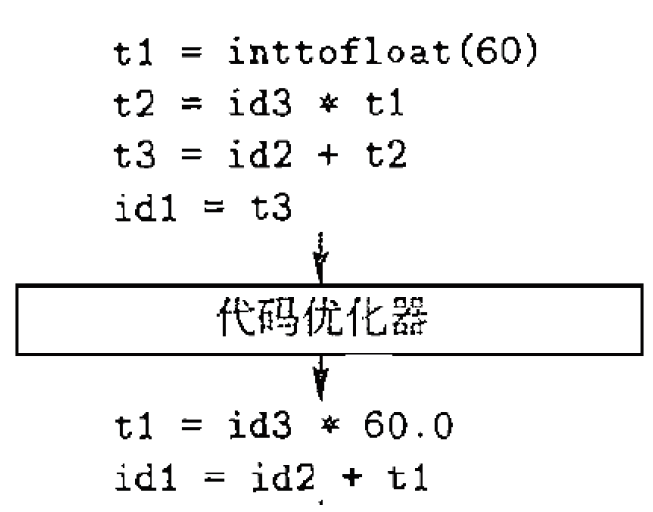

### 3.3.6. 代码生成器
> 生成目标代码, 主要任务包括**指令选择、寄存器分配**

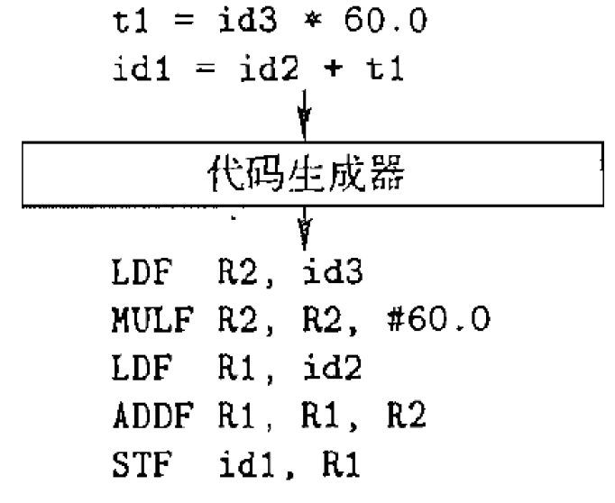

### 3.3.7. 符号表
> 收集并管理**变量名/函数名**相关的信息

1. 变量名:类型、寄存器、内存地址、行号
2. 函数名:参数个数、参数类型、返回值类型

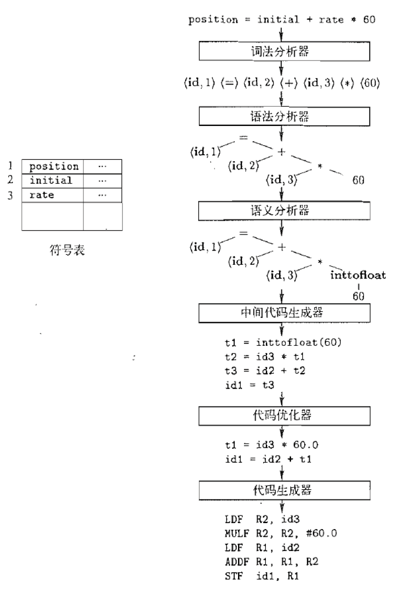

- 红黑树(RB-Tree)、哈希表(Hashtable)

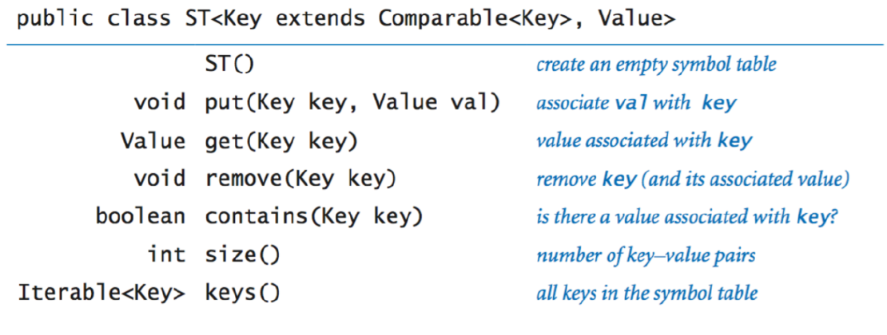

- 为了方便表达**嵌套结构与作用域**, 可能需要维护多个符号表

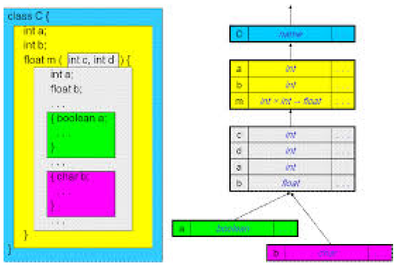

## 3.4. 时间苦短, 来不及优化
> 但是, 在设计实际生产环境中的编译器时, **优化**通常占用了大多数时间

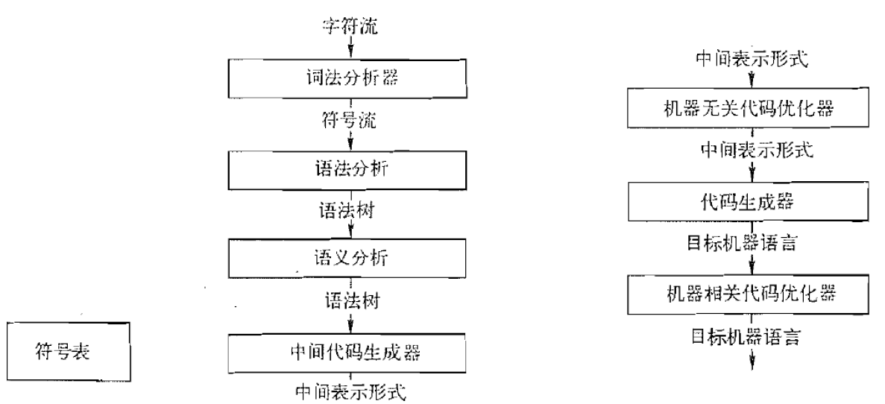
