Lecture2-Lexer
---
> 词法分析

# 1. 输入和输出

1. 输入:程序文本/字符串s和**词法单元(token)的规约**
2. 输出:词法单元流

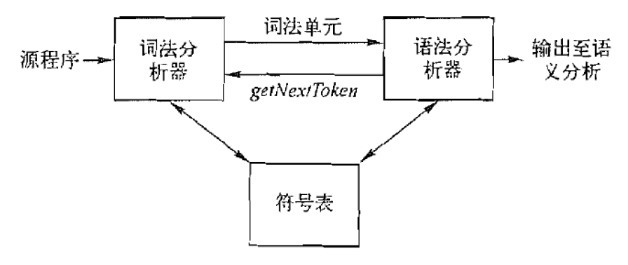

## 1.1. 词法表示形式
`token: <token-class, attribute-value>`

| 词法单元    | 非正式描述                       | 词素示例      |
| ----------- | -------------------------------- | ------------- |
| if          | 字符i、f                         | if            |
| else        | 字符e、l、s、e                   | else          |
| comparision | < 或 > 或 <= 或 >= 或 == 或 !=   | <= , !=       |
| id          | 字符开头的字母/字符串            | pi, score, D2 |
| number      | 任何字符常量                     | 3.14          |
| literal     | 在两个"之间，处理"以外的任何字符 | "core dumped" |

- int/if:关键词
- ws:空格、制表符、换行符
- comment:“//” 开头的一行注释或者“/* */” 包围的多行注释

## 1.2. 词法分析示例
```c++
int main(void){
  printf("hello, world\n")
}
```

> 词法分析的结果：本质上，就是一个**字符串(匹配/识别)**算法

```
int ws main/id LP void RP ws
LB ws
ws id LP literal RP SC ws
RB
```

# 2. 词法分析器的三种设计方法
> 生产环境下的编译器(如gcc) 通常选择手写词法分析器

1. 手写词法分析器
2. 词法分析器的生成器
3. 自动化词法分析器

- flex是自动的词法分析器
- 词法分析器相对比较简单，手写词法分析器可以做一些人为的优化。
- gcc中，c语言的lex是1400多行，而c++的lex则是4000多行代码，number是最复杂的，包含不同进制、字母等问题，课程与gcc有一定差异

## 2.1. 第一种：手写词法分析器
1. 识别字符串s中符合**某种词法单元模式**的**所有词素**

```c++
if ab42 >= 3.14:
  xyz := 2.99792458E8
else
  xyz := 2.718
  abc := 1024
```

> 这里的分割不适宜使用空格，例如`ab42>=42`则空格分割不出来。

```
ws if else id integer
relop(关系运算符)
real sci(识别实数，带科学技术发和不带的)
assign(:=)
```

1. 识别字符串s中**词素某种词法单元模式**的**前缀词素**
2. 识别字符串s中**符合特定词法单元模式**的**前缀词素**(例如识别符合id的模式的开头的第一个词素)
3. 注意：这里的第一个词素就只看第一个，而不是找到符合要求的第一个
4. 最重要的是状态转移图

### 2.1.1. 分支与判断
1. 识别字符串s中符合特定词法单元模式的前缀词素

> 分支:先判断属于哪一类, 然后进入特定词法单元的前缀词素匹配流程

2. 识别字符串s中符合某种词法单元模式的前缀词素

> 循环:返回当前识别出来的词法单元与词素, 继续识别下一个前缀词素

3. 识别字符串s中符合某种词法单元模式的所有词素

```
先: ws if else id integer
然后: relop
最后: real sci
留给大家: assign (:=)
```

### 2.1.2. 识别字符串s中符合**特定词法单元模式**的**开头第一个词素**
```java
public int line = 1;
private char peek = " ";
private Hashable words = new Hashtable();
```

1. line:行号, 用于调试
2. peek:**下一个向前看字符(Lookahead)**
3. words:**从词素到词法单元标识符或关键词的映射表**

```
// 先将关键字方进去
words.put("if", if)
words.put("else", else)
```

#### 2.1.2.1. 识别空格，不做处理
```
ws: blank tab newline
```

```java
// 识别空白部分，并忽略之
public Token scan() throws IOException{
  for(;;peek=(char)System.in.read()){
    if(peek == " " || peek == "\t") continue;
    else if(peek == "\n") line = line + 1;
    else break;
  }
}
```

```java
peek = next input char acter ;
while ( peek != null) {
  //if peek is not a ws, break
  peek = next input char acter
}
// 这样子写，可以吗？这样子是不可以的，因为在最后合并的时候会出现问题。
```

1. char peek = " ":下一个向前看字符
2. 例子:`123abc`，得到`<number, 123>`和`<id, abc>`
3. 注意上文中123读取完了之后跳出的是a位置，不能入上面第二个部分，不然会丢东西。

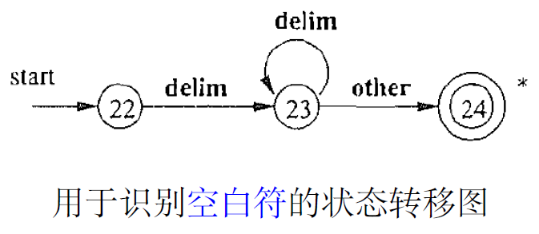

> 1. 上图数字没有含义
> 2. 重要是，当前识别的出的空白符**不包含**当前peek指向的字符
> 3. 22：碰到other怎么办？
> 4. 上图中的*表示，必须是当前的词开始。

#### 2.1.2.2. **integer**: 整数(允许以0开头)

```java
if( Character.isDigit(peek) ) {
  int V = 0;
  do {
    v = 10 * v + Character.digit(peek, 10);
    peek = (char)System.in.read();
  }while(Character.isDigit(peek));
  return new Num(v);
}
```

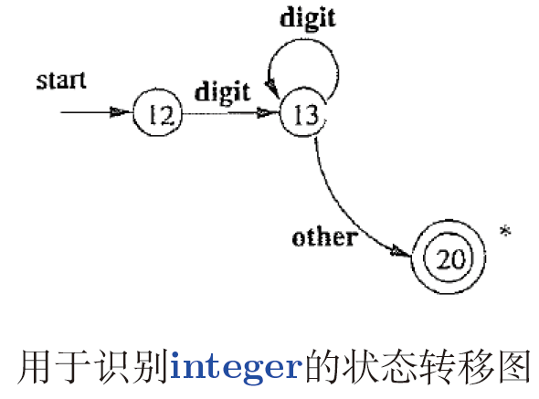

> 12:碰到other如何处理？
> 补充图片如下

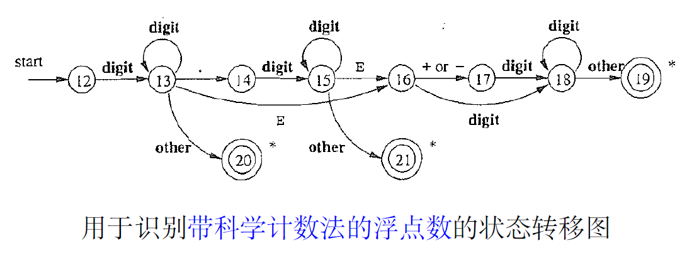

#### 2.1.2.3. id: 字母开头的字母/数字串

```java
if(Character.isLetter(peek) ) {
  StringBuffer b = new StringBuffer() ;
  do {
    b.append(peek);
    peek = (char)System.in.read();
  }while(Character.isLetter0rDigit(peek));
  String s = b.toString();
  // 从表中检查关键字或已识别的标识符，看有无
  Word W = (Word)words.get(s);|
  if(w != null) return w;
  // 如果是未识别的标识符，则加入几区
  w = new Word(Tag.ID, s) ;
  words.put(s, w) ;
  return w;
}
```

- 识别词素、**判断是否是预留的关键字或已识别的标识符**、保存该标识符

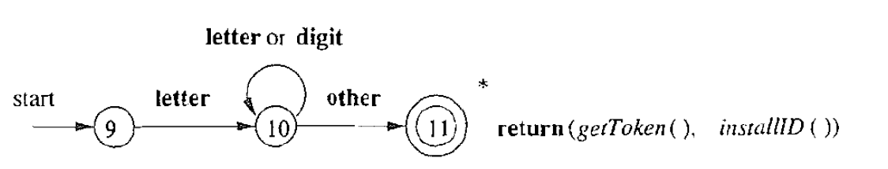

> 9:碰到other怎么处理?

#### 2.1.2.4. 遇到other情况的处理(也就是处理错误)
```java
Token t = new Token(peek);
peek = " ";
return t;
```

> 错误处理模块:出现**词法错误**, 直接报告异常字符

#### 2.1.2.5. SCAN()前缀词素处理
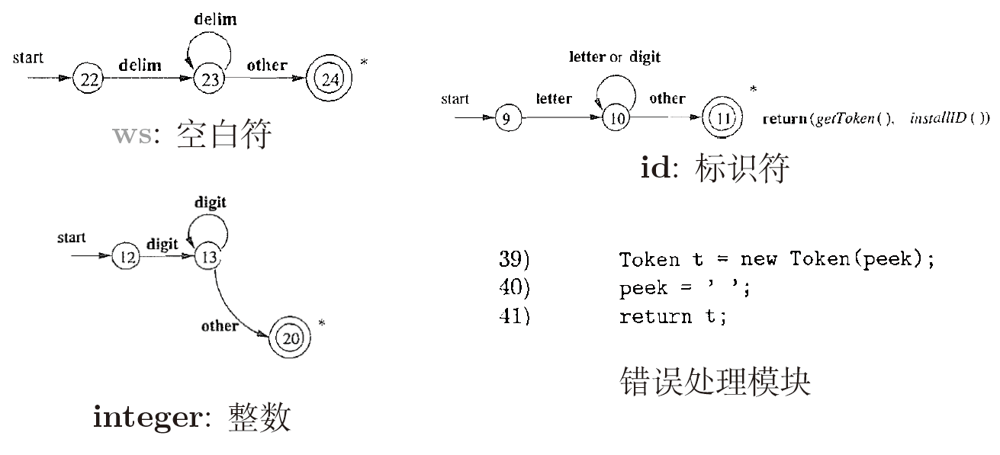

1. **关键点**:合并22, 12, 9, 根据**下一个字符**即可判定词法单元的类型
2. 否则, 调用错误处理模块(对应other), 报告**该字符有误**, 并忽略该字符

#### 2.1.2.6. 合并词法分析器
```java
package lexer; //文件Lexer.java
import java.io.*;
import java.util.*;

public class Lexer {

  public lnt llne = 1 ;
  private char peek = " ";
  private Hashtable words = new Hashtable();

  void reserve(Word t) { words.put(t.lexeme, t);}

  public Lexer() {
    reserve(new Word(Tag.TRUE, "true"));
    reserve(new Word(Tag.FALSE, "false"));
  }
  public Token scan() throws I0Exception {
    //ws
    for(;; peek = (char)System.in.read()) {
      if( peek == " "| | peek == '\t') continue ;
      else if( peek == '\n' ) line = line + 1;
      else break ;
    }
    //digit
    if(Character.isDigit(peek)){
      int v=0;
      do{
        v = 10 * v + Character.digit(peek, 10) ;
        peek = (char)System.in.read();
      } while(Character.isDigit(peek));
      return new Num(v);
    }
    //letter
    if(Char acter.isLetter(peek)) {
      StringBuffer b = new StringBuffer();
      do{
        b.append(peek);
        peek = (char)System.in.read() ;
      }while(Character.isLetter0rDigit(peek));
      String s = b.toString();
      Word w = (Word)words.get(s);
      if( w != null ) return w;
      w = new Word(Tag.ID, s);
      words.put(s，w);
      return w;
    }
    // error
    Token t= new Token(peek) ;
    peek = " ";
    return t;
  }
}
```

1. 外层**循环**调用**scan()**(不考虑语法分析)
2. 或者由语法分析器**按需**调用**scan()**，语法分析器每次从词法分析器中提取到下一个token，检查是不是自己想要的下一个词。

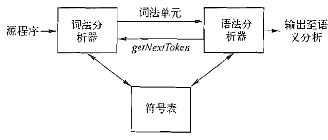

> 回溯之前的问题

#### 2.1.2.7. 处理关系运算符
> relop: < > <= >= == <>

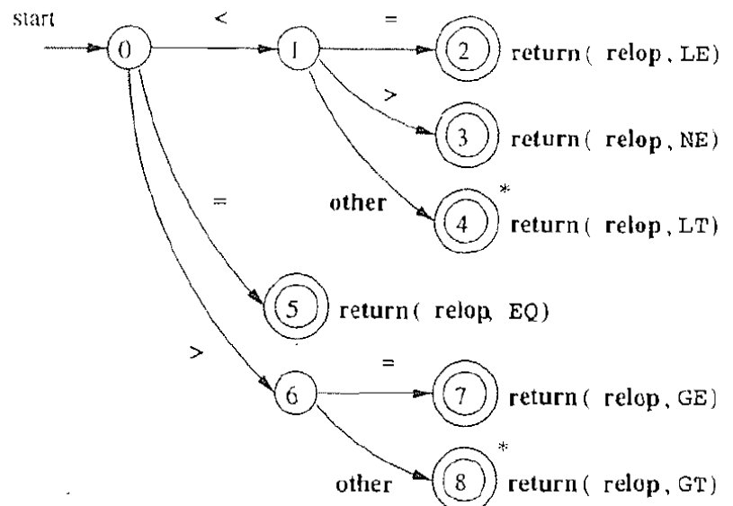

1. 最长优先原则: 例如, 识别出<=, 而不是< 与=
2. 注意：此处的=是判断是否相等的关系运算符。如果=表示赋值，而==表示判断，如何设置词法分析器
3. 问题：0的时候遇到other如何处理？

#### 2.1.2.8. 再次合并
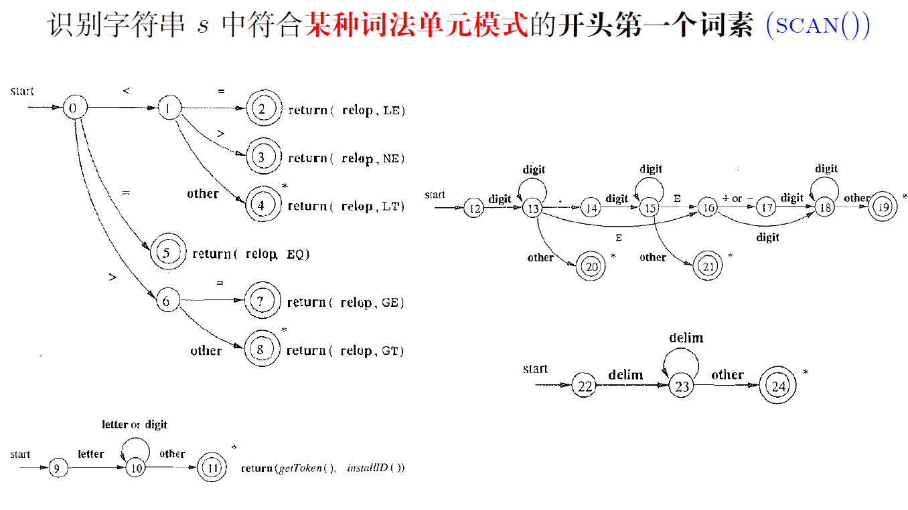

1. 关键点: 合并22, 12, 9, 0, 根据**下一个字符**即可判定词法单元的类型
2. 否则, 调用错误处理模块(对应other), 报告**该字符有误**, 并忽略该字符

### 2.1.3. 更复杂的词法分析器：识别数字
1. 我们可以类似关系运算符来识别各种数字吗？比如将real、sci分开识别，然后合并会有什么问题？
2. `ws if else id integer relop`
3. 前一个词法分析器的前提如下(而现在并不满足这样子)
   1. 根据**下一个字符**即可判定词法单元的类型
   2. 每个状态转移图的每个状态要么是**接受状态**, 要么带有**other 边**
4. 问题:如何同时识别real和sci

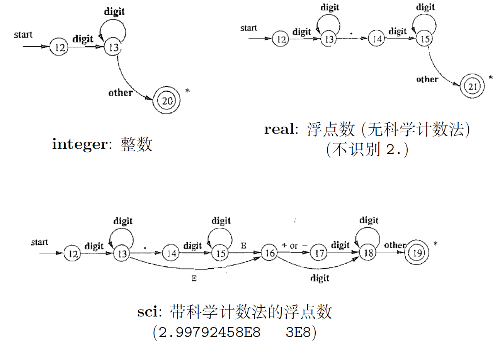

> 1. 上图中主要展示了正确的流程
> 2. 我们可以认识到，看任意个字符我们都无法确定到底进入哪一个，这也就解释了为什么我们不可以类似关系运算符来确定状态。
> 3. 双圈表示接受状态

5. 可以同时识别的real和sci的状态图

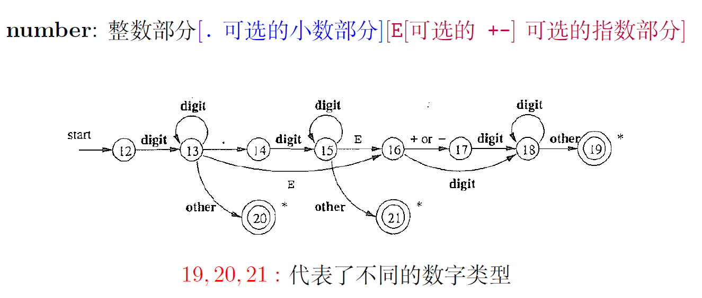

> 1. 12 : 碰到other 怎么办?尝试其它词法单元或进入错误处理模块
> 2. 14, 16, 17 : 碰到other 怎么办?回退, 寻找最长匹配，peek指针也要回退
> 3. 我们允许合并后的状态转换图尽量读取输入，直到不存在下一个状态为止，然后类似上面所讨论的那样取最长的和某个模式匹配的最长词素。
> 4. 例如1.2345E+a -> 1.2345 E + a，gcc会直接认为这个字符串是非法的，而我们的词法分析器在词法部分不这么认为(也就是完成划分)，也就是在语法阶段拒绝。

### 2.1.4. 最终的词法分析器
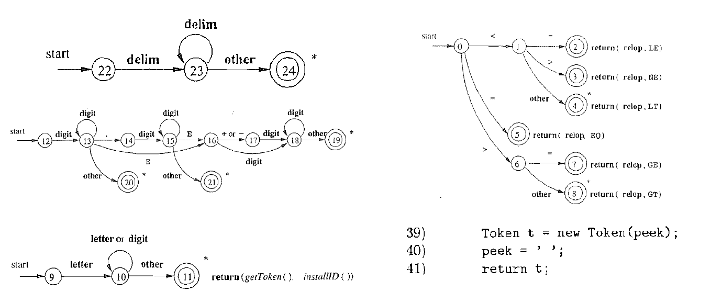

1. **关键点**: 合并22, 12, 9, 0, 根据**下一个字符**即可判定词法单元的类型
2. 否则, 调用错误处理模块(对应other), 报告**该字符有误**, 忽略该字符。
3. 注意, 在sci中, 有时需要**回退**, 寻找最长匹配。

## 2.2. 第二种：Flex(词法分析器的生成器)
> Fast Lexical Analyzer Generator

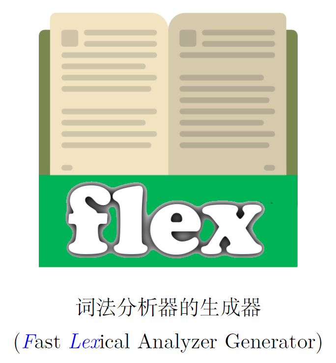

### 2.2.1. 获取词法单元流
1. **输入**: 程序文本/字符串s & 词法单元的规约
2. **输出**: 词法单元流

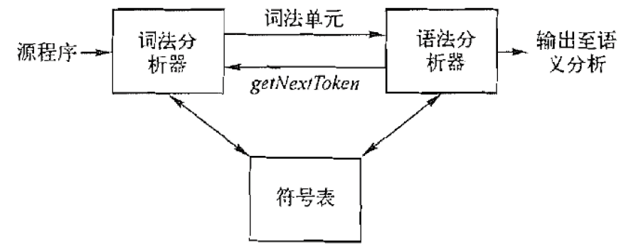

### 2.2.2. 词法分析器的获得
1. **输入**: 词法单元的规约
2. **输出**: 词法分析器
3. 比较关键的是`.l`文件

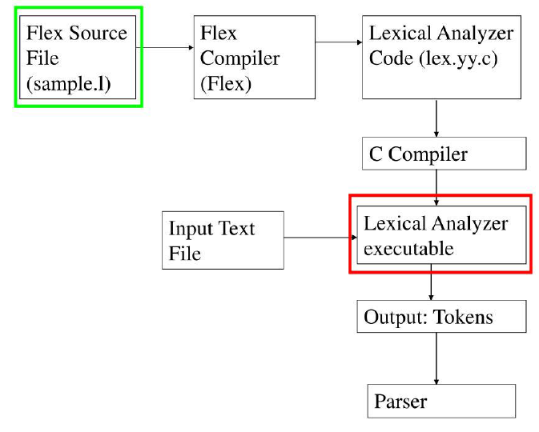

### 2.2.3. 词法单元的规约
1. 我们需要词法单元的形式化规约

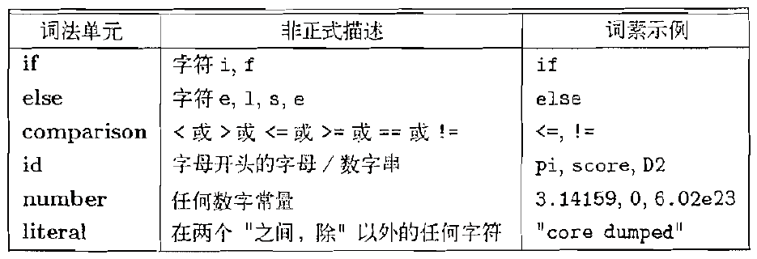

> 我们需要词法单元的**形式化**规约

1. **id**: 字母开头的字母/数字串
2. **id**定义了一个集合, 我们称之为**语言(Language)**，C语言就是使用C语言写出来的所有语言
3. 它使用了字母与数字等符号集合, 我们称之为**字母表(Alphabet)**
4. 该语言中的每个元素(即, 标识符) 称为**串(String)**

### 2.2.4. Definition (字母表)
1. 字母表$\Sigma$是一个有限的符号集合。

### 2.2.5. Definition (串)
1. 字母表$\Sigma$上的串(s)是由$\Sigma$中符号构成的一个**有穷**序列。
2. 空串:$|\epsilon| = 0$

#### 2.2.5.1. Definition (串上的“连接” 运算)
1. x = dog, y = house xy = doghouse
2. $s \epsilon = \epsilon s = s$

#### 2.2.5.2. Definition (串上的“指数” 运算)
1. $s^0 \triangleq ϵ$
2. $s^i \triangleq ss^{i-1}, i>0$

### 2.2.6. Definition (语言)
1. **语言**是给定字母表$\Sigma$上一个任意的**可数**的串集合。

$$
\emptyset \\
{\epsilon} \\
id : {a, b, c, a1, a2, . . . } \\
ws : {blank, tab, newline} \\
if : {if} \\
$$

1. 语言是串的集合，所以所有和集合相关的都可以在语言上操作。
2. 因此, 我们可以通过集合操作**构造**新的语言。

### 2.2.7. 语言上的计算
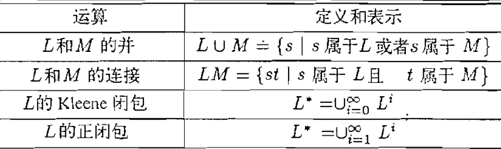

1. 后两项显著增强了语言的能力，Kleene闭包是$L*$，正闭包是$L+$
2. L*允许我们构造**无穷**集合

$$
L = {A,B, . . . ,Z, a, b, . . . , z} \\
D = {0, 1, . . . , 9} \\
L\cup D 并集\\
LD 520个元素\\
L^4 长度为4的字母串\\
L^* 所有子母串\\ 
D^+ 非空数字串\\ 
L(L\cup D)^∗ 标识符 \\
id : L(L \cup D)^∗ \\
$$

## 2.3. 正则表达式
1. 每个正则表达式r 对应一个正则语言L(r)
2. 正则表达式是**语法**, 正则语言是**语义**

### 2.3.1. 定义
1. 给定字母表$\Sigma$, $\Sigma$上的正则表达式**由且仅由**以下规则定义:
   1. $\epsilon$是正则表达式;
   2. $\forall a \in \Sigma$，a是正则表达式;
   3. 如果r是正则表达式, 则(r)是正则表达式;
   4. 如果r与s是正则表达式, 则r|s, rs, r∗ 也是正则表达式(这是语法部分)
2. 运算优先级:$() > * > 连接 > |$
3. $(a)|((b)*(c))\equiv a|b*c$
4. 正则表达式对应的正则语言

$$
L(\epsilon) = {\epsilon} (1)\\
L(a) = {a}, \forall a \in \Sigma (2)\\
L((r)) = L(r) (3)\\
L(r|s) = L(r) \cup L(s) \ L(rs) = L(r)L(s) \ L(r*) =(L(r))* (4)\\
$$

> 示例

$$
\Sigma = {a, b} \\
L(a|b) = {a, b} \\
L((a|b)(a|b)) = {aa, ab, ba, bb} \\
L(a*) = (L(a))* = {a}* = {\emptyset, a , aa, ...}\\
前一个*是正则表达式上的，后一个*是闭包
L((a|b)*) = (L(a, b))*\\
L(a|a*b) = {a, b, ab, aab, ...}\\
$$

### 2.3.2. 词法分析
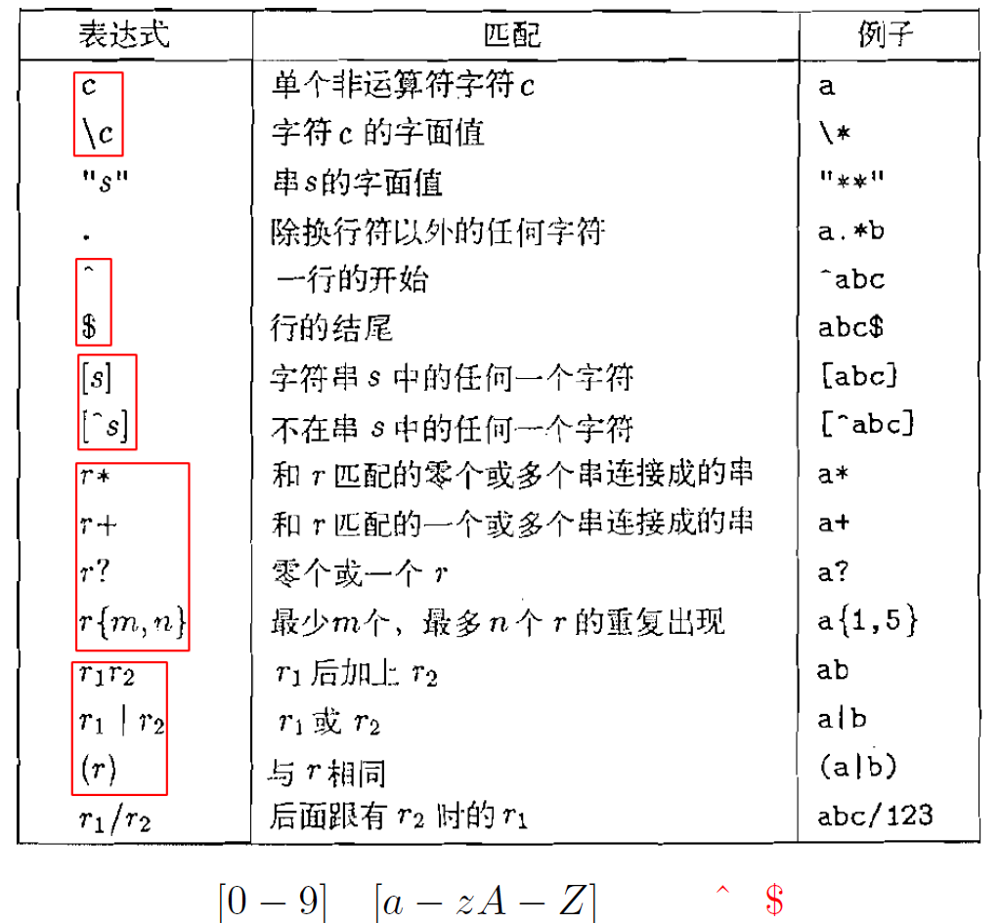
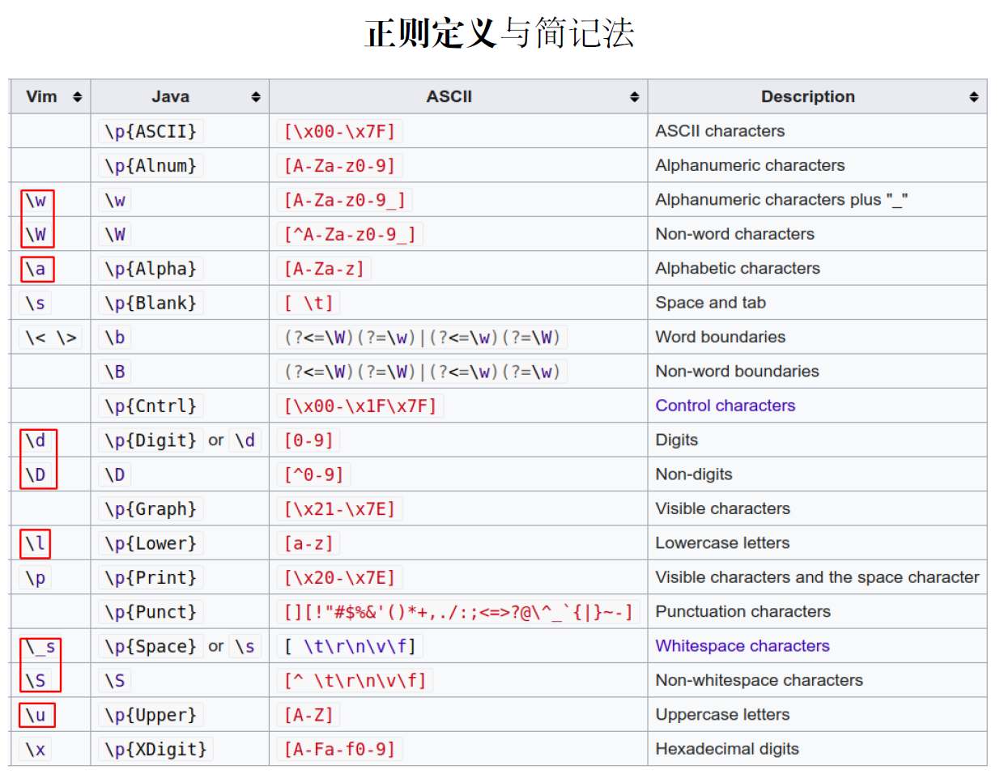

1. 其他常用的:
   1. `[^s]`:表示不在这个s中的任意一个字符
   2. `^`:外面的尖括号，表示行首
   3. `$`:表示结尾
   4. `.`:除了换行符以外的
   5. `\c`:字符自免租

### 2.3.3. 正则表达式示例
| 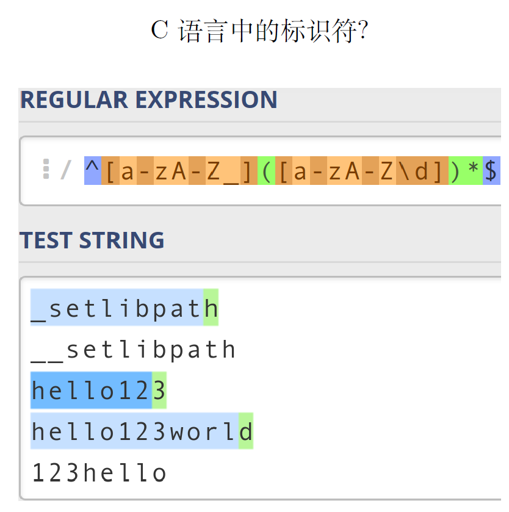 | 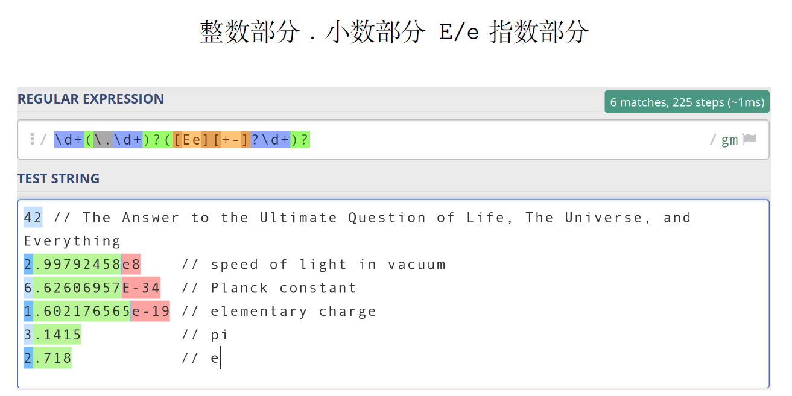 |
| -------------------- | -------------------- |
| 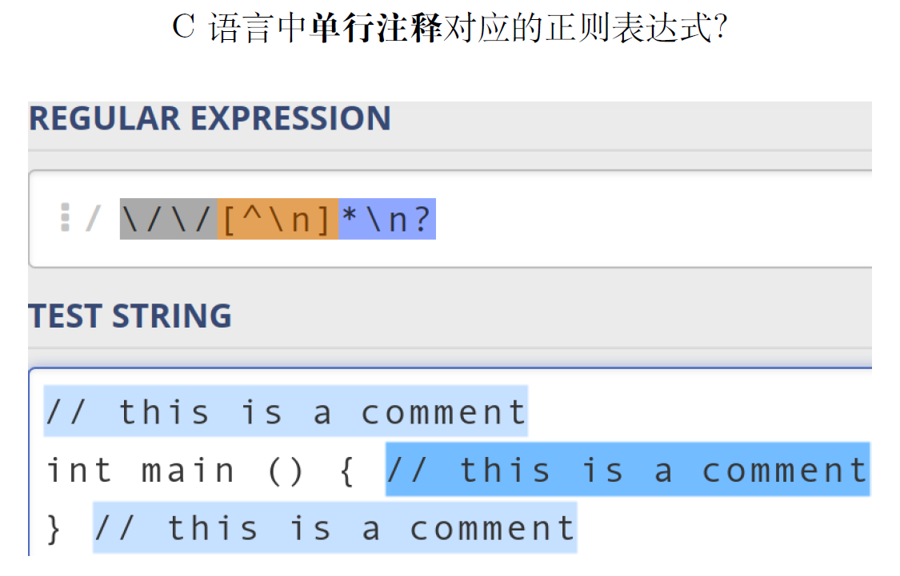 | 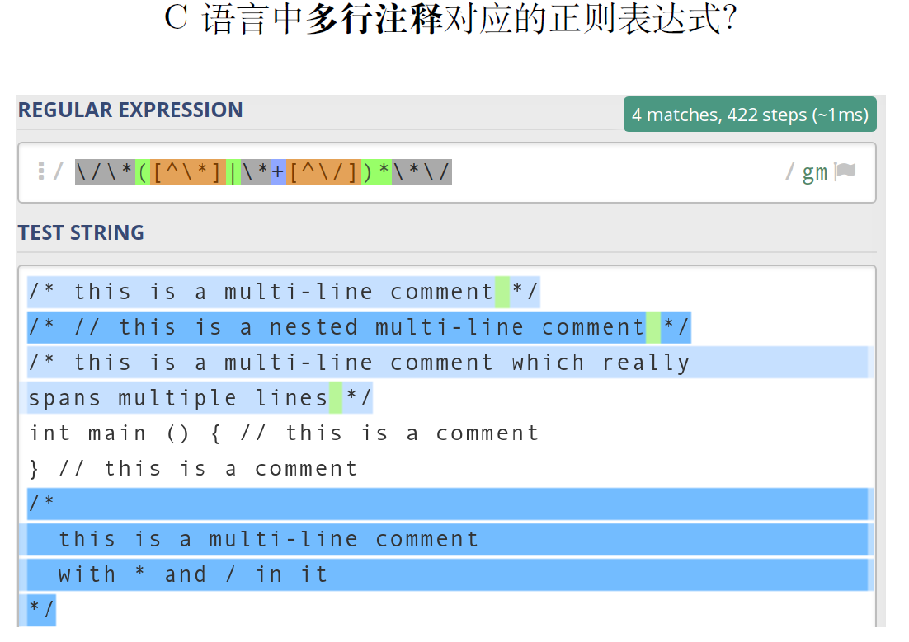 |

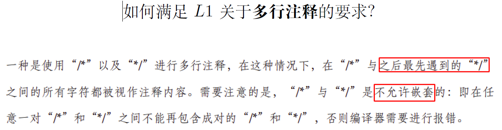

> $(0|1(01*0)1))*$：匹配3的倍数
> <a href = "https://regex101.com/r/ED4qgC/1">正则表达式</a>

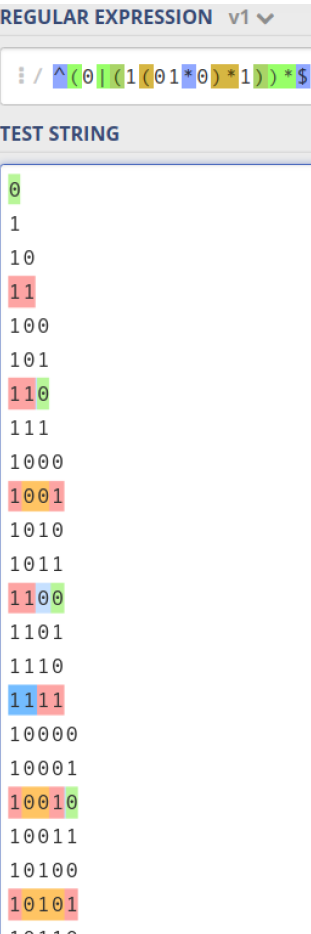

### 2.3.4. Flex程序的结构(.l文件)
1. **声明部分**: 直接拷贝到.c 文件中
2. **转换规则**: **正则表达式{动作}**
3. **辅助函数**: 动作中使用的辅助函数

```
声明部分
%%
转换规则
%%
辅助函数
```

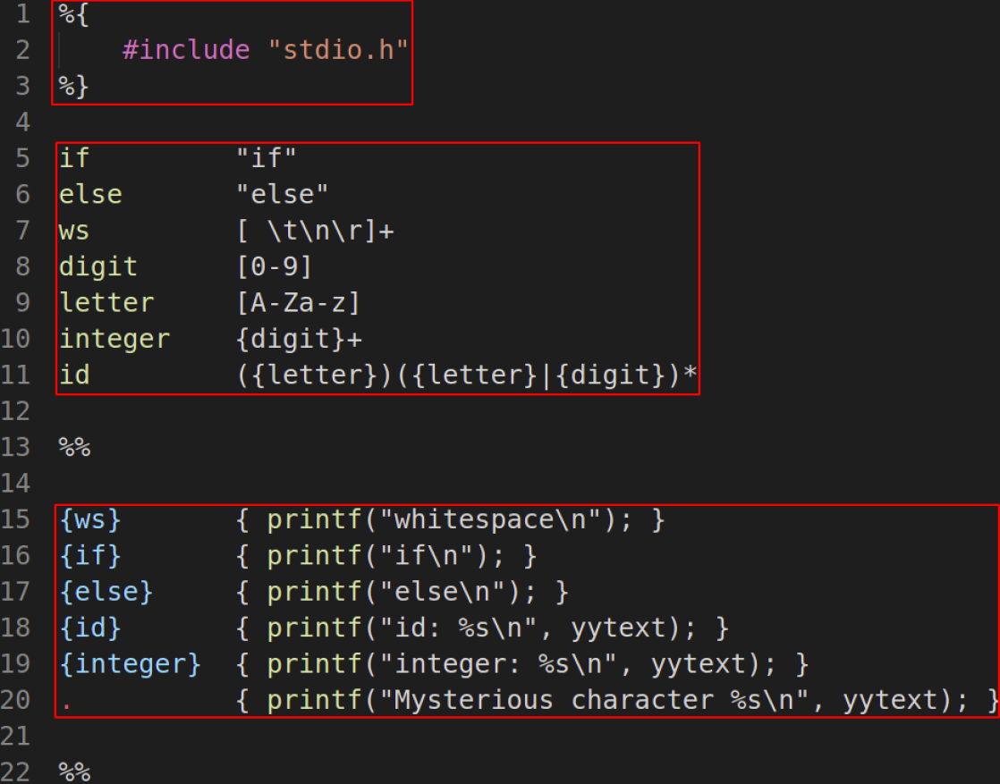

1. 最上面我们使用的标准库(原封不动拷贝到lex.yy.c中)
2. 第三部分没有用到
3. 声明部分是可以互相引用的:通过`{}`来实现、
4. 动作中调用的函数可以在辅助部分使用
5. `yytext`是哪里来的呢？flex背后做了很多的事情，需要告诉你做了什么，`yytext`是flex暴露的全局变量，表示获取到的词素。

```sh
flex lexical.l // 生成.yy.c文件
cc lex.yy.c -lfl -o lexical.out // 使用cc进行编译，-lfl表示需要调用一些库
./lexical-out // 执行
```

### 2.3.5. Flex 中两大**冲突解决**规则
1. 最前优先匹配: 关键字vs. 标识符
2. 最长优先匹配: >=, ifhappy, thenext, 1.23


## 2.4. 第三种：自动化词法分析器

### 2.4.1. 自动机(Automaton，自动机单数; Automata，自动机复数)


1. 两大要素: **状态集**$S$以及**状态转移函数**$\delta$
2. 根据**表达/计算能力**的强弱, 自动机可以分为不同层次：如上图所示，表达能力和计算能力是等价的，组合逻辑(数字逻辑电路)
3. 自动机会对应用于一种语言L(A)

$$
L(A) \subseteq L(A')
$$

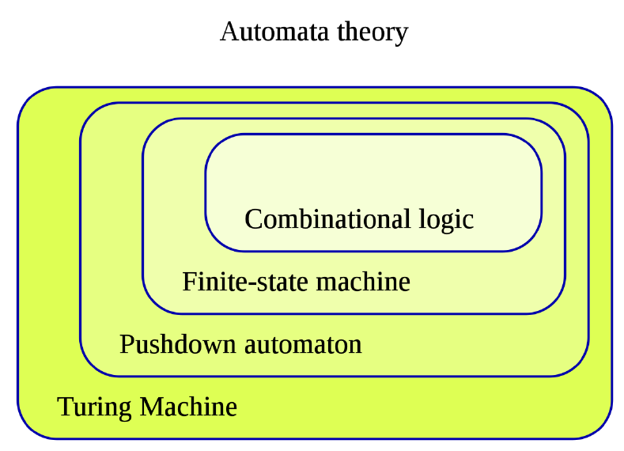

### 2.4.2. 元胞自动机(Cellular Automaton)，也称为生命游戏)

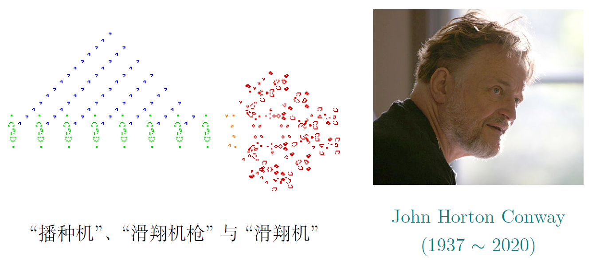

1. 无限网格，每一个网格有一个状态
   1. 1代表alive，0代表dead
   2. 状态转化：根据规则，比如周围八个邻居的当前状态会决定其本身的下一个状态
2. 参考
   1. <a href = "https://en.wikipedia.org/wiki/File:Conways_game_of_life_breeder_animation.gif">元胞自动机Gif</a>
   2. <a href = "https://www.youtube.com/watch?v=C2vgICfQawE&t=270s">“生命游戏”(Game of Life) 史诗级巨作</a>

## 2.5. 目标: 正则表达式RE => 词法分析器
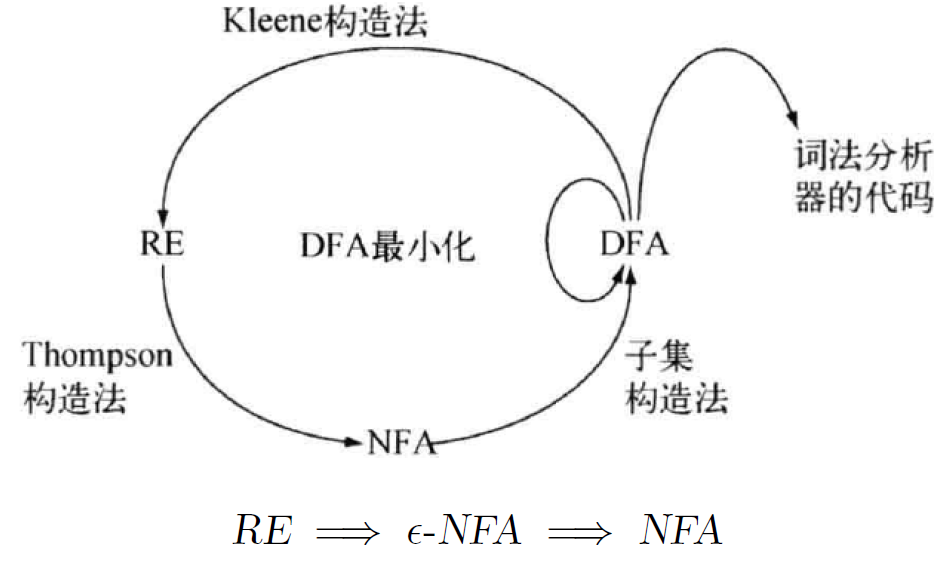

> 终点固然令人向往, 这一路上的风景更是美不胜收

### 2.5.1. NFA(Nondeteministic Finite Automaton)定义
1. 非确定性有穷自动$A$是一个五元组$A = (\Sigma, S, s_0, \delta, F)$:
   1. 字母表$\Sigma (\epsilon \notin \Sigma)$
   2. 有穷的状态集合$S$
   3. 唯一的初始状态$s_0 \in S$
   4. 状态转移函数$\delta$，$\delta : S * (\Sigma \cup {\epsilon}) -> 2^S$，这里是不确定的
   5. 接受状态集合$F \subseteq S$

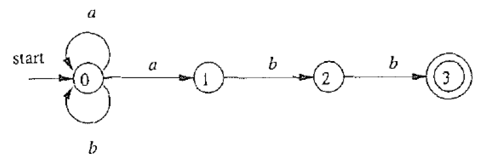

2. 约定: 所有没有对应出边的字符默认指向一个不存在的**空状态**:$\emptyset$，一般我们就不画空状态了。
3. P和NP：NP(Nondeterministic)

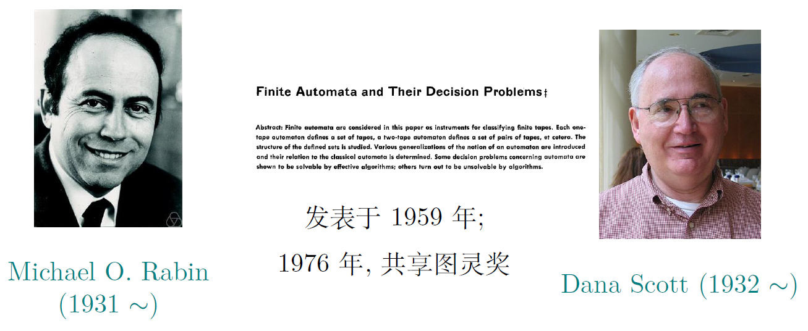

3. “which introduced the idea of **nondeterministic machines**, which has proved to be an enormously valuable concept.”
4. (非确定性) 有穷自动机是一类极其简单的**计算**装置
5. 它可以识别(接受/拒绝)$\Sigma$上的字符串

### 2.5.2. 接受(Accept)定义
1. (非确定性) 有穷自动机A接受字符串x, 当且仅当存在一条从开始状态$s_0$到某个接受状态$f\in F$、标号为x 的路径
2. 因此, A 定义了一种语言L(A): 它能接受的所有字符串构成的集合

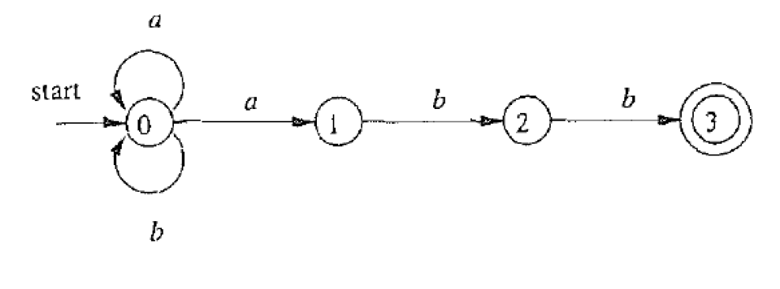

$$
aabb \in L(A) \\
ababab \notin L(A) \\
L(A) = L((a|b)^∗abb)
$$

### 2.5.3. 关于自动机A的两个基本问题
1. Membership 问题: 给定字符串$x$, $x \in L(A)$?
2. $L(A)$究竟是什么?

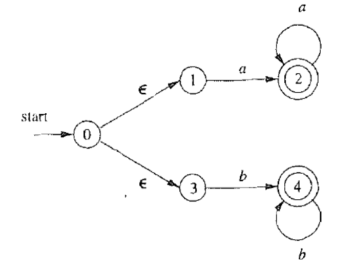

$$
aaa \in A? 可以被接受\\
aab \in A? 不可以被接受\\
L(A) = L((aa^∗|bb^∗)) \\
$$

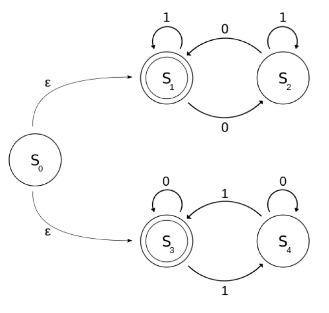

> $\epsilon$不影响

$$
1011 \in L(A)? \\
0011 \in L(A)? \\
L(A) = {包含偶数个1或偶数个0的01串}
$$

### 2.5.4. DFA(Deterministic Finite Automaton)定义
1. 确定性有穷自动机$A$是一个五元组$A = (\Sigma, S, s_0, \delta, F)$:
   1. 字母表$\Sigma (\epsilon \notin \Sigma)$
   2. 有穷的状态集合$S$
   3. 唯一的初始状态$s_0 \in S$
   4. 状态转移函数$\delta$，$δ : S *\Sigma \rightarrow S$，对于一个$\Sigma$都有对应的唯一状态
   5. 接受状态集合$F \subseteq S$

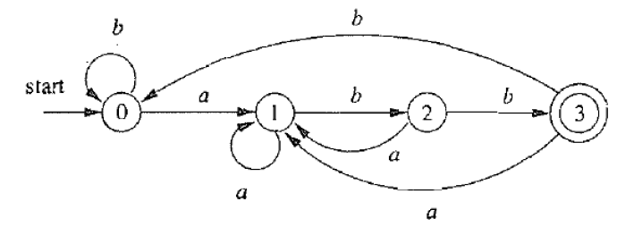

2. 约定: 所有没有对应出边的字符默认指向一个不存在的“死状态”

$$
aabb \in L(A) \\
ababab \notin L(A) \\
L(A) = L((a|b)^∗abb) \\
$$


> 上面的确定性自动机和非确定性自动机是等价的

## 2.6. 归纳推导
1. NFA 简洁易于理解, 方面描述语言L(A)
2. DFA 易于判断$x \in L(A)$, 适合产生词法分析器
3. 用NFA 描述语言, 用DFA 实现词法分析器
4. RE => NFA => DFA => 词法分析器
5. 以下我们就要将上述的几个算法

### 2.6.1. 从RE到NFA: Thompson 构造法


$$
RE => NFA \\
r => N(r) \\
要求: L(N(r)) => L(r) \\
$$

1. Thompson 构造法的基本思想: 按结构归纳

#### 2.6.1.1. 正则表达式的定义
1. 给定字母表$\Sigma$, $\Sigma$上的正则表达式由且仅由以下规则定义:
   1. $\epsilon$是正则表达式;
   2. $\forall a \in \Sigma$，$a$是正则表达式;
   3. 如果$s$是正则表达式, 则$(s)$是正则表达式;
   4. 如果$s$与$t$是正则表达式, 则$s|t$,$st$,$s^∗$也是正则表达式。

#### 2.6.1.2. 只接受空串的正则表达式
> $\epsilon$是正则表达式，NFA：只接受空串

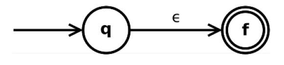

#### 2.6.1.3. 只接受字符a的正则表达式
> $a \in \Sigma$，NFA：只接受字符a


#### 2.6.1.4. 正则表达式s|t
1. 如果$s$是正则表达式, 则$(s)$是正则表达式;
2. $N((s)) = N(s)$
3. 如果$s, t$是正则表达式, 则$s|t$是正则表达式。

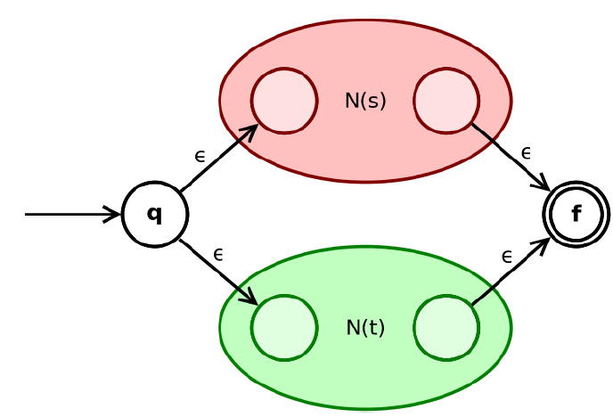

4. Q:如果$N(s)$或$N(t)$的开始状态或接受状态不唯一, 怎么办?
5. 根据**归纳假设**, N(s) 与N(t) 的开始状态与接受状态均**唯一**：我们的算法是递归构造的，前两种基本情况都为单输入单输出，所以在此基础上构造页必然为单输入单输出

#### 
6. 如果$s$,$t$是正则表达式, 则$st$是正则表达式。

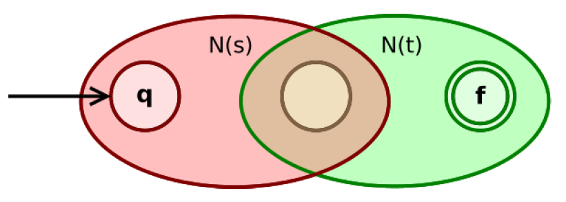

9.  根据**归纳假设**,$N(s)$与$N(t)$的开始状态与接受状态均**唯一**。
10. 如果$s$是正则表达式, 则$s^∗$是正则表达式。

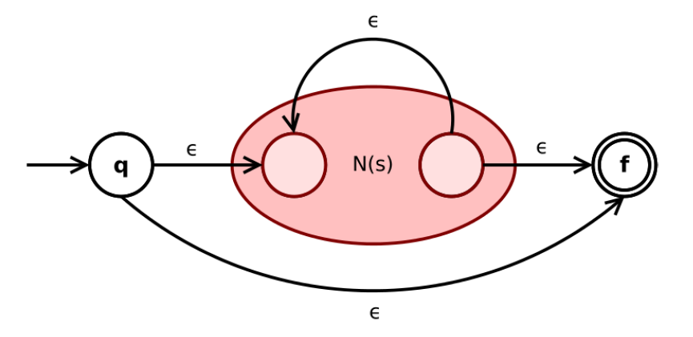

11. 根据归纳假设, $N(s)$的开始状态与接受状态唯一。

### 2.6.2. $N(r)$ 的性质以及Thompson 构造法复杂度分析
1. $N(r)$的开始状态与接受状态均唯一。
2. 开始状态没有入边, 接受状态没有出边。
3. $N(r)$的状态数$|S| \leq 2 × |r|$。($|r|:r$中运算符与运算分量的总和)
4. 每个状态最多有两个$\epsilon-$入边与两个$\epsilon-$出边。
5. $\forall a \in \Sigma$, 每个状态最多有一个a-入边与一个a-出边。

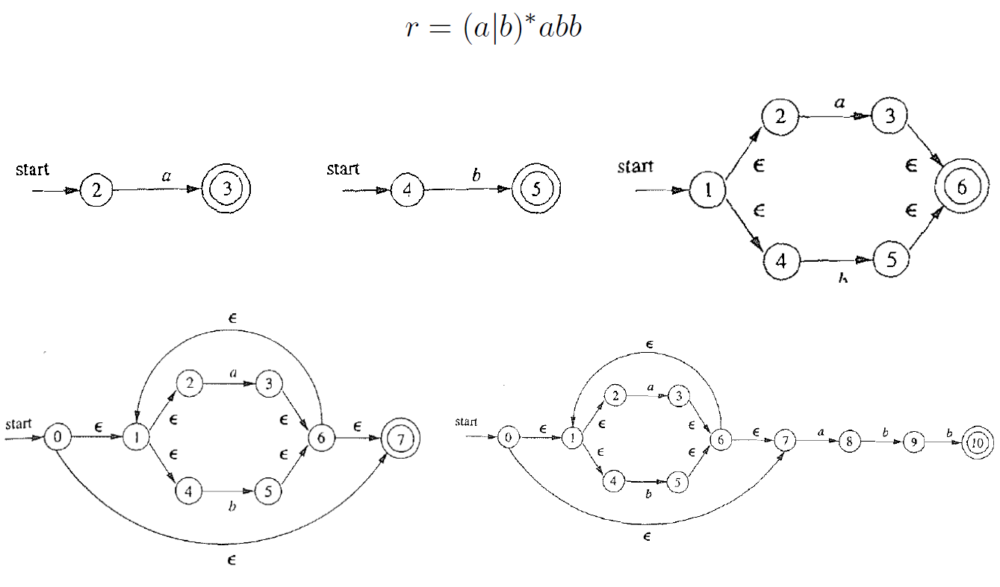

### 2.6.3. DFA模仿NFA


$$
NFA => DFA \\
N => D \\
要求: L(D) = L(N) \\
$$
4. 从NFA 到DFA 的转换: 子集构造法(Subset/Powerset Construction)
5. 思想: 用DFA 模拟NFA

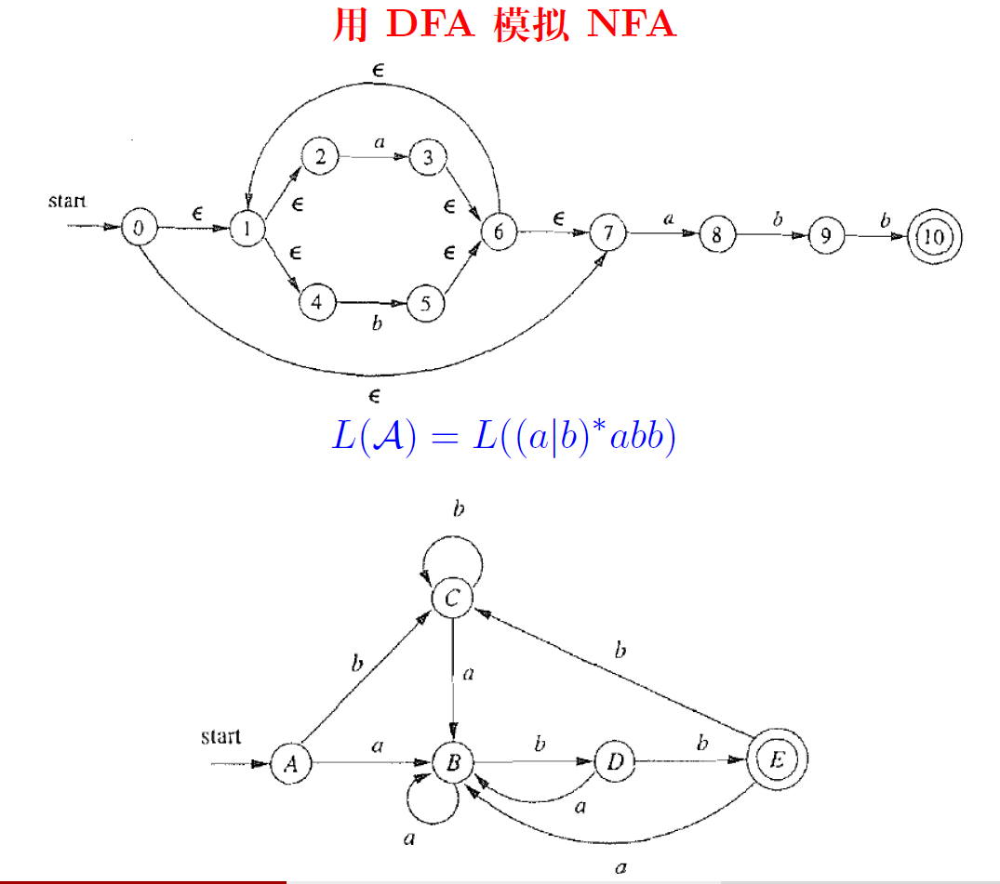
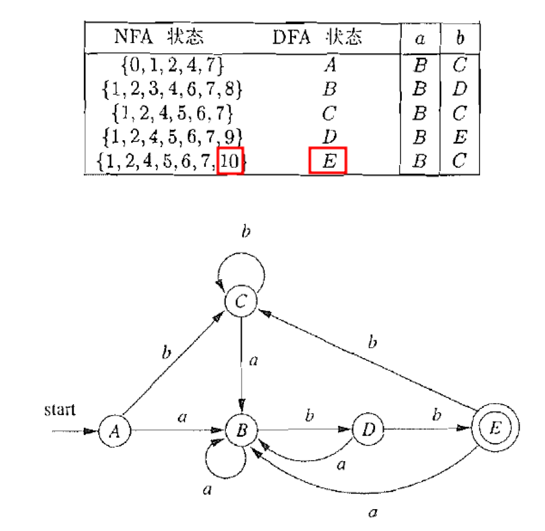
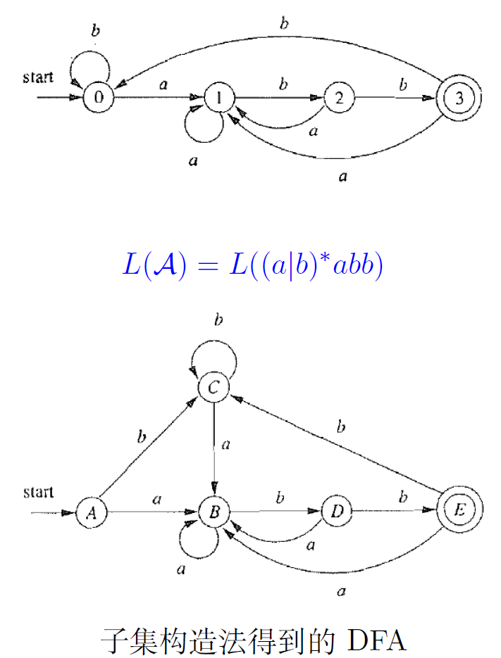

1. 子集构造法($N => D$) 的原理:
   1. $N : (\Sigma_N, S_N, n_0, \delta_N, F_N)$
   2. $D : (\Sigma_D, S_D, d_0, \delta_D, F_D)$
   3. $\Sigma_D = \Sigma_N$
   4. $S_D \subseteq 2^{S^N} (\forall s_D \in S_D : s_D \subseteq S_N)$
2. **初始状态**$d_0 = \epsilon-closure(s_0)$
3. **转移函数**$\forall a \in \Sigma_D : \delta_D(s_D, a) = \epsilon-closure(move(s_D, a))$
4. **接受状态集**$F_D = {s_D \in S_D | \exist f \in F_N. f \in s_D}$
5. 子集构造法(N => D) 的实现: 使用栈实现$\epsilon-closure(T)$

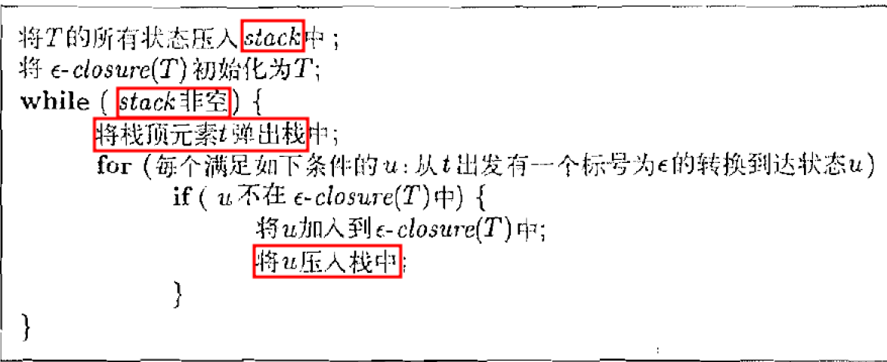

6. 子集构造法(N => D) 的实现: 使用标记搜索过程构造状态集

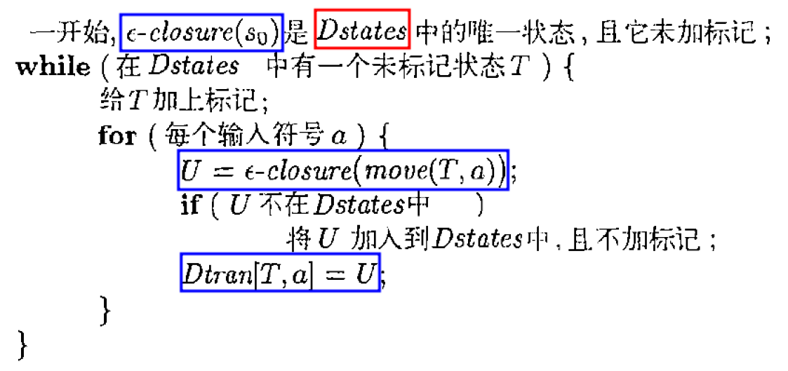

7. 子集构造法的复杂度分析:
   1. $(|S_N| = n)$
   2. $|S_D| = Θ(2^n)$
   3. 最坏情况下, $|S_D| = \Omega(2^n)$
8. “长度为m ≥ n 个字符的a, b 串, 且倒数第n 个字符是a”
$Ln = (a|b)^∗a(a|b)^{n−1}$

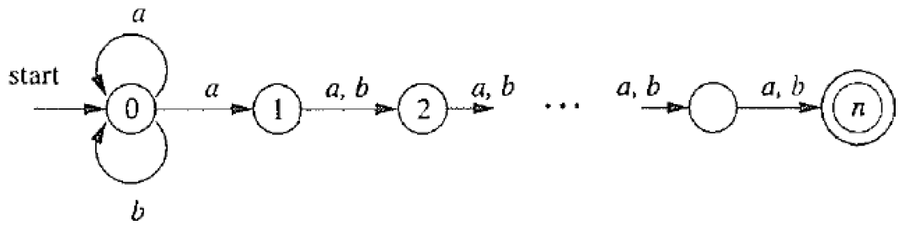

9. 练习(非作业): $m = n = 3$
10. 闭包(Closure): $f-closure(T)$
11. $\epsilon-closure(T):L^∗ =\bigcup\limits_{i=0}\limits^{\infty}L^i$
12. $R^+$: 传递闭包
13. $T => f(T) => f(f(T)) => f(f(f(T))) => . . .$直到找到x 使得f(x) = x (x 称为f 的不动点)


13. DFA 最小化

101页
