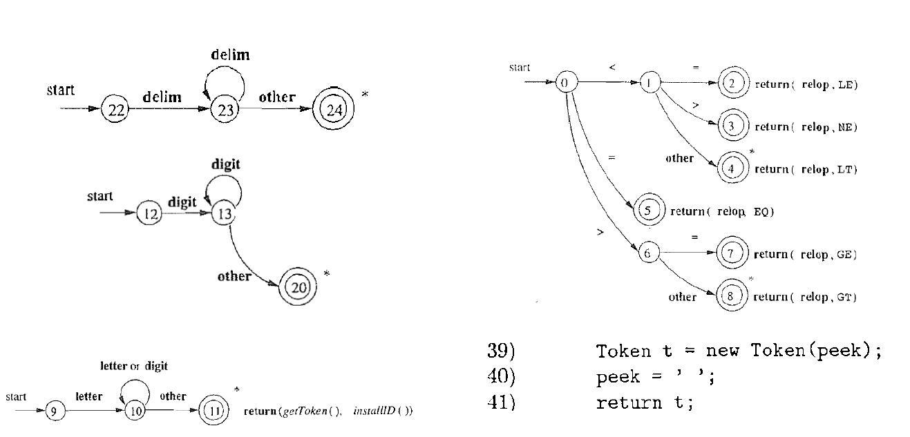

Lecture2-Lexer
---
> 词法分析

# 1. 输入和输出

1. 输入:程序文本/字符串s和**词法单元(token)的规约**
2. 输出:词法单元流


## 1.1. 词法表示形式
`token: <token-class, attribute-value>`

| 词法单元    | 非正式描述                       | 词素示例      |
| ----------- | -------------------------------- | ------------- |
| if          | 字符i、f                         | if            |
| else        | 字符e、l、s、e                   | else          |
| comparision | < 或 > 或 <= 或 >= 或 == 或 !=   | <= , !=       |
| id          | 字符开头的字母/字符串            | pi, score, D2 |
| number      | 任何字符常量                     | 3.14          |
| literal     | 在两个"之间，处理"以外的任何字符 | "core dumped" |

- int/if:关键词
- ws:空格、制表符、换行符
- comment:“//” 开头的一行注释或者“/* */” 包围的多行注释

## 1.2. 词法分析示例
```c++
int main(void){
  printf("hello, world\n")
}
```

> 词法分析的结果：本质上，就是一个**字符串(匹配/识别)**算法

```
int ws main/id LP void RP ws
LB ws
ws id LP literal RP SC ws
RB
```

# 2. 词法分析器的三种设计方法
> 生产环境下的编译器(如gcc) 通常选择手写词法分析器

1. 手写词法分析器
2. 词法分析器的生成器
3. 自动化词法分析器

## 2.1. 手写词法分析器
1. 识别字符串s中符合**某种词法单元模式**的**所有词素**

```c++
if ab42 >= 42:
  xyz = 3.14
else xyz
```

```
ws if else id integer real relop assign
```

1. 识别字符串s中**符合某种词法单元模式**的**开头第一个词素**
2. 识别字符串s中**符合特定词法单元模式**的**开头第一个词素**

### 2.1.1. 识别字符串s中符合**特定词法单元模式**的**开头第一个词素**
```java
public int line = 1;
private char peek = " ";
private Hashable words = new Hashtable();
```

1. line:行号, 用于调试
2. peek:**下一个向前看字符(Lookahead)**
3. words:**从词素到词法单元标识符或关键词的映射表**

```
ws: blank tab newline
```

```java
public Token scan() throws IOException{
  for(;;peek=(char)System.in.read()){
    if(peek == " " || peek == "\t") continue;
    else if(peek == "\n") line = line + 1;
    else break;
  }
}
```
> 识别空白部分，但不做处理

```java
peek = next input char acter ;
while ( peek != null) {
  //if peek is not a ws, break
  peek = next input char acter
}
```

> 这样写，可不可以？


> **num**: 整数(允许以0 开头)

```java
if( Character.isDigit(peek) ) {
  int V = 0;
  do {
    v = 10 * v + Character.digit(peek, 10);
    peek = (char)System.in.read();
  }while(Character.isDigit(peek));
  return new Num(v);
}
```


> id: 字母开头的字母/数字串

```java
if(Character.isLetter(peek) ) {
  StringBuffer b = new StringBuffer() ;
  do {
    b.append(peek);
    peek = (char)System.in.read();
  }while(Character.isLetter0rDigit(peek));
  String s = b.toString();
  Word W = (Word)words.get(s);|
  if(w != null) return w;
  w = new Word(Tag.ID, s) ;
  words .put(s, w) ;
  return w;
}
```

1. 识别词素、**判断是否是预留的关键字**、保存该标识符


> relop: < > <= >= == <>


```java
Token t = new Token(peek);
peek = " ";
return t;
```

> 出现**词法错误**, 直接报告异常字符



1. 关键点: 根据**下一个字符**即可判定词法单元的类型
2. 否则, 报告**该字符有误**, 并忽略该字符

```java
package lexer; //文件Lexer.java
import java.io.*;
import java.util.*;

public class Lexer {
  public lnt llne = 1 ;
  private char peek = " ";
  private Hashtable words = new Hashtable();
  void reserve(Word t) { words.put(t.lexeme, t);}
  public Lexer() {
    reserve(new Word(Tag.TRUE, "true"));
    reserve(new Word(Tag.FALSE, "false"));
  }
  public Token scan() throws I0Exception {
    for(;; peek = (char)System.in.read()) {
      if( peek == " "| | peek == '\t') continue ;
      else if( peek == '\n' ) line = line + 1;
      else break ;
    }
    if(Character.isDigit(peek)){
      int v=0;
      do{
        v = 10 * v + Character.digit(peek, 10) ;
        peek = (char)System.in.read();
      } while(Character.isDigit(peek));
      return new Num(v);
    }
    if(Char acter.isLetter(peek)) {
      StringBuffer b = new StringBuffer();
      do{
        b.append(peek);
        peek = (char)System.in.read() ;
      }while(Character.isLetter0rDigit(peek));
      String s = b.toString();
      Word w = (Word)words.get(s);
      if( w != null ) return w;
      w = new Word(Tag.ID, s);
      words.put(s，w);
      return w;
    }
  Token t= new Token(peek) ;
  peek = " ";
  return t;
  }
}
```

- 外层**循环**调用**scan()**，或者, 由语法分析器**按需**调用**scan()**


```java
public Token scan() throws I0Exception {
  for( ; ; peek = (char)System.in.read()){
    if( peek == " " || peek == '\t' } continue;
    else if( peek == '\n' ) line = line + 1;
    else break ;
}
peek = next input character ;
while (peek != null) {
  // if peek is not a WS, break
  peek = next input character
}
```

- char peek = '': 下一个向前看字符
- **循环不变式**
- 当**scan()**返回一个词法单元时,
- peek 是空白符或者是**当前词素后的第一个字符**

22页