Lecture3-Parser
---

1. **输入**:程序文本/字符串s & **词法单元(token) 的规约**


2. **输出**:词法单元流

# 1. 语法分析举例


# 2. 语法分析阶段的主题

## 2.1. 上下文无关文法


1. 我们需要递归来提升我们语言的能力。

## 2.2. 构建语法分析树


1. 自顶向上构造：比较符合直观，但是能力有限
2. 自底向下构造：Knuth算法

## 2.3. 错误恢复
1. 报错
2. **恢复**：现在的程序是比较大的，如果直接停止编译则导致有多少错误就需要编译多少次，不合适。
3. 继续分析

# 3. 上下文无关文法(CFG, Context-Free Grammer, 上下文无关文法)
> LL(1)可以完成手写分析器，LR(1)可以更不容易出现细节问题，Bison公式是本实验使用的工具。

## 3.1. 上下文无关文法(CFG)定义
1. 上下文无关文法$G$是一个四元组$G=(T,N,P,S)$:
2. T是**终结符号 Terminal**集合, 对应于词法分析器产生的词法单元;
3. N是**非终结符号 Non-terminal**集合;
4. P是**产生式 Production**集合;

$$
A \in N \rightarrow \alpha \in (T \cup N)*
$$

- 头部/左部(Head)$A$: **单个**非终结符，必须只有一个，这就是为什么我们称其为上下文无关文法，如果有多个则不符合上下文无关文法，会被成为上下文有关文法，但是几乎无法处理。
- 体部/右部(Body)$\alpha$: 终结符与非终结符构成的串, 也可以是空串$\epsilon$
5. S为开始(Start)符号。要求$S \in N$且唯一。

### 3.1.1. 上下文无关文法示例
1. 一个符号要么是终结符号，要么是非终结符号
2. 终结符号表示到此为止，无法再进行替换

$$
\begin{array}{l}
   G = (\{S\}, \{(, )\}, P, S) \\
   S \rightarrow SS \\
   S \rightarrow (S) \\
   S \rightarrow () \\
\end{array}
$$

> 任意嵌套的所有匹配好的括号串

$$
\begin{array}{l}
   G = (\{S\}, \{a, b\}, P, S) \\
   S \rightarrow aSb \\
   S \rightarrow \epsilon \\
\end{array}
$$

> 可以有很多的情况

### 3.1.2. **条件语句**文法
1. **悬空(Dangling)-else**文法
2. 这样的文法是有问题，我们进一步分析才可以，other作为终结符。

### 3.1.3. 约定


3. **约定**: 如果没有明确指定, 第一个产生式的头部就是开始符号，用来避免写如上例子中的一些描述

### 3.1.4. 关于终结符号的约定
> 下述符号是终结符号:(通常的约定)

1. 在字母表里排在前面的小写字母，比如a、b、c。
2. 运算符号，比如+、*等。
3. 标点符号，比如括号、逗号等。
4. 数字0、1、.... 9。
5. **黑体字符串**，比如id或if。每个这样的字符串表示一个终结符号。
  
### 3.1.5. 关于**非终结符号**的约定
> 下述符号是非终结符号:

1. 在字母表中排在前面的大写字母，比如A、B、C。
2. **字母S**。它出现时通常表示开始符号。
3. 小写、斜体的名字，比如expr或stmt.

## 3.2. 语义
1. 上下文无关文法$G$定义了一个语言$L(G)$
2. 语言是**串**的集合
3. 串从何来?

## 3.3. 推导(Derivation)的定义

### 3.3.1. 表达式文法
$$
E \rightarrow -E|E + E | E ∗ E | (E) | id
$$

1. 推导即是将某个产生式的左边**替换**成它的右边
2. 每一步推导需要选择替换**哪个非终结符号**，以及使用**哪个产生式**

$$
E \Rightarrow -E \Rightarrow −(E) \Rightarrow −(E+E) \Rightarrow −(id+E) \Rightarrow −(id+id)
$$

$$
\begin{array}{l}
   E \Rightarrow −E : 经过一步推导得出 \\
   E \xRightarrow{+} −(id + E):经过一步或多步推导得出 \\
   E \xRightarrow{*} −(id +E):经过零步或多步推导得出 \\
\end{array}
$$

$$
E \Rightarrow -E \Rightarrow −(E) \Rightarrow −(E+E) \Rightarrow −(E+id) \Rightarrow −(id+id)
$$

### 3.3.2. Definition (Sentential Form;句型)
如果$S \xRightarrow{*} \alpha$，且$\alpha \in ( T \cup N)^*$，则称$\alpha$是文法G的一个句型(包含非终结符)

$$
\begin{array}{l}
   E \rightarrow -E | E + E | E ∗ E | (E) | id \\
   E \Rightarrow -E \Rightarrow −(E) \Rightarrow −(E+E) \Rightarrow −(id+E) \Rightarrow −(id+id)
\end{array}
$$

### 3.3.3. Definition (Sentence; 句子)
1. 如果$S \xRightarrow{*} w$，且$w \in T^*$，则称w是文法G的一个**句子**(没有非终结符了)
2. 句子就是这个语言中的串

## 3.4. Definition (文法G生成的语言L(G))
文法F的**语言**L(G)是它能推导出的**所有句子**构成的集合。

$$
w \in L(G) \Leftrightarrow S \xRightarrow{*} w
$$

## 3.5. 关于文法G的两个基本问题
1. Membership问题:给定字符串$x \in T^*, x \in L(G)$？字符串可不可以由文法推理得到
2. L(G)究竟是什么？

### 3.5.1. 问题一:Membership问题
1. 给定字符串$x \in T^*, x \in L(G)$，(即检查x是否符合文法G)
2. 这就是**语法分析器**的任务:为输入的词法单元流寻找推导、**构建语法分析树**, 或者报错

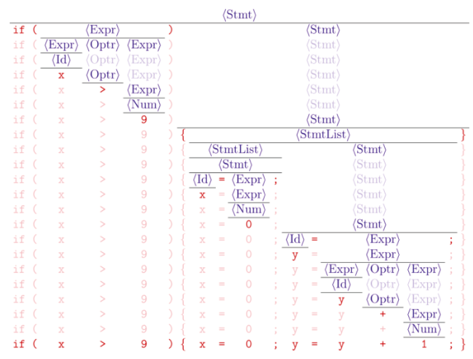

1. 根节点是文法G的起始符号
2. 叶子节点是输入的词法单元流
3. 常用的语法分析器以**自顶向下**或**自底向上**的方式构建中间部分

### 3.5.2. 问题二:L(G) 是什么?
1. 这是程序设计语言设计者需要考虑的问题

#### 3.5.2.1. 根据文法G推导语言L(G)
1. 例子一：
$$
\begin{array}{l}
   S \rightarrow SS \\
   S \rightarrow (S) \\
   S \rightarrow () \\
   S \rightarrow \epsilon \\
   L(G) = \{良匹配括号串\} \\
\end{array}
$$

2. 例子二：
$$
\begin{array}{l}
   S \rightarrow aSb \\
   S \rightarrow \epsilon \\
   L(G) = {a^nb^n|n \geq 0 } \\
\end{array}
$$

#### 3.5.2.2. 根据语言L(G)来推导文法G
1. 目标生成：字母表$\sum = {a, b}$上的所有**回文串**(Palindrome)构成的语言

$$
\begin{array}{l}
   S \rightarrow aSa \\
   S \rightarrow bSb \\
   S \rightarrow a \\
   S \rightarrow b \\
   S \rightarrow ϵ \\
   S \rightarrow aSa|bSb|a|b|\epsilon \\
\end{array}
$$

2. 目标生成：${b^na^mb^{2n}|n \geq 0, m \geq 0}$
$$
\begin{array}{l}
   S \rightarrow bSbb|A \\
   A \rightarrow aA|\epsilon \\
\end{array}
$$

3. 目标生成：$\{x\in \{a, b\}^* | x 中a,b个数相同 \}$
   1. 证明：a可以是空串
   2. 证明：a以a开头，那么后面肯定能找到**一个**b保证被分为了aVbV并且V中的ab数量均相同，以b开头类似。

$$
\begin{array}{l}
   V \rightarrow aVbV | bVaV | \epsilon \\
\end{array}
$$

4. 目标生成：$\{x\in \{a, b\}^* | x 中a,b个数不同 \}$
   1. T表示a多一个或者更多
   2. U表示b多一个或者更多
   3. UT不能同时出现，和V去组合即可
   4. 证明(TODO)

$$
\begin{array}{l}
   S \rightarrow T | U \\
   T \rightarrow VaT |VaV \\
   U \rightarrow VbU | VbV \\
   V \rightarrow aVbV | bVaV | \epsilon \\
\end{array}
$$

## 3.6. 顺序语句、条件语句、打印语句


- 上图中的L是顺序语句

## 3.7. L-System(不考)
> <a href = "https://en.wikipedia.org/wiki/L-system">L-System</a>:这不是上下文无关文法, 但精神高度一致

$$
\begin{array}{l}
   variables: A B \\
   constants: + - \\
   start: A \\
   rules:(A \rightarrow B-A-B),(B \rightarrow A+B+A) \\
   angles:60' \\
\end{array}
$$


1. $A,B$:向前移动并画线
2. +:左转
3. -:右转
4. 每一步都**并行地**应用**所有**规则

|                      |                      |
| -------------------- | -------------------- |
| 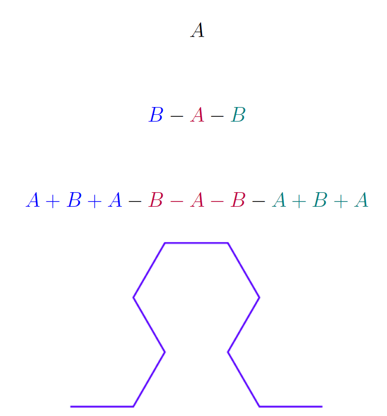 | 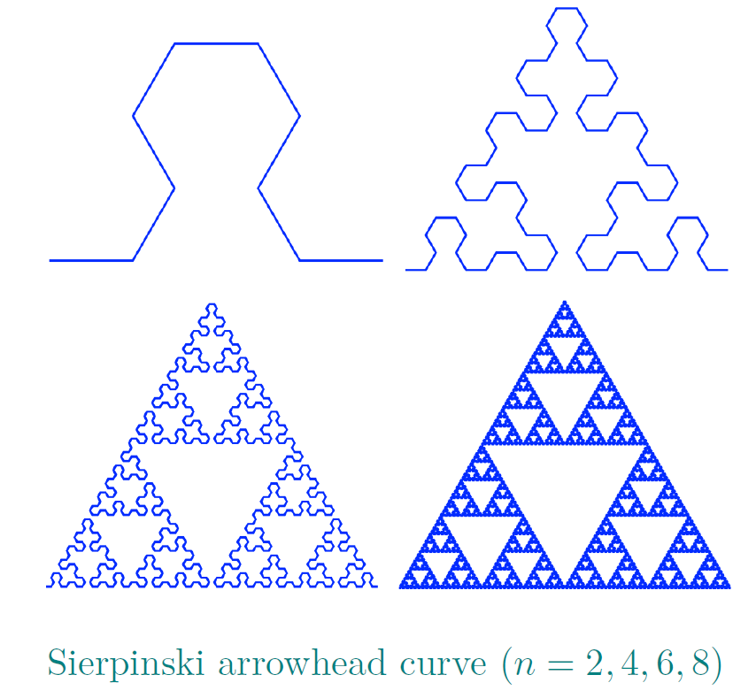 |


$$
\begin{array}{l}
   variables: X Y
   constants: F + -
   start: FX
   rules:(X \rightarrow X+YF+),(Y \rightarrow -FX-Y)
   angles:90'
\end{array}
$$

1. $F$:向前移动并画线
2. +:右转
3. -:左转
4. X:仅用于展开，在作画时被忽略
5. 每一步都**并行地**应用**所有**规则

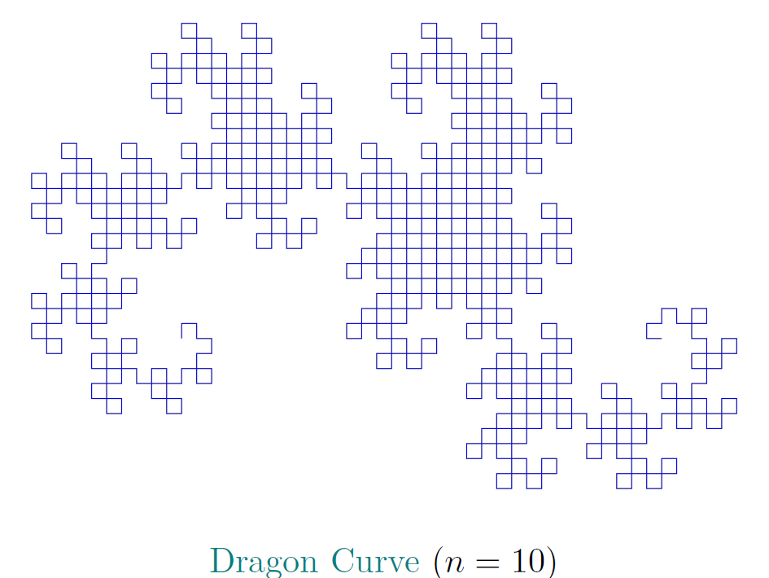

## 3.8. 最左(leftmost) 推导与最右(rightmost) 推导
$$
\begin{array}{l}
   E \rightarrow E + E | E * E | (E) | id \\
   E \xRightarrow[lm]{} -E \xRightarrow[lm]{} -(E) \xRightarrow[lm]{} -(E+E) \xRightarrow[lm]{} -(id + E) \xRightarrow[lm]{} -(id+id)
\end{array}
$$

1. $E \xRightarrow[lm]{} -E$:经过一步最左推导得出
2. $E \xRightarrow[lm]{+} -(id + E)$:经过一步或多步最左推导得出
3. $E \xRightarrow[lm]{*} -(id + E)$:经过零步或多步最左推导得出
4. 最左推导是有非终结符优先选择最左侧的进行推导
5. 最右推导是有非终结符有限选择最右侧的进行推导

$$
E \xRightarrow[rm]{} -E \xRightarrow[rm]{} -(E) \xRightarrow[rm]{} -(E+E) \xRightarrow[rm]{} -(E + id) \xRightarrow[rm]{} -(id+id)
$$

### 3.8.1. Definition (Left-sentential Form; 最左句型)
1. 如果$S \xRightarrow[lm]{*} \alpha$, 并且$\alpha \in (T \cup N)^*$，则称$\alpha$是文法G的一个**最左句型**。

$$
E \xRightarrow[lm]{} -E \xRightarrow[lm]{} -(E) \xRightarrow[lm]{} -(E+E) \xRightarrow[lm]{} -(id + E) \xRightarrow[lm]{} -(id+id)
$$

### 3.8.2. Definition (Right-sentential Form; 最右句型)
1. 如果$S \xRightarrow[rm]{*} \alpha$, 并且$\alpha \in (T \cup N)^*$，则称$\alpha$是文法G的一个**最右句型**。

$$
E \xRightarrow[rm]{} -E \xRightarrow[rm]{} -(E) \xRightarrow[rm]{} -(E+E) \xRightarrow[rm]{} -(id + E) \xRightarrow[rm]{} -(id+id)
$$

## 3.9. 语法分析树
1. 语法分析树是静态的, 它不关心动态的推导顺序

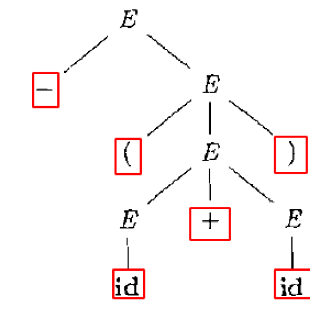

2. 一棵语法分析树对应多个推导
3. 但是, 一棵语法分析树与**最左(最右) 推导**一一对应

### 3.9.1. 二义性引入
4. 1 - 2 - 3的语法树的两种不同表达形式
5. 以下的两棵语法树是不同的，生成出来的目标代码也是不同的
6. 这个文法是有问题的，这个文法具有二义性，我们需要通过修改文法避开二义性问题。
7. 语法没有二义性的描述，L(G)本身只是一个串的集合。

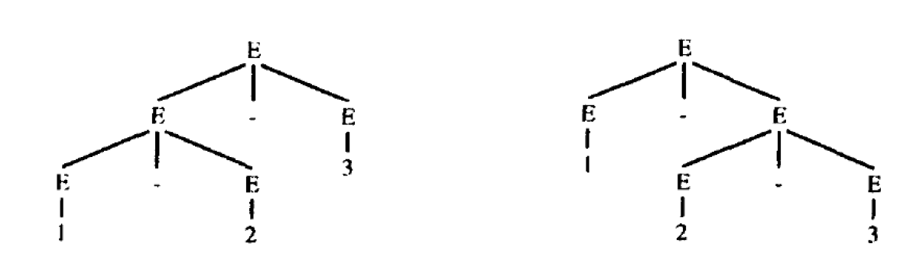

### 3.9.2. Definition (**二义性**(Ambiguous) 文法)
1. 如果L(G) 中的**某个**句子有**一个以上**语法树/最左推导/最右推导,则文法G是二义性的。
2. 1 + 2 * 3的语法树

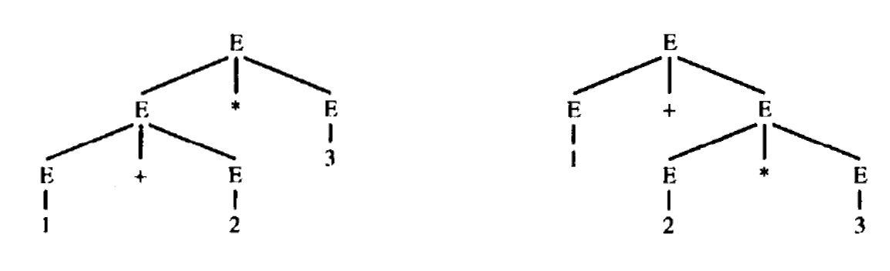

### 3.9.3. 悬空-else


## 3.10. 二义性文法
1. 不同的语法分析树产生不同的语义
2. 所有语法分析器都要求文法是无二义性的


3. Q:如何识别二义性文法?这是**不可判定**的问题，是指没有通用的算法，可以判断任意的文法G
4. Q:如何消除文法的二义性?

### 3.10.1. 消除文法二义性
1. 四则运算均是左结合的
2. **优先级**: 括号最先, 先乘除后加减
3. 二义性表达式文法以**相同的方式**处理所有的算术运算符
4. 要消除二义性, 需要**区别对待**不同的运算符
5.  将运算的"先后" 顺序信息编码到语法树的"层次"结构中

$$
\begin{array}{l}
   E \rightarrow E + E | id \\
\end{array}
$$

### 3.10.2. 左结合文法
$$
\begin{array}{l}
   E \rightarrow E + T \\
   T \rightarrow id \\
\end{array}
$$

### 3.10.3. 右结合文法
$$
\begin{array}{l}
   E \rightarrow T + E \\
   T \rightarrow id \\
\end{array}
$$

### 3.10.4. 使用左(右)递归实现左(右)结合

### 3.10.5. 括号最先, 先乘后加文法
1. 乘号更靠近叶子节点

$$
\begin{array}{l}
   E \rightarrow E + E|E*E|(E)|id \\
   E \rightarrow E + T|T \\
   T \rightarrow T * F | F\\
   F \rightarrow (E)|id
\end{array}
$$

### 3.10.6. Summary
$$
\begin{array}{l}
   E \rightarrow E + E|E - E|E*E|E/E|(E)|id|number \\
   E \rightarrow E + T | E - T|T \\
   T \rightarrow T * F | T/F | F \\
   F \rightarrow (E) | id | number \\
\end{array}
$$

1. **无二义性**的表达式文法
   1. E:表达式(expression)
   2. T:项(term)
   3. F:因子(factor)
2. **将运算的"先后"顺序信息编码到语法树的"层次"结构中**

### 3.10.7. IF-Then-Else问题


> 每个else与**最近的尚未匹配的**then匹配

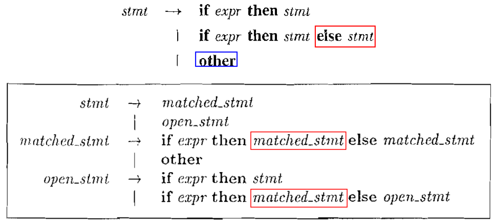

- 基本思想: **then与else**之间的语句必须是"**已匹配的**"

- 证明两件事情
  - $L(G) = L(G')$
  - $G'$是无二义性的

#### 3.10.7.1. $L(G) = L(G')$证明过程


$$
\begin{array}{l}
   L(G') \subseteq L(G) 简单容易证明\\
\end{array}
$$

> 文法是递归的，我们可以使用数学归纳法，对推导步骤进行归纳
$$
\begin{array}{l}
   L(G) \subseteq L(G') \\
   x \in L(G) \rightarrow x \in L(G') \\
   stmt \rightarrow ... \rightarrow x \\
\end{array}
$$

1. 只要G中展开一步，G'中都有相应的对应即证明了$L(G) \subseteq L(G')$

#### 3.10.7.2. $G'$ 是无二义性的
1. 每个句子对应的**语法分析树**是唯一的
2. 只需证明: 每个非终结符的**展开方式**是唯一的

$$
\begin{array}{l}
   L(matched\_stmt) \cap L(open\_stmt) = \emptyset \\
   L(matched\_stmt_1) \cap L(matched\_stmt_2) = \emptyset \\
   L(open\_stmt_1) \cap L(open\_stmt_2) = \emptyset \\
\end{array}
$$

1. 下标代表子句   


- 为什么不使用优雅、强大的**正则表达式**描述程序设计语言的语法?正则表达式的表达能力**严格弱于**上下文无关文法


- 每个**正则表达式**r对应的语言L(r) 都可以使用**上下文无关文法**来描述

$$
r=(a|b)^∗abb
$$


- 此外, 若$\delta(A_i,\epsilon) = A_j$，则添加$A_i \rightarrow A_j$

$$
\begin{array}{l}
   S \rightarrow aSb \\
   S \rightarrow \epsilon \\
   L = {a^nb^n|n \geq 0} \\
\end{array}
$$

- 该语言**无法**使用正则表达式来描述
- 定理:$L = \{a^nb^n | n ≥ 0\}$ 无法使用正则表达式描述
- 反证法
  - 假设存在正则表达式r:$L(r) = L$
  - 则存在**有限**状态自动机D(r):$L(D(r)) = L$; 设其状态数为k
  - 考虑输入$a^m(m>k)$


- $D(r)$也能接受a^{i+j}b^i，**矛盾**！
- Pumping Lemma for Regular Languages：$L = {a^nb^n | n \geq 0}$
- Pumping Lemma for Context-free Languages:$L = {a^nb^nc^n | n \geq 0}$
- 只考虑无二义性的文法这意味着,每个句子对应唯一的一棵语法分析树

# 4. LL(1)语法分析器
1. 自顶向下的、递归下降的、预测分析的、适用于**LL(1)文法**的LL(1)语法分析器
2. **自顶向下**构建语法分析树
   1. **根节点**是文法的起始符号$S$
   2. 每个**中间节点**表示**对某个非终结符应用于某个产生式进行推导**
   3. (Q :选择哪个非终结符, 以及选择哪个产生式)
   4. **叶节点**是词法单元流$w\$$
3. 仅包含终结符号与特殊的文件结束符$\$$
4. **递归下降算法**的实现框架

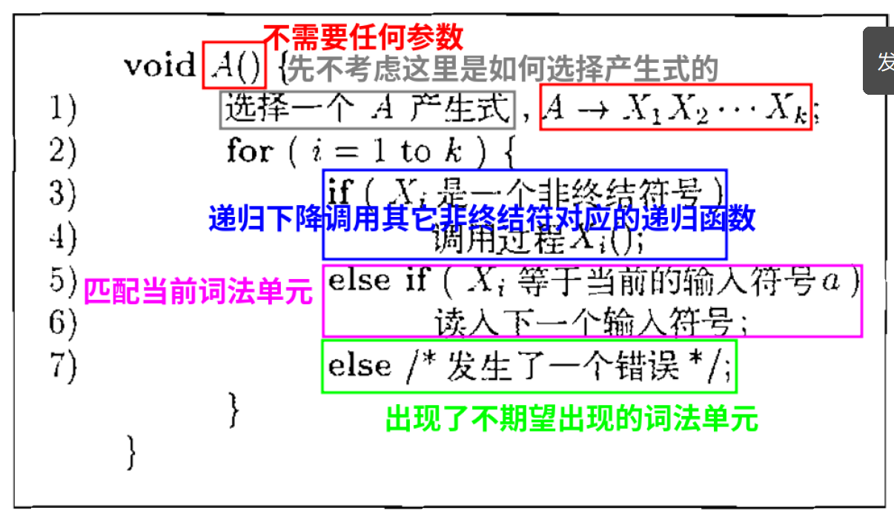

5. 为每个**非终结符**写一个**递归函数**：但是工作量会比较大
6. 内部按需调用其它非终结符对应的递归函数

## 4.1. 语法树生成例子
$$
\begin{array}{l}
   S \rightarrow F \\
   S \rightarrow (S+F) \\
   F \rightarrow a \\
\end{array}
$$

> 演示递归下降过程(指针移动)：针对结构$w=((a+a)+a)$
> 1. 首先进入S的递归函数，我们选择一条产生式(假设已经选择好)，我们选择的是$S \rightarrow (S + F)$
> 2. 然后我们发现还是非终结符，我们仍然选择$S \rightarrow (S + F)$
> 3. 然后我们发现还是非终结符，我们选择$S \rightarrow F$，
> 4. 然后我们发现是终结符，检查$F \rightarrow a$得到的结果是否和当前指针指向的位置的值，匹配则继续，否则报错。
> 5. 之后省略，注意右括号被匹配意味相应部分递归结束。
> 以上的过程在本质上是DFS的过程。

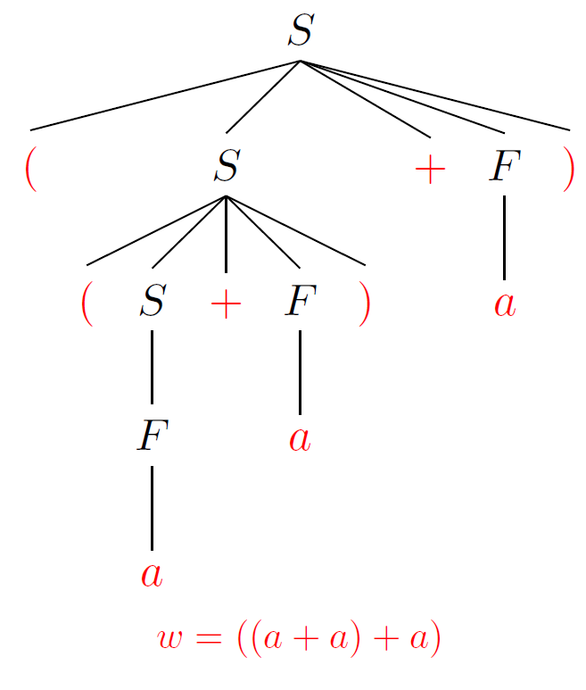

1. 每次都选择语法分析树**最左边**的**非终结符**进行展开，所以得到**最左推导**
2. 同样是展开非终结符S，为什么前两次选择了$S \rightarrow (S + F)$, 而第三次选择了$S \rightarrow F$?
3. 因为只有选择$S \rightarrow (S + F)$才能生成一个左括号开头的式子，这个是由文法决定的，也就是因为它们面对的**当前词法单元**不同

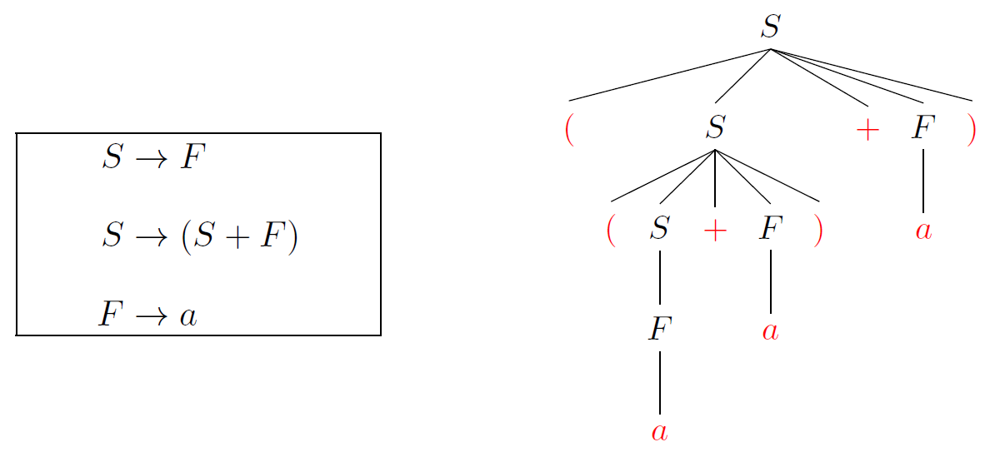

## 4.2. 使用预测分析表确定产生式
1. 指明了每个**非终结符**在面对不同的**词法单元或文件结束符**时,该选择哪个产生式(按编号进行索引)或者**报错**
2. 预测分析表如下图所示

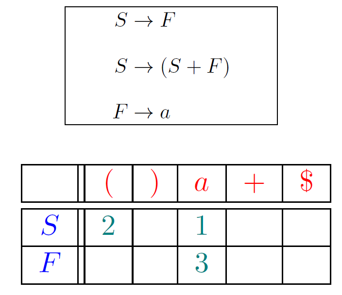

2. 例子：当前值为`(`选择2号产生式，`a且S`则选择1号产生式，`a且F`则选择3号产生式，空白记为报错。
3. 问题：如何构造上面的表格？

## 4.3. Definition (LL(1) 文法)
1. 如果文法G的**预测分析表**是**无冲突**的, 则G是LL(1)文法。
2. **无冲突**: 每个单元格里只有一个生成式(编号)，不然就会出现选择问题。

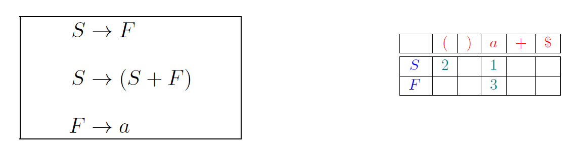

3. 对于当前选择的**非终结符**,仅根据输入中**当前的词法单元**即可确定需要使用哪条产生式
4. **递归下降的、预测分析**实现方法


### 4.3.1. 解析$S()$

```
1: procedure S()
2:    if token = '(' then
3:       MATCH('(')
4:       S()
5:       MATCH('+')
6:       F()
7:       MATCH(')')
8:    else if token ='a' then
9:       F()
10:   else
11:      ERROR(token, {'(', 'a'})
```

### 4.3.2. 解析$F()$
```
1: procedure F()
2:    if token = 'a' then
3:       MATCH('a')
4:    else
5:       ERROR(token, {'a'})
```

### 4.3.3. 解析$MATCH()$
```
1: procedure MATCH(t)
2:    if token = t then
3:       token <- NEXT-TOKEN
4:    else 
5:       ERROR(token, t)
```
## 4.4. 如何计算给定文法G的预测分析表?
下文则会重点解释如何计算给定文法G的预测分析表

## 4.5. Definition($First(\alpha)$集合)
> 对于任意的(产生式的右部) $\alpha \in (N \cup T)^*$
$$
FIRST(\alpha) = {t \in T \cup {\epsilon} | \alpha \xRightarrow{*} t\beta \wedge \alpha \xRightarrow{*}\epsilon}
$$

1. $First(\alpha)$ 是可从$\alpha$推导得到的句型的**首终结符号**的集合
2. $T$是终结符集合，$t$可能是终结符，也可能是$\epsilon$
3. 考虑非终结符A的所有产生式$A \rightarrow \alpha_1,A \rightarrow \alpha_2, ... ,A \rightarrow \alpha_m$,如果它们对应的$First(\alpha_i)$ 集合互不相交，则只需查看**当前输入词法单元**, 即可确定选择哪个产生式(或**报错**)，如果相交，则不是LL(1)文法。


## 4.6. Definition($Follow(A)$集合)
> 对于任意的(产生式的左部) **非终结符**$A \in N$
$$
Follow(A) = \{t \in T \cup \{\$\} | \exist w.S \xRightarrow{*} w = \beta A t \gamma\}
$$

1. $Follow(A)$是可能在某些句型中**紧跟在A右边的终结符**的集合
2. $t$可以是终结符和文件终止符。
3. 考虑产生式:$A \rightarrow a$，如果从$\alpha$可能推导出空串($\alpha \xRightarrow{*} \epsilon$)，则只有当当前词法单元$t \in Follow(A)$, 才可以选择该产生式：因为$A$可能推导没了，然后就是$t$了，我们期望$t$能够匹配当前位置上的对应符号。

## 4.7. 计算$First$集合

### 4.7.1. 先计算每个符号X的$First(X)$集合
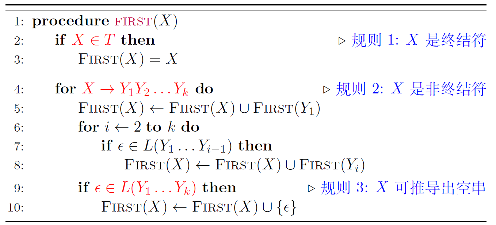

1. 如果$Y_1...Y_{i-1}$都可以推导成为空串，那么$Y_i$的首终结符应该也是X的首终结符。
2. 不断应用上面的规则, 直到每个$First(X)$都不再变化(**闭包**!!!)尤其注意递归。

### 4.7.2. 再计算每个符号串$\alpha$的$First(\alpha)$集合
$$
\begin{array}{l}
   \alpha = X \beta \\
   First(\alpha) = \begin{cases}
      First(X) & \epsilon \in L(X) \\
      Fitst(X)\cup First(\beta) & \epsilon \notin L(X) \\
   \end{cases}
\end{array}
$$

### 4.7.3. 求解$First(\alpha)$的例子
$$
\begin{array}{l}
   (1) & X \rightarrow Y \\
   (2) & X \rightarrow a \\
   (3) & Y \rightarrow \epsilon \\
   (4) & Y \rightarrow c \\
   (5) & Z \rightarrow d \\
   (6) & Z \rightarrow XYZ \\
\end{array}
$$

$$
\begin{array}{l}
   FIRST(X) = \{a,c,\epsilon\} \\
   FIRST(Y) = \{c, \epsilon\} \\
   FIRST(Z) = \{a, c, d\} \\
   FIRST(XYZ) = FIRST(X) \cup FISRT(YZ) \\
   = FIRST(X) \cup FIRST(Y) \cup FIRST(Z) = \{a, c, d\}\\
\end{array}
$$

> 注意不要忘记$\epsilon$

## 4.8. 为每个非终结符X计算$Follow(X)$集合
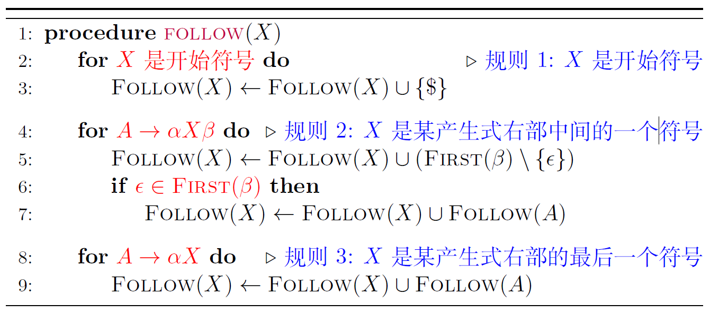

1. 不断应用上面的规则, 直到每个Follow(X) 都不再变化(**闭包**!!!)
2. Follow例子：注意闭包，可以无限扩充

$$
\begin{array}{l}
   (1) & X \rightarrow Y \\
   (2) & X \rightarrow a \\
   (3) & Y \rightarrow \epsilon \\
   (4) & Y \rightarrow c \\
   (5) & Z \rightarrow d \\
   (6) & Z \rightarrow XYZ \\
\end{array}
$$

$$
\begin{array}{l}
   FOLLOW(X) = \{a, c, d, \$\} \\
   FOLLOW(Y) = \{a, c, d, \$\} \\
   FOLLOW(Z) = \emptyset \\
\end{array}
$$

## 4.9. 如何根据$First$与$Follow$集合计算给定文法G的预测分析表?
> 按照以下规则, 在表格[A, t] 中填入生成式$A \rightarrow \alpha(编号)$

$$
\begin{array}{l}
   t \in First(\alpha) & (1)\\
   \alpha \xRightarrow{*} \epsilon \wedge t \in Follow(A) & (2)\\
\end{array}
$$

> 对于每一个生成式只要满足上面一条规则即可(或关系)，首先，在下单元格中可以填写$A \rightarrow \alpha$，则可以推导出$\alpha \xRightarrow{*} \epsilon \wedge t \in Follow(A)$(必要条件)，但是由于是LL(1)文法的**唯一性**，那么必要条件等价于充分条件，也就是这是一个充要条件。

|     | $t$                    |
| --- | ---------------------- |
| $A$ | $A \rightarrow \alpha$ |

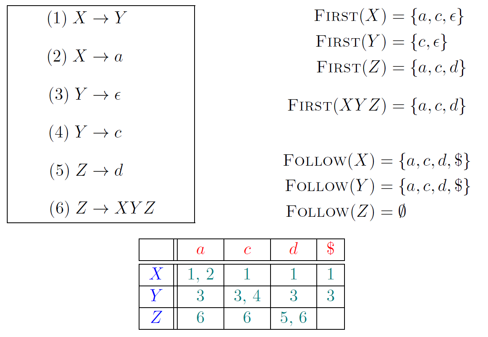

## 4.10. Definition (LL(1) 文法)
> 如果文法G的**预测分析表**是**无冲突**的, 则G是LL(1)文法。

$$
\begin{array}{l}
   (1) & X \rightarrow Y \\
   (2) & X \rightarrow a \\
   (3) & Y \rightarrow \epsilon \\
   (4) & Y \rightarrow c \\
   (5) & Z \rightarrow d \\
   (6) & Z \rightarrow XYZ \\
\end{array}
$$
$$
\begin{array}{l}
   FIRST(X) = \{a,c,\epsilon\} \\
   FIRST(Y) = \{c, \epsilon\} \\
   FIRST(Z) = \{a, c, d\} \\
   FIRST(XYZ) = FIRST(X) \cup FISRT(YZ) \\
   = FIRST(X) \cup FIRST(Y) \cup FIRST(Z) = \{a, c, d\}\\
\end{array}
$$
$$
\begin{array}{l}
   FOLLOW(X) = \{a, c, d, \$\} \\
   FOLLOW(Y) = \{a, c, d, \$\} \\
   FOLLOW(Z) = \emptyset \\
\end{array}
$$


## 4.11. LL(1) 语法分析器
1. L:从左向右(left-to-right) 扫描输入
2. L:构建最左(leftmost) 推导
3. 1:只需向前看一个输入符号便可确定使用哪条产生式

## 4.12. 非递归的预测分析方法
> 非递归算法效率会高一些

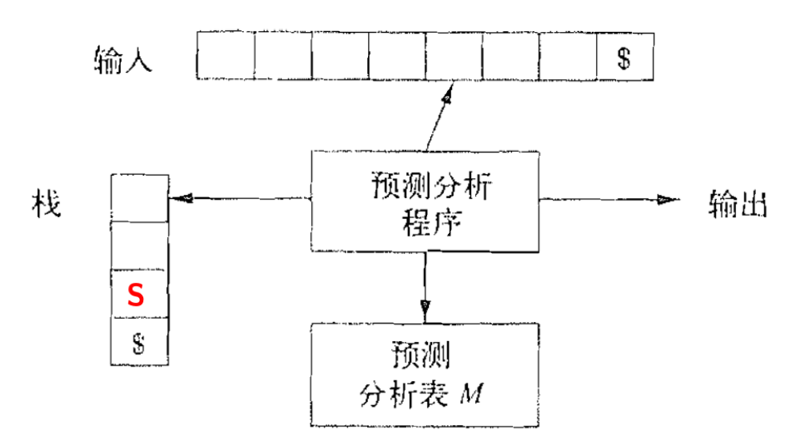
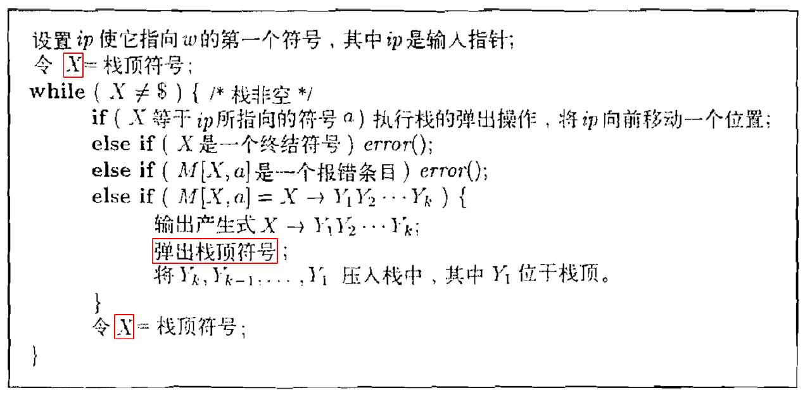

## 4.13. 改造文法成为LL(1)文法
1. 改造它
   1. 消除左递归
   2. 提取左公因子
2. 有左递归，有左公因子，则必然不是LL(1)文法
3. 没有左递归，没有左公因子，则未必是LL(1)文法

### 4.13.1. 左递归
$$
\begin{array}{l}
   E \rightarrow E + T | E - T | T \\
   T \rightarrow T * F | T / F | F \\
   F \rightarrow (E) | id | num \\
\end{array}
$$

1. E 在**不消耗任何词法单元**的情况下, 直接递归调用E, 造成**死循环**，E左侧没有非终结符，不能消耗符号。
2. 存在$FIRST(E + T) \cap FIRST(T) \neq \emptyset$，不是LL(1)文法
3. 消除左递归

### 4.13.2. 消除左递归
1. 左递归：

$$
E \rightarrow E + T | T
$$

2. 消除左递归(至少会消耗一个+)
$$
\begin{array}{l}
   E \rightarrow TE' \\
   E' \rightarrow +TE' | \epsilon \\
\end{array}
$$

3. 将左递归转为**右递归**，注: 右递归对应右结合; 需要在后续阶段进行额外处理，至少语法分析可以通过。

### 4.13.3. 左递归例子
$$
\begin{array}{l}
   A \rightarrow A\alpha_1 | A\alpha_2 |...A\alpha_m|\beta_1|\beta_2|...\beta_n \\
\end{array}
$$

- $\beta_i$都不以A开发

$$
\begin{array}{l}
   A \rightarrow \beta_1A' | \beta_2A' | ... | \beta_nA' \\
   A' \rightarrow \alpha_1A'|\alpha_2A'|...|\alpha_mA'|\epsilon \\
\end{array}
$$

### 4.13.4. 左递归例子II
$$
\begin{array}{l}
   E \rightarrow E + T|T \\
   T \rightarrow T * F|F \\
   F \rightarrow (E) | id \\
\end{array}
$$

- 消除左递归

$$
\begin{array}{l}
   E \rightarrow TE' \\
   E' \rightarrow +TE' | \epsilon \\
   T \rightarrow FT' \\
   T' \rightarrow *FT' | \epsilon \\
   F \rightarrow (E)|id|num \\
\end{array}
$$

### 4.13.5. 非直接左递归
$$
\begin{array}{l}
   S \rightarrow Aa|b \\
   A \rightarrow Ac|Sb|\epsilon\\
   S \Rightarrow Aa \Rightarrow Sda \\
\end{array}
$$

### 4.13.6. 消除左递归算法
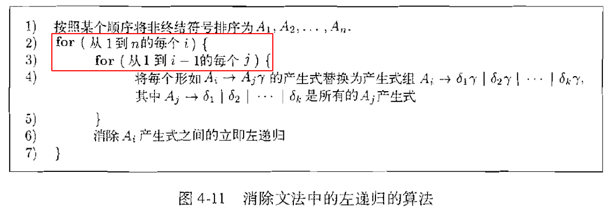

$$
A_k \rightarrow A_l\alpha \Rightarrow l > k
$$

1. 不会出现左递归，也不会出现间接左递归：因为不会回到自己
2. 例子：

$$
\begin{array}{l}
   S \rightarrow Aa|b \\
   A \rightarrow Ac|Sb|\epsilon \\
\end{array}
$$

> 考虑1号非终结符S，替换掉A中的S

$$
A \rightarrow Ac|Aad|bd|\epsilon
$$

> 考虑2号非终结符A，使用A'进行替换，首先找不含A的生成A'，然后交换包含A的位置

$$
\begin{array}{l}
   S \rightarrow Aa|b \\
   A \rightarrow bdA'|A' \\
   A' \rightarrow cA'|adA'|\epsilon \\
\end{array}
$$

### 4.13.7. 消除左递归的例子
> 注意"("等部分首终结符，最好选择一个顺序：比如从下往上算。

$$
\begin{array}{l}
   E \rightarrow TE' \\
   E' \rightarrow +TE' | \epsilon \\
   T \rightarrow FT' \\
   T' \rightarrow *FT' | \epsilon \\
   F \rightarrow (E)|id|num \\
\end{array}
$$

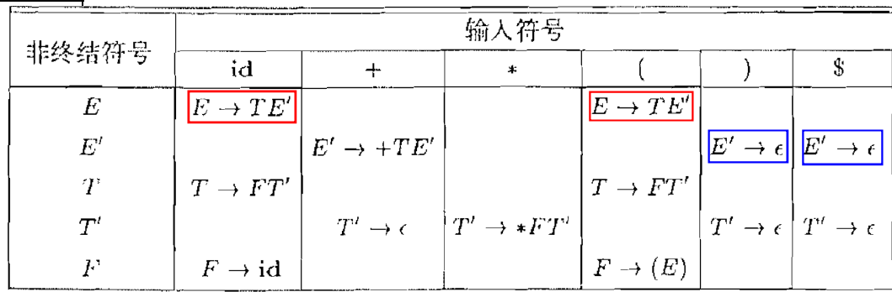

$$
\begin{array}{l}
   First从左侧开始找 \\
   First(F) = \{(,id\} \\
   First(T') = \{*,\epsilon\} \\
   First(T) = \{(,id\} \\
   First(E) = \{(,id\} \\
   First(E') =  \{+ , \epsilon\} \\
   Follow从右侧开始找 \\
   Follow(E) = \{), \$\} \\
   Follow(E') = \{), \$\} \\
   Follow(T) = \{+, ), \$\} \\
   Follow(T') = \{+, ), \$\} \\
   Follow(F) = \{+, ∗, ), \$\} \\
\end{array}
$$

### 4.13.8. 提取左公因子
> 包含左公因子
$$
\begin{array}{l}
   S \rightarrow iEtS|iEtSeS|a \\
   E \rightarrow b
\end{array}
$$

> 提取左公因子
$$
\begin{array}{l}
   S \rightarrow iEtSS'|a \\
   S' \rightarrow eS|\epsilon \\
   E \rightarrow b \\
\end{array}
$$

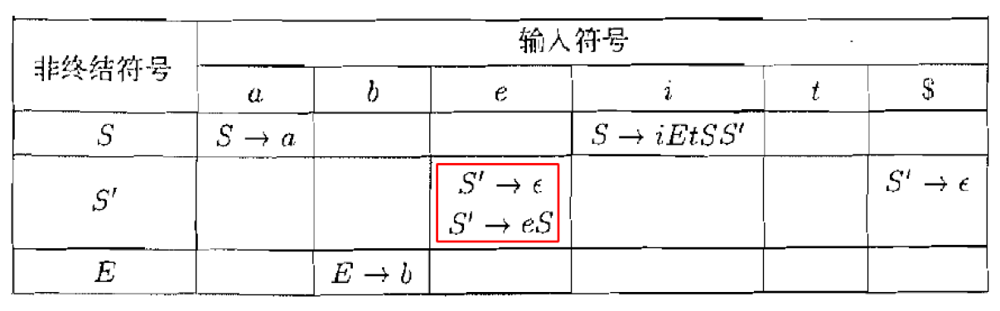

> 解决二义性(人为解决): 选择$S' \rightarrow eS$, 将else与前面最近的then关联起来

### 4.13.9. $符号的必要性

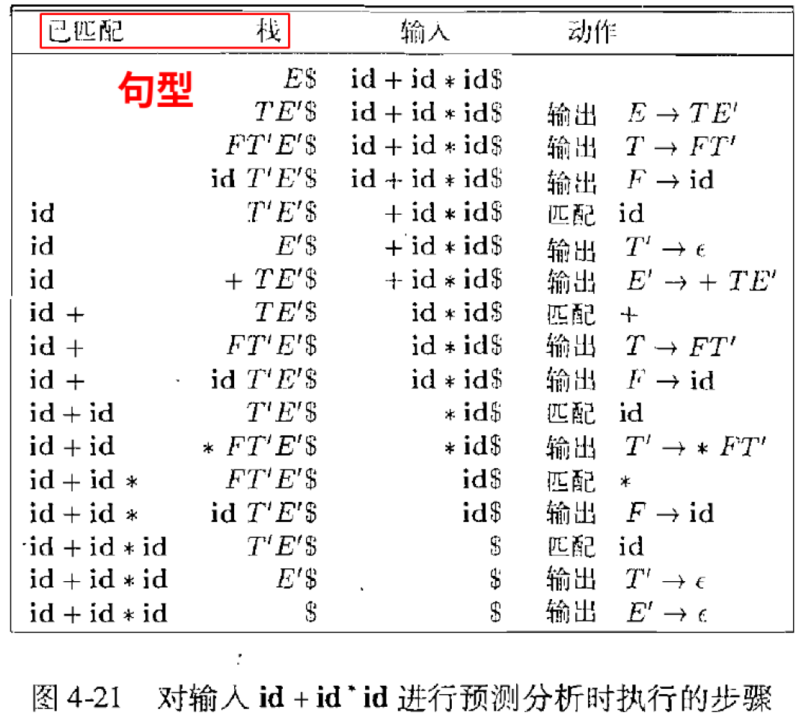

# 5. LR(1)(LR(0))语法分析器
1. 自顶向下的、不断归约的、基于句柄识别自动机的、适用于LR(∗) 文法的、LR(∗) 语法分析器
2. 只考虑无二义性的文法

## 5.1. 构建语法树过程
1. **自底向上**构建语法分析树
2. **根节点**是文法的起始符号$S$
3. 每个中间非终结符节点表示**使用它的某条产生式进行归约**
4. **叶节点**是词法单元$w\$$
5. 仅包含终结符号与特殊的**文件结束符$**

## 5.2. 自顶向下的"推导"与自底向上的"归约"
$$
E \xRightarrow[rm]{} T \xRightarrow[rm]{} T * F \xRightarrow[rm]{} T * id \xRightarrow[rm]{} F * id \xRightarrow[rm]{} id * id
$$

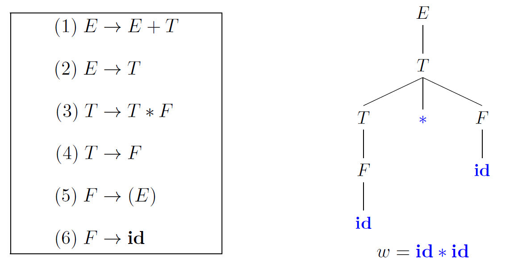

$$
E \Leftarrow T \Leftarrow T * F \Leftarrow T * id \Leftarrow F * id \Leftarrow id * id
$$

> 第一个生成式的左侧是开始符号

## 5.3. 推导与归约
1. 从**产生式**的角度看，是**推导**：$A \rightarrow \alpha$
2. 从**输入**的角度看，是**规约**：$A \leftarrow \alpha$

$$
\begin{array}{l}
   A \triangleq \gamma_{0} \Rightarrow ... \gamma_{i-1} \Rightarrow \gamma_i \Rightarrow \gamma_{r+1} \Rightarrow ... \Rightarrow r_n = w \\
   A \triangleq \gamma_{0} \Leftarrow ... \gamma_{i-1} \Leftarrow \gamma_i \Leftarrow \gamma_{r+1} \Leftarrow ... \Leftarrow r_n = w \\
\end{array}
$$

3. 自底向上语法分析器为输入构造**反向推导**

## 5.4. LR(∗)语法分析器
1. L:**从左向右**(left-to-right) 扫描输入
2. R:构建**反向**(reverse)**最右**(leftmost)推导

3. 在最右推导中, 最左叶节点最后才被处理
4. 在反向最右推导中, 最左叶节点最先被处理(与从左到右扫描一致)

### 5.4.1. LR语法分析器的状态
1. 在任意时刻, 语法分析树的**上边缘**与**剩余的输入**构成当前句型，也就是LR语法分析器的状态。

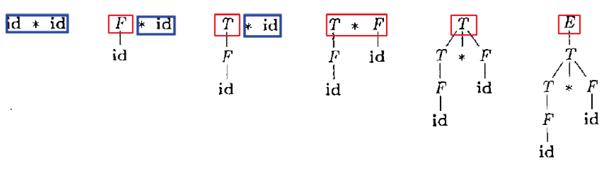

$$
E \Leftarrow T \Leftarrow T * F \Leftarrow T * id \Leftarrow F * id \Leftarrow id * id
$$

2. LR语法分析器使用**栈**存储语法分析树的**上边缘**

### 5.4.2. 栈上操作
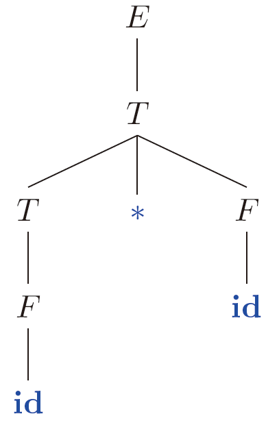

> 栈操作如下图所示：标号不是状态，仅表示顺序

| 时间序号 | 0   | 1   | 2   | 3   | 4   | 5   | 6   | 7   | 8   | 9   | 10  | 11  | 12  | 13  |
| -------- | --- | --- | --- | --- | --- | --- | --- | --- | --- | --- | --- | --- | --- | --- |
| 栈顶     |     |     |     |     |     |     |     | id  |     | F   |     |     |     |     |
|          |     |     |     |     |     |     | *   | *   | *   | *   |     |     |     |     |
| 栈底     |     | id  |     | F   |     | T   | T   | T   | T   | T   |     | T   |     | E   |

1. 两大操作: **移入输入符号**与**按产生式归约**
2. 直到栈中仅剩开始符号S, 且输入已结束, 则成功停止

## 5.5. 基于栈的LR语法分析器
1. Q1:何时归约? (何时移入?)：要么是移入要么是归约。
2. Q2:按哪条产生式进行归约?


1. 为什么第二个F以 T ∗ F 整体被归约为T?这与**栈**的当前状态T ∗ F相关

### 5.5.1. LR分析表指导LR语法分析器
|                      |                      |
| -------------------- | -------------------- |
| 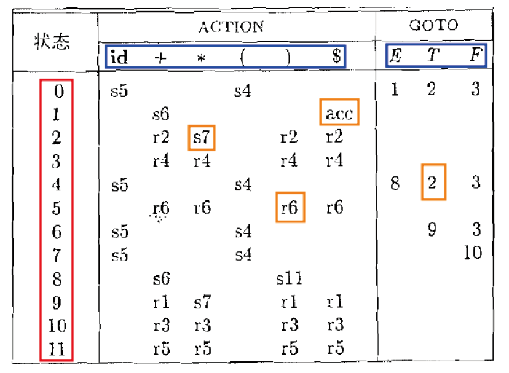 | 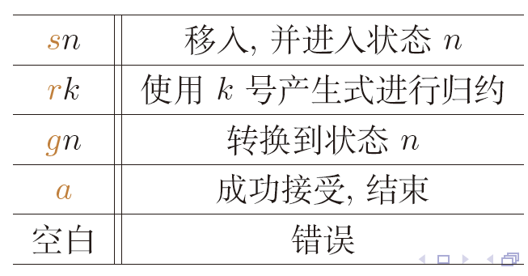 |

1. 在**当前状态(编号)**下, 面对**当前文法符号**时, 该采取什么**动作**
2. **ACTION**表指明动作, **GOTO**表仅用于归约时的状态转换
3. LR(0)、SLR(1)、LR(1)、LALR(1)的分析表会略有差异，加强规则会使其可以处理更多的文法。

### 5.5.2. Definition (LR(0)文法)
1. 如果文法G的**LR(0)分析表**是**无冲突**的, 则G是LR(0)文法。
2. **无冲突**: ACTION表中每个单元格最多只有一种动作


3. **两类可能的冲突**: "移入/归约" 冲突、"归约/归约" 冲突

### 5.5.3. 再次板书演示"栈" 上操作: 移入与规约
|                      |                      |
| -------------------- | -------------------- |
| 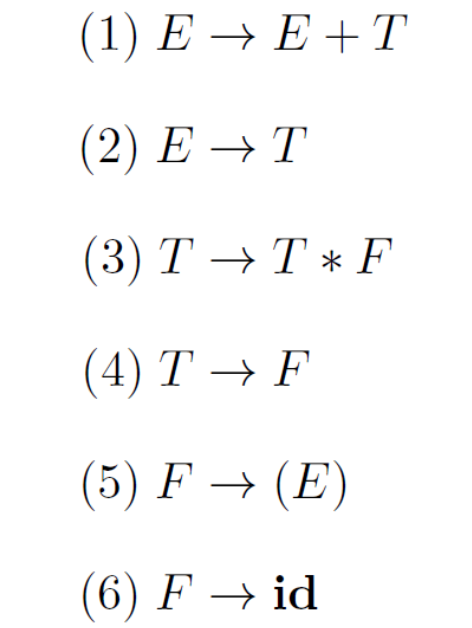 |  |

> 1. 状态只和栈之中的元素有关，如果弹出了，则重置状态为当前栈内状态，上面的序号只表示顺序，当前栈的状态，如()所示。
> 2. 在5时刻遇到了$符号，进行操作

| 时间序号 | 0   | 1   | 2   | 3   | 4   | 5   | 6   | 7   | 8   | 9   | 10  | 11  | 12  | 13  |
| -------- | --- | --- | --- | --- | --- | --- | --- | --- | --- | --- | --- | --- | --- | --- |
| 状态     | 0   | 5   | 0   | 3   | 0   | 2   | 7   | 5   | 7   | 10  | 0   | 2   | 0   | 1   |
| 栈顶     |     |     |     |     |     |     |     | id  |     | F   |     |     |     |     |
|          |     |     |     |     |     |     | *   | *   | *   | *   |     |     |     |     |
| 栈底     |     | id  |     | F   |     | T   | T   | T   | T   | T   |     | T   |     | E   |

- $w = id * id\$$
- 栈中存储语法分析器的状态(编号), "编码"了语法分析树的上边缘


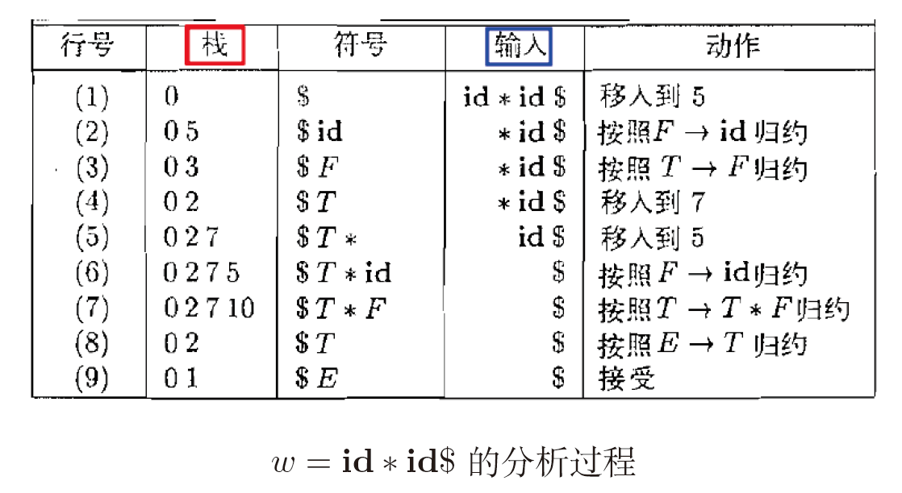

## 5.6. 如何构造LR分析表?


1. LR(0)分析表指导LR(0)语法分析器
2. 在**当前状态(编号)**下, 面对**当前文法符号**时,该采取什么动作

### 5.6.1. 状态是什么? 如何跟踪状态?


1. 状态是语法分析树的上边缘, 存储在栈中
2. 可以用**自动机**跟踪状态变化(**自动机中的路径 $\Leftrightarrow$栈中符号/状态编号**)

### 5.6.2. 何时归约? 使用哪条产生式进行归约?


1. **必要条件**: 当前状态中, 已观察到**某个产生式的完整右部**
2. 对于LR(0) 文法, 这是当前**唯一**的选择

### 5.6.3. Definition(句柄(Handle))
> 在输入串的(唯一)反向最右推导中, **如果**下一步是逆用产生式$A \rightarrow \alpha$将$\alpha$规约为$A$, 则称$\alpha$是**当前句型的句柄**。

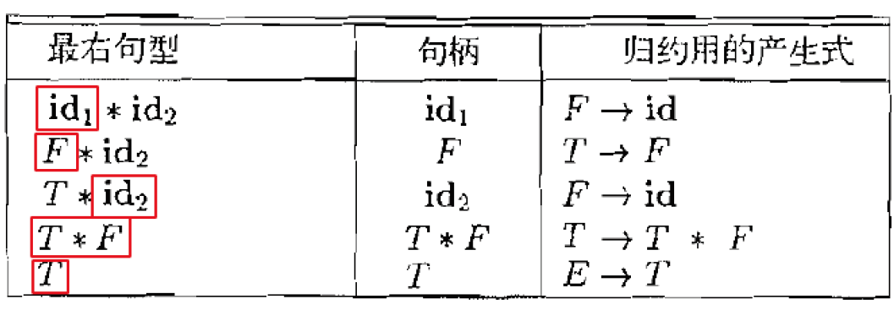

2. LR语法分析器的关键就是高效**寻找每个归约步骤所使用的句柄**。

### 5.6.4. 句柄可能在哪里？
> Theorem：**存在**一种LR语法分析方法，保证句柄总是出现在栈顶

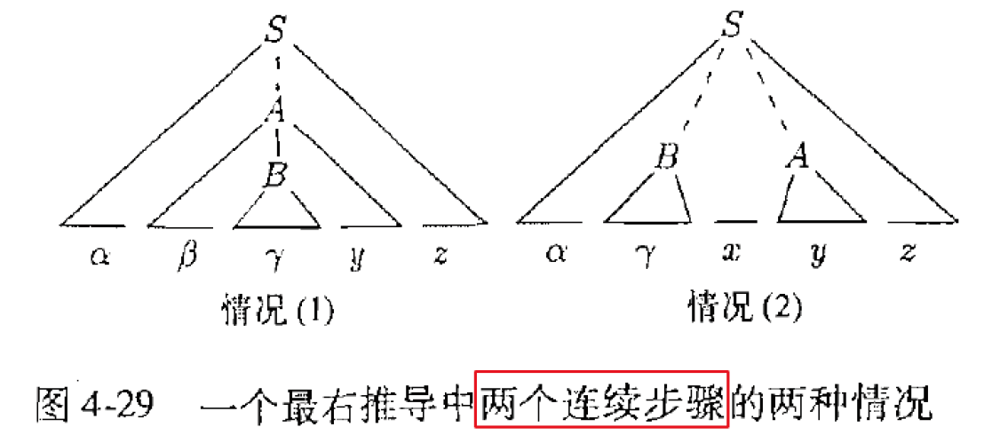


1. 句柄出现在栈顶极大程度上方便了我们进行分析。

$$
\begin{array}{l}
   S \xRightarrow[rm]{*} \alpha Az  \xRightarrow[rm]{*} \alpha\beta Byz  \xRightarrow[rm]{*} \alpha\beta\gamma yz \\
   S \xRightarrow[rm]{*} \alpha BxAz  \xRightarrow[rm]{*} \alpha Bxyz  \xRightarrow[rm]{*} \alpha\gamma xy \\
\end{array}
$$

2. 对于最右推导，任何推导都只有如上两次情况(注意是两次连续推导，也就是A是B的父亲(等价于B是A的父亲)或者A和B平级。情况2中的x必然为终结符(最右推导)，每次规约后我们都可以在栈顶找到终结符。
3. 可以用**自动机**跟踪状态变化(**自动机中的路径 $\Leftrightarrow$ 栈中符号/状态编号**)

> Theorem:**存在**一种LR语法分析方法, 保证**句柄总是出现在栈顶**。
3. 在自动机的当前状态识别可能的句柄(观察到的完整右部)(自动机的当前状态 $\Leftrightarrow$ 栈顶)
4. LR(0) 句柄识别有穷状态自动机(Handle-Finding Automaton)

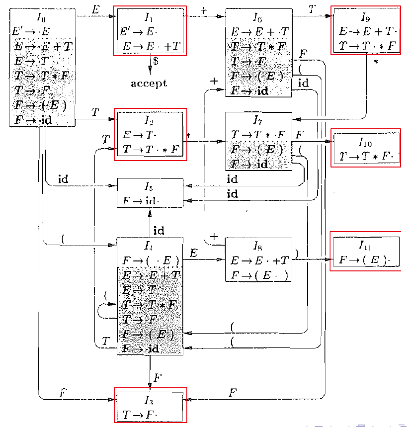

> 红色框出来的就是接受状态。

## 5.7. 状态刻画了"当前观察到的针对所有产生式的右部的前缀"

### 5.7.1. Definition (LR(0) 项(Item))
1. 一个文法G的一个**LR(0)项**是G的一个产生式再加上一个位于体部某处的**点**。

$$
\begin{array}{l}
   A \rightarrow XYZ \\
   [A \rightarrow ·XYZ] \\
   [A \rightarrow X·YZ]\\
   [A \rightarrow XY·Z] \\
   [A \rightarrow XYZ·] \\
\end{array}
$$

2. 产生式$A \rightarrow \epsilon$只有一个项$[A \rightarrow ·]$
3. **项**指明了语法分析器已经看到了一个产生式的哪些部分
4. **点**指示了栈顶, 左边(与路径) 是栈中内容, 右边是期望看到的文法符号

### 5.7.2. Definition (项集)
1. **项集**就是若干**项**构成的集合。
2. 因此, 句柄识别自动机的一个**状态**可以表示为一个**项集**

### 5.7.3. Definition (项集族)
1. **项集族**就是若干**项**集构成的集合。
2. 因此, 句柄识别自动机的**状态集**可以表示为一个**项集族**

### 5.7.4. 示例


### 5.7.5. Definition (增广文法(Augmented Grammar))
1. 文法G 的增广文法是在G 中加入产生式$S' \rightarrow S$得到的文法。
2. 目的: 告诉语法分析器何时停止分析并接受输入符号串
3. 当语法分析器面对$\$$且要使用$S' \rightarrow S$进行归约时, 输入符号串被接受
4. 注: 此"接受" (输入串) 非彼"接受" (句柄识别自动机)

## 5.8. LR(0) 句柄识别自动机
1. 初始状态是什么?
2. 状态之间如何转移?

### 5.8.1. 初始状态
1. **点**指示了**栈顶**, 左边(与路径) 是栈中内容, 右边是期望看到的文法符号
2. $S' \rightarrow S$是增广语法添加的。
3. 红色部分：$S' \rightarrow ·S$中的点表示栈顶，整句话表示栈是空的，我们找到E。
4. 黑色部分：通过迭代的方式在其中添加栈顶的位置，然后计算闭包得到。

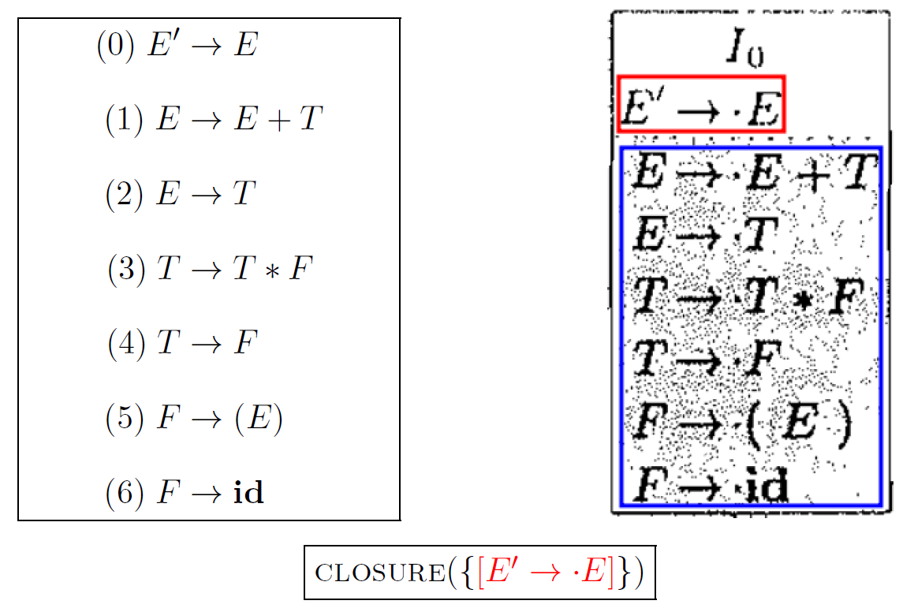

### 5.8.2. 构造LR(0)句柄识别自动机的构造过程


> 只有红色框中的状态为接受状态，$I_5$状态也是接受状态

1. 闭包等于自身，则终止，比如左上角接受状态，那么如果当前为E，则移动一下栈顶得到结果
2. 对于(会首先遇到一个非终结符，那么需要展开对应非终结符以获取闭包)
3. 然后对每一个状态进行递归：箭头上是看到的符号(下一个符号)，找到产生式右侧中包含的项。
4. 伪代码描述如下图：

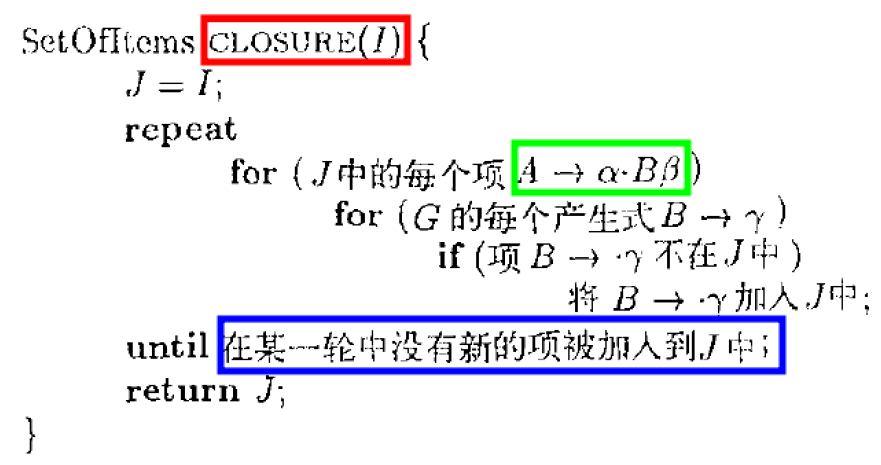

$$
\begin{array}{l}
   J = GOTO(I, X) = CLOSURE(\{[A \rightarrow \alpha X ·\beta ] | [A \rightarrow · X \beta] \in I \}) \\
   (X \in N \cup T \cup \{\$\})\\
\end{array}
$$

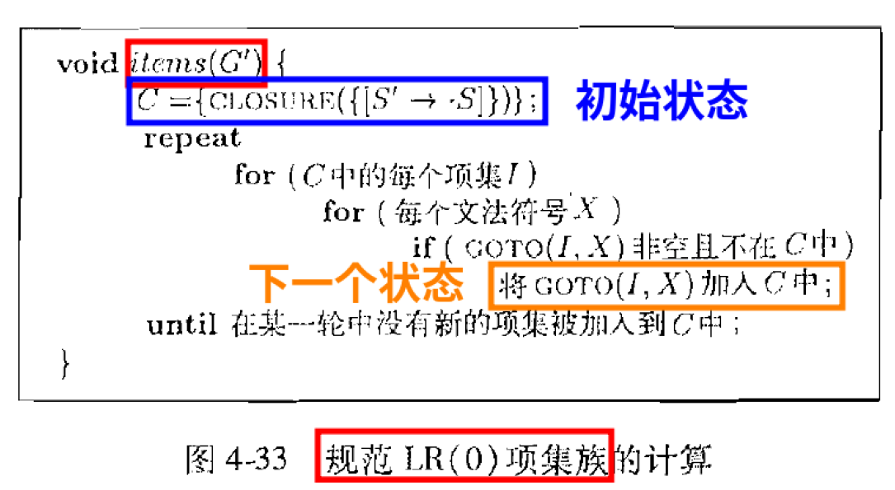

> C表示的是所有的状态的集合。

接受状态$F = \{I \in C | \exist k.[k:A \rightarrow \alpha ·] \in I\}$

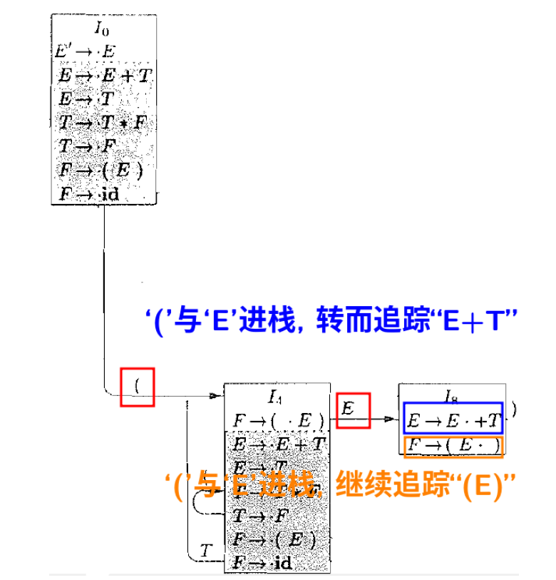

> **点**指示了**栈顶**，左边(与路径)是栈中内容，右边是期望看到的文法符号串

### 5.8.3. LR(0)分析表
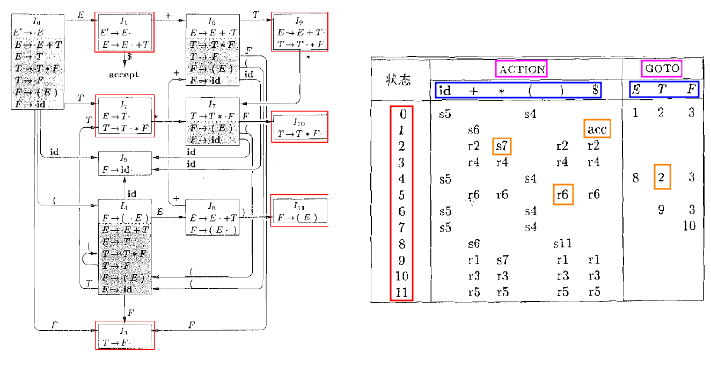

1. GOTO函数被拆分成ACTION表(针对终结符)与GOTO表(针对非终结符)

> 终结符，转换状态(s)：$(1) GOTO(I_i, a) = I_j \wedge a \in T \Rightarrow ACTION[i, a] \leftarrow sj$

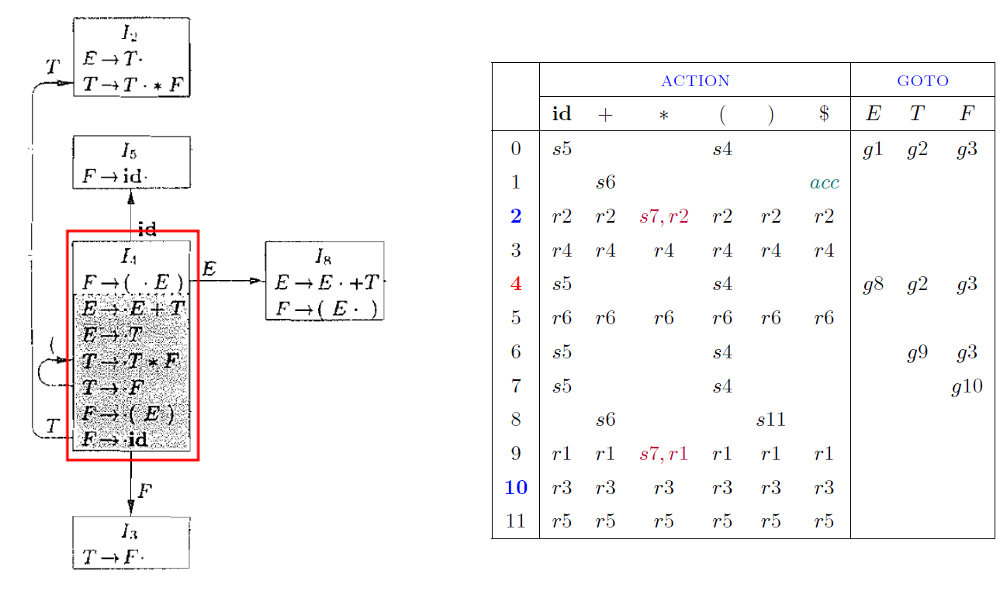

> 非终结符，调整状态(goto)：$(2) GOTO(I_i, A) = I_j \wedge A \in N \Rightarrow ACTION[i, A] \leftarrow gj$

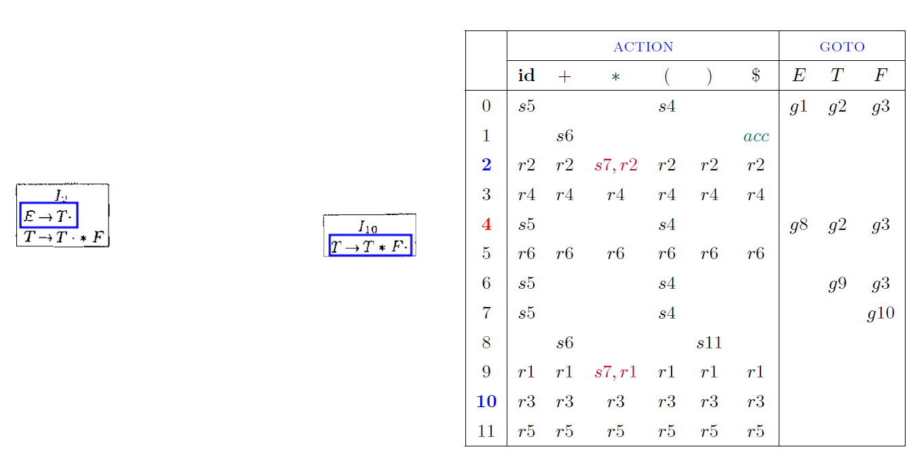

> $(3) [k:A \rightarrow \alpha·] \in I_i \wedge A \neq S' \Rightarrow \forall t \in T \cup {\$}. ACTION[i, t] = rk$，假设产生式编号为k，并且不是S'开头的

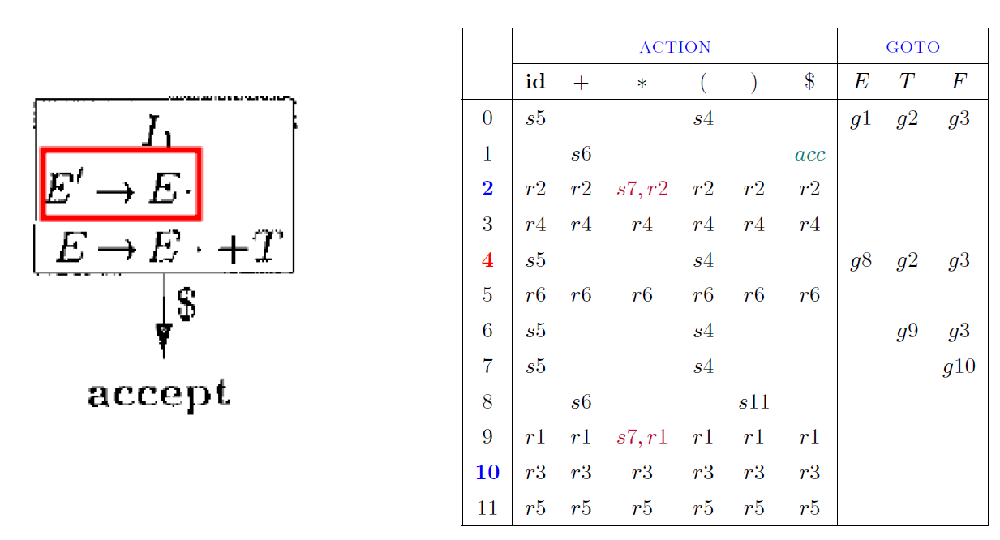

> $(4) [S' \rightarrow S·] \in I_i \Rightarrow ACTION[i, \$] \leftarrow acc$
> 接受不等于自动机中的接受状态，判断输入是否可以被接受。

### 5.8.4. LR(0)分析表构造规则
$$
\begin{array}{l}
   (1) & GOTO(I_i, a) = I_j \wedge a \in T \Rightarrow ACTION[i, a] \leftarrow sj \\
   (2) & GOTO(I_i, A) = I_j \wedge A \in N \Rightarrow ACTION[i, A] \leftarrow gj \\
   (3) & [k:A \rightarrow \alpha·] \in I_i \wedge A \neq S' \Rightarrow \forall t \in T \cup {\$}. ACTION[i, t] = rk \\
   (4) & [S' \rightarrow S·] \in I_i \Rightarrow ACTION[i, \$] \leftarrow acc \\
\end{array}
$$

### 5.8.5. Definition (LR(0) 文法)
1. 如果文法G的**LR(0)分析表**是**无冲突**的, 则G是LR(0) 文法。

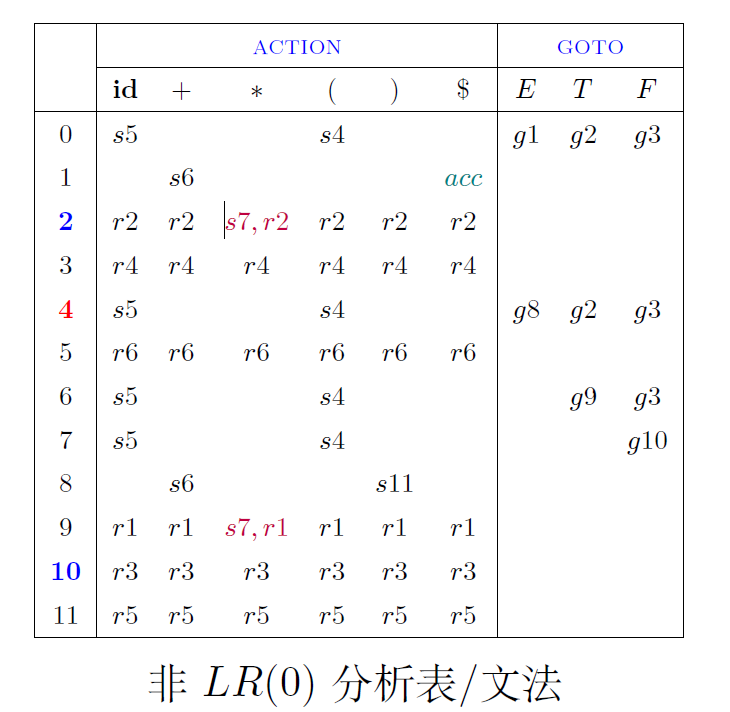

2. LR(0)分析表每一行(状态)**所选用的归约产生式是相同的**

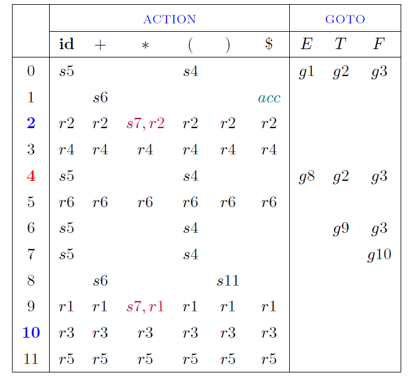

3. **归约**时不需要向前看, 这就是**0**的含义

## 5.9. LR(0) 语法分析器
1. L:**从左向右**(Left-to-right) 扫描输入
2. R:构建**反向**(Reverse)**最右推导**
3. 0:**归约**时无需向前看
4. LR(0) 自动机与栈之间的互动关系
   1. 向前走 $\Leftrightarrow$ 移入
   2. 回溯 $\Leftrightarrow$ 归约
5. **自动机才是本质, 栈是实现方式**，用栈记住"来时的路", 以便回溯

## 5.10. SLR(1)分析表
> 1. 规约:$(3) [k:A \rightarrow \alpha·] \in I_i \wedge A \neq S' \Rightarrow \forall t \in Follow(A) \cup {\$}. ACTION[i, t] = rk$，要规约就是我们发现了完整的右部($A \rightarrow \alpha$，并且当前符号为$t$)，如果t不在Follow(A)中，那么不可能有一个句型包含t。
> 2. 处理的时候还是要看一下当前的符号来判断是否需要规约，根据当前的分析，我们可以发现下图中的被圈起来的s7是不必要的。

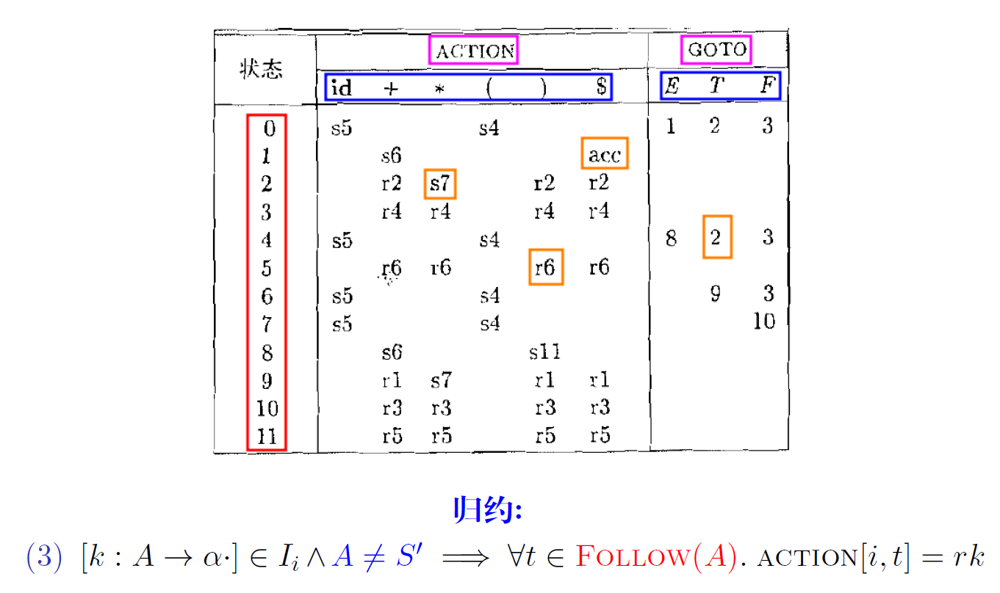


## 5.11. Definition (SLR(1)文法)
1. 如果文法G 的SLR(1) 分析表是无冲突的, 则G是SLR(1) 文法。

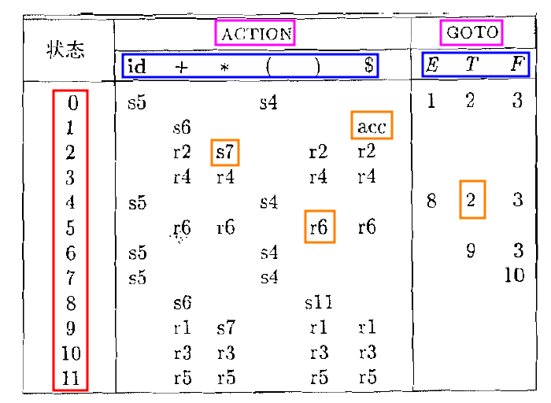

2. **无冲突**: action 表中每个单元格最多只有一种动作
3. **两类可能的冲突**: "移入/归约" 冲突、"归约/归约" 冲突

## 5.12. 非SLR(1)文法举例
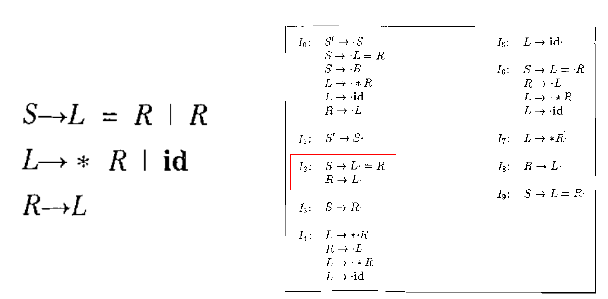

$$
\begin{array}{l}
   [S \rightarrow L·=R] \in I_2 \Rightarrow ACTION(I_2, =) \leftarrow s6 \\
   \\
   = \in Follow(R) \Rightarrow ACTION(I_2, =) \leftarrow L_5
\end{array}
$$

1. 即使考虑$= \in Follow(A)$, 对该文法来说仍然不够，这个仅仅意味有一个句型满足推导出原式子，但不是所有句型都满足原式子。
2. 该文法没有以`R=···`开头的最右句型

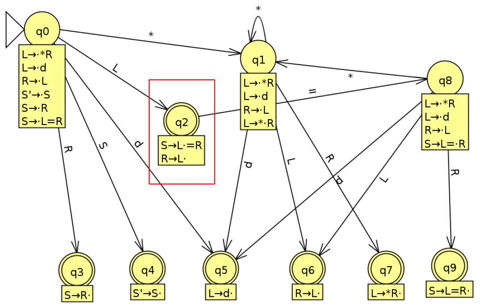

> 符号是不一定一致的，仅供参考。

1. 希望LR语法分析器的每个状态能**尽可能精确**地指明**哪些输入符号可以跟在句柄$A \rightarrow \alpha$的后面**
2. 在LR(0) 自动机中, 某个项集$I_j$中包含$[A \rightarrow α·]$，则在之前的某个项集$I_i$中包含$[B \rightarrow \beta · A\gamma]$，只有这样子才是可以的。
3. 解决方案：这表明只有$a \in First(\gamma)$时, 才可以进行$A \rightarrow \alpha$归约，$t \in Follow(A)$，并且是包含$t \in First(\gamma)$，后者条件更强。
4. 但是, 对$I_i$求闭包时, 仅得到$[A \rightarrow ·\alpha]$, 丢失了$First(\gamma)$信息，这个就是LR(0)的问题，接下来的目标就是保留下$\gamma$的信息。

## 5.13. Definition (LR(1) 项(Item))
1. $[A \rightarrow \alpha·\beta, a] (a \in T \cup {\$})$，此处, a是向前看符号, 数量为1，使用a来记住$\gamma$
2. 思想: $\alpha$在栈顶, 且输入中开头的是可以从$\beta\alpha$推导出的符号串

## 5.14. LR(1)句柄识别自动机
> $[A \rightarrow \alpha · B \beta, a] \in I (a \in T \cup \{\$\})$

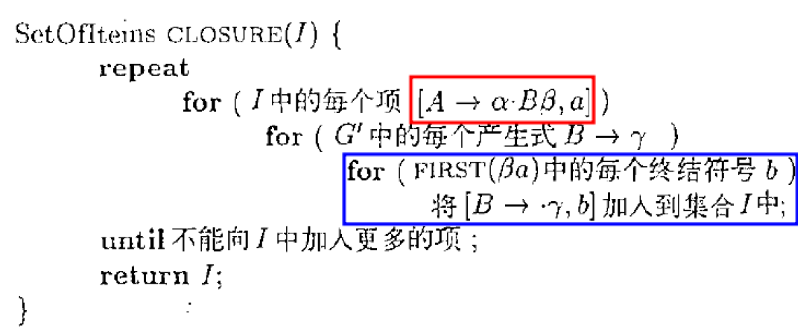

> $\forall b \in First(\beta a).[B \rightarrow ·\gamma, b] \in I$

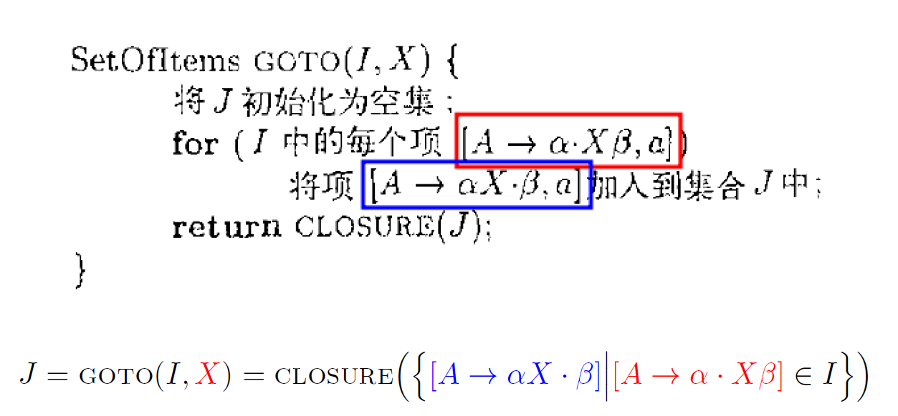

> $J = GOTO(I, X) = CLOSURE(\{[A \rightarrow \alpha X ·\beta]|[A \rightarrow \alpha · X \beta] \in I\}) (X \in N \cup T)$

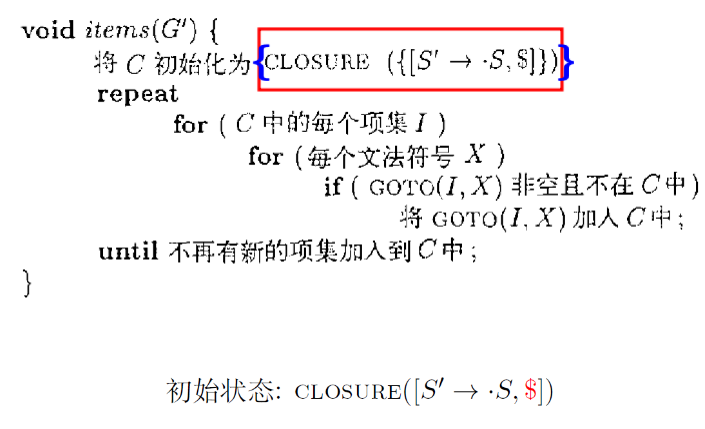

## 5.15. LR(1)自动机的构造过程
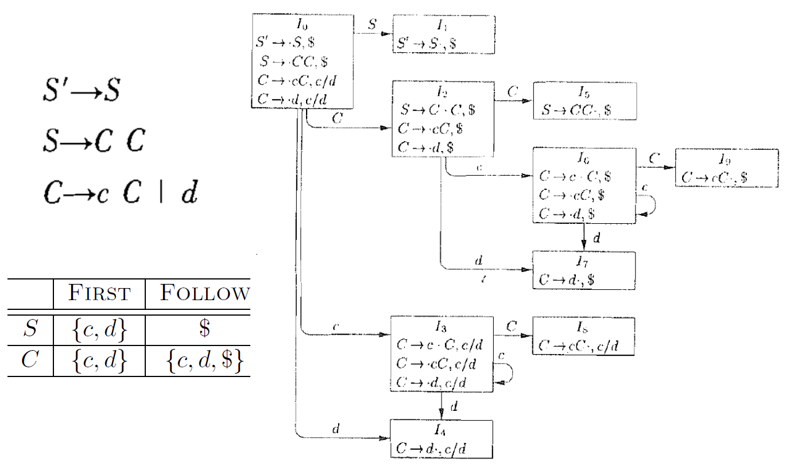

## 5.16. LR(1) 自动机构建LR(1) 分析表
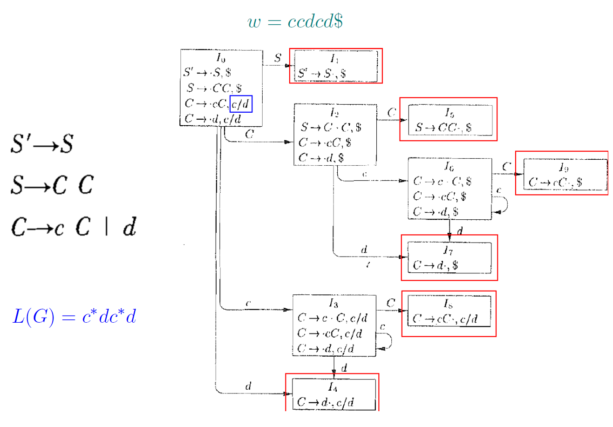

## 5.17. Definition (LR(1) 文法)
1. 如果文法G 的LR(1) 分析表是无冲突的, 则G 是LR(1) 文法。

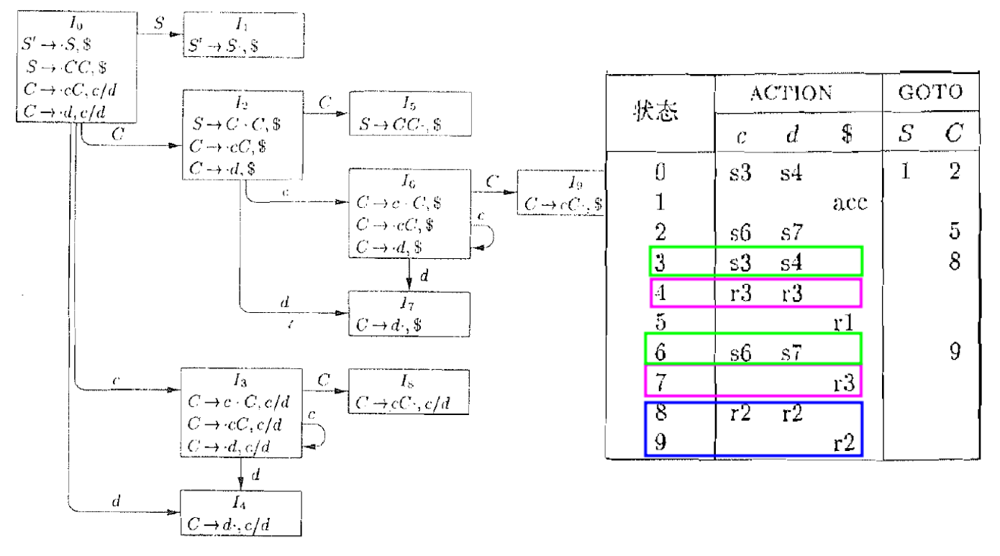

2. LR(1) 通过不同的向前看符号, 区分了状态对(3, 6), (4, 7) 与(8, 9)

## 5.18. LR(0)、SLR(1)、LR(1) 的归约条件
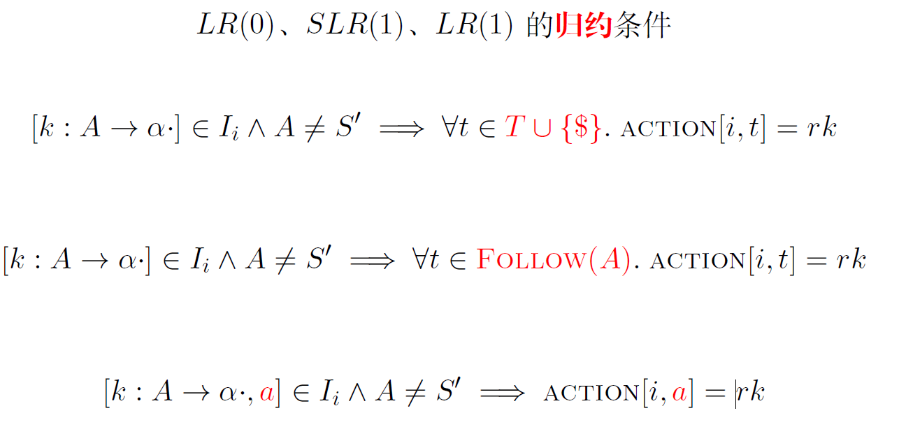

## 5.19. LR(1) 虽然强大, 但是生成的LR(1) 分析表可能过大, 状态过多
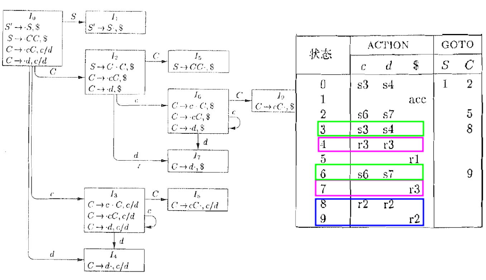

> LALR(1) : 合并具有相同核心LR(0)项的状态(忽略不同的向前看符号)

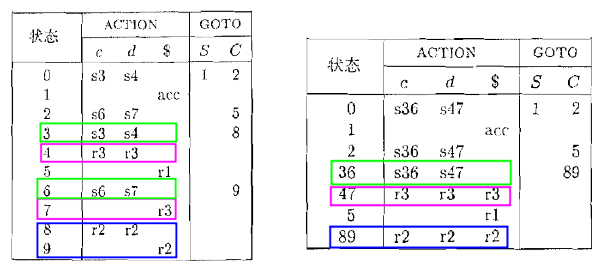

1. Q:goto 函数怎么办?
2. A:可以合并的状态的goto 目标(状态) 一定也是可以合并的
3. Q : 对于LR(1) 文法, 合并得到的LALR(1) 分析表是否会引入冲突?
4. Theorem:LALR(1) 分析表不会引入移入/归约冲突。
5. 反证法
   1. 假设合并后出现[A → α·, a] 与[B → β · aγ, b]，则在LR(1) 自动机中,存在某状态同时包含[A → α·, a] 与[B → β · aγ, c]
6. Q : 对于LR(1) 文法, 合并得到的LALR(1) 分析表是否会引入冲突?
7. Theorem：LALR(1) 分析表可能会引入归约/归约冲突。

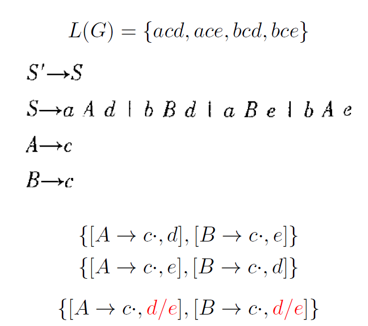

8. 好消息: 善用LR 语法分析器, 处理二义性文法

## 5.20. 表达式文法
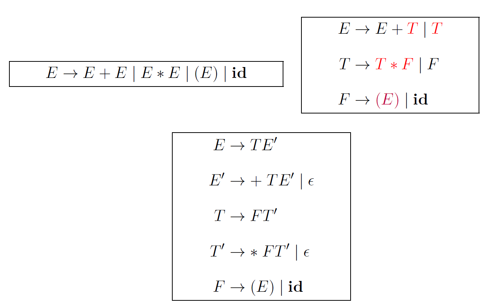

### 5.20.1. 使用SLR(1) 语法分析方法
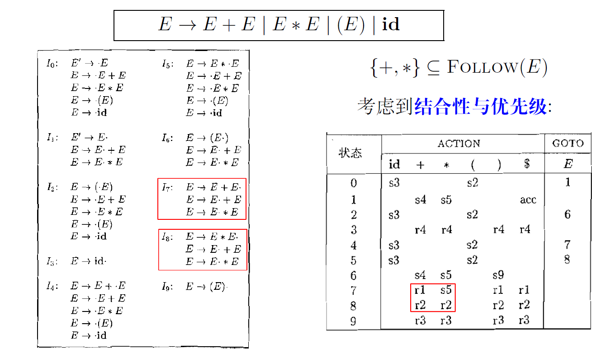

### 5.20.2. 条件语句文法
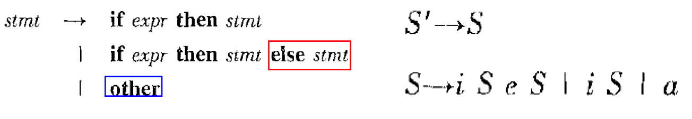

### 5.20.3. 条件语句文法: 使用SLR(1) 语法分析方法
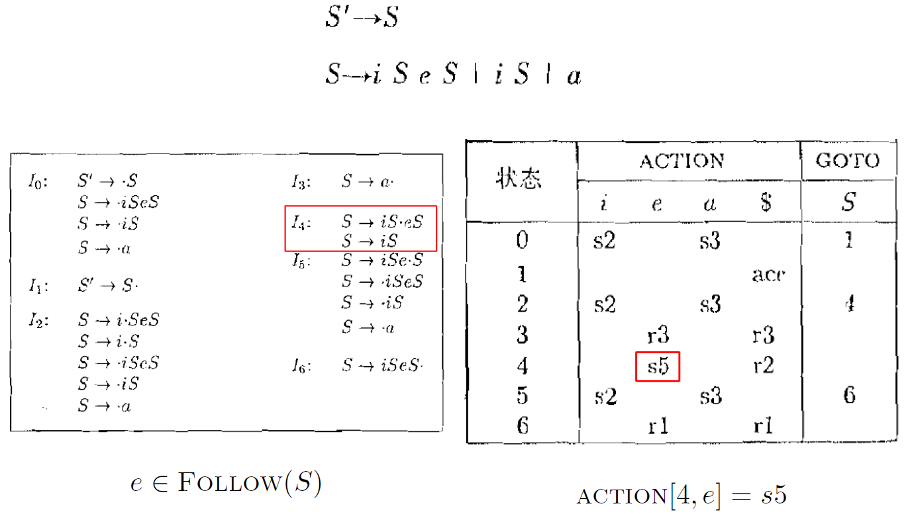
