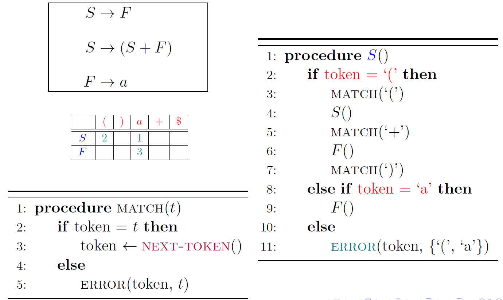
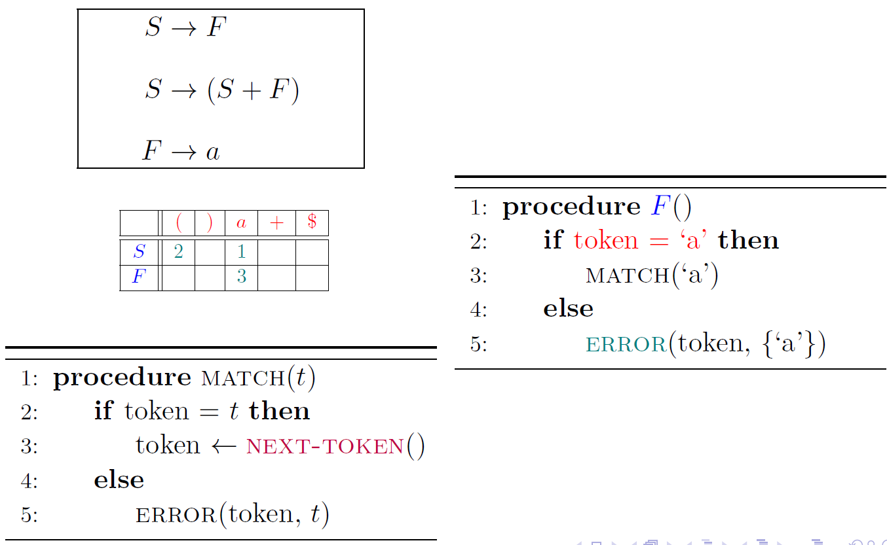

Lecture3-Parser
---

1. **输入**:程序文本/字符串s & **词法单元(token) 的规约**

2. **输出**:词法单元流

# 1. 语法分析举例

# 2. 语法分析阶段的主题

## 2.1. 上下文无关文法

1. 我们需要递归来提升我们语言的能力。

## 2.2. 构建语法分析树

1. 自顶向上构造：比较符合直观，但是能力有限
2. 自底向下构造：Knuth算法

## 2.3. 错误恢复
1. 报错
2. **恢复**：现在的程序是比较大的，如果直接停止编译则导致有多少错误就需要编译多少次，不合适。
3. 继续分析

# 3. 上下文无关文法(CFG, Context-Free Grammer, 上下文无关文法)
> LL(1)可以完成手写分析器，LR(1)可以更不容易出现细节问题，Bison公式是本实验使用的工具。

## 3.1. 上下文无关文法(CFG)定义
1. 上下文无关文法$G$是一个四元组$G=(T,N,P,S)$:
2. T是**终结符号 Terminal**集合, 对应于词法分析器产生的词法单元;
3. N是**非终结符号 Non-terminal**集合;
4. P是**产生式 Production**集合;

$$
A \in N \rightarrow \alpha \in (T \cup N)*
$$

- 头部/左部(Head)$A$: **单个**非终结符，必须只有一个，这就是为什么我们称其为上下文无关文法，如果有多个则不符合上下文无关文法，会被成为上下文有关文法，但是几乎无法处理。
- 体部/右部(Body)$\alpha$: 终结符与非终结符构成的串, 也可以是空串$\epsilon$
5. S为开始(Start)符号。要求$S \in N$且唯一。

### 3.1.1. 上下文无关文法示例
1. 一个符号要么是终结符号，要么是非终结符号
2. 终结符号表示到此为止，无法再进行替换

$$
G = (\{S\}, \{(, )\}, P, S) \\
S \rightarrow SS \\
S \rightarrow (S) \\
S \rightarrow () \\
$$

> 任意嵌套的所有匹配好的括号串

$$
G = (\{S\}, \{a, b\}, P, S) \\
S \rightarrow aSb \\
S \rightarrow \epsilon \\
$$

> 可以有很多的情况

### 3.1.2. **条件语句**文法
1. **悬空(Dangling)-else**文法
2. 这样的文法是有问题，我们进一步分析才可以，other作为终结符。

### 3.1.3. 约定

3. **约定**: 如果没有明确指定, 第一个产生式的头部就是开始符号，用来避免写如上例子中的一些描述

### 3.1.4. 关于终结符号的约定
> 下述符号是终结符号:(通常的约定)

1. 在字母表里排在前面的小写字母，比如a、b、c。
2. 运算符号，比如+、*等。
3. 标点符号，比如括号、逗号等。
4. 数字0、1、.... 9。
5. **黑体字符串**，比如id或if。每个这样的字符串表示一个终结符号。
  
### 3.1.5. 关于**非终结符号**的约定
> 下述符号是非终结符号:

1. 在字母表中排在前面的大写字母，比如A、B、C。
2. **字母S**。它出现时通常表示开始符号。
3. 小写、斜体的名字，比如expr或stmt.

## 3.2. 语义
1. 上下文无关文法$G$定义了一个语言$L(G)$
2. 语言是**串**的集合
3. 串从何来?

## 3.3. 推导(Derivation)的定义

### 3.3.1. 表达式文法
$$
E \rightarrow -E|E + E | E ∗ E | (E) | id
$$

1. 推导即是将某个产生式的左边**替换**成它的右边
2. 每一步推导需要选择替换**哪个非终结符号**，以及使用**哪个产生式**

$$
E \Rightarrow -E \Rightarrow −(E) \Rightarrow −(E+E) \Rightarrow −(id+E) \Rightarrow −(id+id)
$$

$$
E \Rightarrow −E : 经过一步推导得出 \\
E \xRightarrow{+} −(id + E):经过一步或多步推导得出 \\
E \xRightarrow{*} −(id +E):经过零步或多步推导得出 \\
$$

$$
E \Rightarrow -E \Rightarrow −(E) \Rightarrow −(E+E) \Rightarrow −(E+id) \Rightarrow −(id+id)
$$

### 3.3.2. Definition (Sentential Form;句型)
如果$S \xRightarrow{*} \alpha$，且$\alpha \in ( T \cup N)^*$，则称$\alpha$是文法G的一个句型(包含非终结符)

$$
E \rightarrow -E | E + E | E ∗ E | (E) | id \\
E \Rightarrow -E \Rightarrow −(E) \Rightarrow −(E+E) \Rightarrow −(id+E) \Rightarrow −(id+id)
$$

### 3.3.3. Definition (Sentence; 句子)
1. 如果$S \xRightarrow{*} w$，且$w \in T^*$，则称w是文法G的一个**句子**(没有非终结符了)
2. 句子就是这个语言中的串

## 3.4. Definition (文法G生成的语言L(G))
文法F的**语言**L(G)是它能推导出的**所有句子**构成的集合。

$$
w \in L(G) \Leftrightarrow S \xRightarrow{*} w
$$

## 3.5. 关于文法G的两个基本问题
1. Membership问题:给定字符串$x \in T^*, x \in L(G)$？字符串可不可以由文法推理得到
2. L(G)究竟是什么？

### 3.5.1. 问题一:Membership问题
1. 给定字符串$x \in T^*, x \in L(G)$，(即检查x是否符合文法G)
2. 这就是**语法分析器**的任务:为输入的词法单元流寻找推导、**构建语法分析树**, 或者报错

1. 根节点是文法G的起始符号
2. 叶子节点是输入的词法单元流
3. 常用的语法分析器以**自顶向下**或**自底向上**的方式构建中间部分

### 3.5.2. 问题二:L(G) 是什么?
1. 这是程序设计语言设计者需要考虑的问题

#### 3.5.2.1. 根据文法G推导语言L(G)
1. 例子一：
$$
S \rightarrow SS \\
S \rightarrow (S) \\
S \rightarrow () \\
S \rightarrow \epsilon \\
L(G) = \{良匹配括号串\} \\
$$

2. 例子二：
$$
S \rightarrow aSb \\
S \rightarrow \epsilon \\
L(G) = {a^nb^n|n \geq 0 } \\
$$

#### 3.5.2.2. 根据语言L(G)来推导文法G
1. 目标生成：字母表$\sum = {a, b}$上的所有**回文串**(Palindrome)构成的语言

$$
S \rightarrow aSa \\
S \rightarrow bSb \\
S \rightarrow a \\
S \rightarrow b \\
S \rightarrow ϵ \\
S \rightarrow aSa|bSb|a|b|\epsilon \\
$$

2. 目标生成：${b^na^mb^{2n}|n \geq 0, m \geq 0}$
$$
S \rightarrow bSbb|A \\
A \rightarrow aA|\epsilon \\
$$

3. 目标生成：$\{x\in \{a, b\}^* | x 中a,b个数相同 \}$
   1. 证明：a可以是空串
   2. 证明：a以a开头，那么后面肯定能找到**一个**b保证被分为了aVbV并且V中的ab数量均相同，以b开头类似。

$$
V \rightarrow aVbV | bVaV | \epsilon \\
$$

4. 目标生成：$\{x\in \{a, b\}^* | x 中a,b个数不同 \}$
   1. T表示a多一个或者更多
   2. U表示b多一个或者更多
   3. UT不能同时出现，和V去组合即可
   4. 证明(TODO)

$$
S \rightarrow T | U \\
T \rightarrow VaT |VaV \\
U \rightarrow VbU | VbV \\
V \rightarrow aVbV | bVaV | \epsilon \\
$$

## 3.6. 顺序语句、条件语句、打印语句

- 上图中的L是顺序语句

## 3.7. L-System(不考)
> <a href = "https://en.wikipedia.org/wiki/L-system">L-System</a>:这不是上下文无关文法, 但精神高度一致

$$
variables: A B \\
constants: + - \\
start: A \\
rules:(A \rightarrow B-A-B),(B \rightarrow A+B+A) \\
angles:60' \\
$$

1. $A,B$:向前移动并画线
2. +:左转
3. -:右转
4. 每一步都**并行地**应用**所有**规则

|                      |                      |
| -------------------- | -------------------- |
|  |  |

$$
variables: X Y
constants: F + -
start: FX
rules:(X \rightarrow X+YF+),(Y \rightarrow -FX-Y)
angles:90'
$$

1. $F$:向前移动并画线
2. +:右转
3. -:左转
4. X:仅用于展开，在作画时被忽略
5. 每一步都**并行地**应用**所有**规则

## 3.8. 最左(leftmost) 推导与最右(rightmost) 推导
$$
E \rightarrow E + E | E * E | (E) | id \\
E \xRightarrow[lm]{} -E \xRightarrow[lm]{} -(E) \xRightarrow[lm]{} -(E+E) \xRightarrow[lm]{} -(id + E) \xRightarrow[lm]{} -(id+id)
$$

1. $E \xRightarrow[lm]{} -E$:经过一步最左推导得出
2. $E \xRightarrow[lm]{+} -(id + E)$:经过一步或多步最左推导得出
3. $E \xRightarrow[lm]{*} -(id + E)$:经过零步或多步最左推导得出
4. 最左推导是有非终结符优先选择最左侧的进行推导
5. 最右推导是有非终结符有限选择最右侧的进行推导

$$
E \xRightarrow[rm]{} -E \xRightarrow[rm]{} -(E) \xRightarrow[rm]{} -(E+E) \xRightarrow[rm]{} -(E + id) \xRightarrow[rm]{} -(id+id)
$$

### 3.8.1. Definition (Left-sentential Form; 最左句型)
1. 如果$S \xRightarrow[lm]{*} \alpha$, 并且$\alpha \in (T \cup N)^*$，则称$\alpha$是文法G的一个**最左句型**。

$$
E \xRightarrow[lm]{} -E \xRightarrow[lm]{} -(E) \xRightarrow[lm]{} -(E+E) \xRightarrow[lm]{} -(id + E) \xRightarrow[lm]{} -(id+id)
$$

### 3.8.2. Definition (Right-sentential Form; 最右句型)
1. 如果$S \xRightarrow[rm]{*} \alpha$, 并且$\alpha \in (T \cup N)^*$，则称$\alpha$是文法G的一个**最右句型**。

$$
E \xRightarrow[rm]{} -E \xRightarrow[rm]{} -(E) \xRightarrow[rm]{} -(E+E) \xRightarrow[rm]{} -(id + E) \xRightarrow[rm]{} -(id+id)
$$

## 3.9. 语法分析树
1. 语法分析树是静态的, 它不关心动态的推导顺序

2. 一棵语法分析树对应多个推导
3. 但是, 一棵语法分析树与**最左(最右) 推导**一一对应

### 3.9.1. 二义性引入
4. 1 - 2 - 3的语法树的两种不同表达形式
5. 以下的两棵语法树是不同的，生成出来的目标代码也是不同的
6. 这个文法是有问题的，这个文法具有二义性，我们需要通过修改文法避开二义性问题。
7. 语法没有二义性的描述，L(G)本身只是一个串的集合。

### 3.9.2. Definition (**二义性**(Ambiguous) 文法)
1. 如果L(G) 中的**某个**句子有**一个以上**语法树/最左推导/最右推导,则文法G是二义性的。
2. 1 + 2 * 3的语法树

### 3.9.3. 悬空-else

## 3.10. 二义性文法
1. 不同的语法分析树产生不同的语义
2. 所有语法分析器都要求文法是无二义性的

3. Q:如何识别二义性文法?这是**不可判定**的问题，是指没有通用的算法，可以判断任意的文法G
4. Q:如何消除文法的二义性?

### 3.10.1. 消除文法二义性
1. 四则运算均是左结合的
2. **优先级**: 括号最先, 先乘除后加减
3. 二义性表达式文法以**相同的方式**处理所有的算术运算符
4. 要消除二义性, 需要**区别对待**不同的运算符
5.  将运算的“先后” 顺序信息编码到语法树的“层次” 结构中

$$
E \rightarrow E + E | id \\
$$

### 3.10.2. 左结合文法
$$
E \rightarrow E + T \\
T \rightarrow id \\
$$

### 3.10.3. 右结合文法
$$
E \rightarrow T + E \\
T \rightarrow id \\
$$

### 3.10.4. 使用左(右)递归实现左(右)结合

### 3.10.5. 括号最先, 先乘后加文法
1. 乘号更靠近叶子节点

$$
E \rightarrow E + E|E*E|(E)|id \\
E \rightarrow E + T|T \\
T \rightarrow T * F | F\\
F \rightarrow (E)|id
$$

### 3.10.6. Summary
$$
E \rightarrow E + E|E - E|E*E|E/E|(E)|id|number \\
E \rightarrow E + T | E - T|T \\
T \rightarrow T * F | T/F | F \\
F \rightarrow (E) | id | number \\
$$

1. **无二义性**的表达式文法
   1. E:表达式(expression)
   2. T:项(term)
   3. F:因子(factor)
2. **将运算的“先后”顺序信息编码到语法树的“层次”结构中**

### 3.10.7. IF-Then-Else问题

> 每个else与**最近的尚未匹配的**then匹配

- 基本思想: **then与else**之间的语句必须是“**已匹配的**”

- 证明两件事情
  - $L(G) = L(G')$
  - $G'$是无二义性的

#### 3.10.7.1. $L(G) = L(G')$证明过程

$$
L(G') \subseteq L(G) 简单容易证明\\
$$

> 文法是递归的，我们可以使用数学归纳法，对推导步骤进行归纳
$$
L(G) \subseteq L(G') \\
x \in L(G) \rightarrow x \in L(G') \\
stmt \rightarrow ... \rightarrow x \\
$$

1. 只要G中展开一步，G'中都有相应的对应即证明了$L(G) \subseteq L(G')$

#### 3.10.7.2. $G'$ 是无二义性的
1. 每个句子对应的**语法分析树**是唯一的
2. 只需证明: 每个非终结符的**展开方式**是唯一的

$$
L(matched\_stmt) \cap L(open\_stmt) = \emptyset \\
L(matched\_stmt_1) \cap L(matched\_stmt_2) = \emptyset \\
L(open\_stmt_1) \cap L(open\_stmt_2) = \emptyset \\
$$

1. 下标代表子句   

- 为什么不使用优雅、强大的**正则表达式**描述程序设计语言的语法?正则表达式的表达能力**严格弱于**上下文无关文法

- 每个**正则表达式**r对应的语言L(r) 都可以使用**上下文无关文法**来描述

$$
r=(a|b)^∗abb
$$

- 此外, 若$\delta(A_i,\epsilon) = A_j$，则添加$A_i \rightarrow A_j$

$$
S \rightarrow aSb \\
S \rightarrow \epsilon \\
L = {a^nb^n|n \geq 0}
$$

- 该语言**无法**使用正则表达式来描述
- 定理:$L = \{a^nb^n | n ≥ 0\} 无法使用正则表达式描述
- 反证法
  - 假设存在正则表达式r:$L(r) = L$
  - 则存在**有限**状态自动机D(r):$L(D(r)) = L$; 设其状态数为k
  - 考虑输入$a^m(m>k)$

- $D(r)$也能接受a^{i+j}b^i，**矛盾**！
- Pumping Lemma for Regular Languages：$L = {a^nb^n | n \geq 0}$
- Pumping Lemma for Context-free Languages:$L = {a^nb^nc^n | n \geq 0}$
- 只考虑无二义性的文法这意味着,每个句子对应唯一的一棵语法分析树

# 4. LL(1)语法分析器
1. 自顶向下的、递归下降的、预测分析的、适用于**LL(1)文法**的LL(1) 语法分析器
2. **自顶向下**构建语法分析树
3. **根节点**是文法的起始符号S
4. 每个**中间节点**表示**对某个非终结符应用某个产生式进行推导**
5. (Q :选择哪个非终结符, 以及选择哪个产生式)
6. **叶节点**是词法单元流w
7. 仅包含终结符号与特殊的文件结束符$
8. **递归下降**的实现框架

9. 为每个**非终结符**写一个递归函数
10. 内部按需调用其它非终结符对应的递归函数

$$
S \rightarrow F \\
S \rightarrow (S+F) \\
F \rightarrow a \\
w = ((a + a) + a) \\
$$

- 板书演示递归下降过程

- 每次都选择语法分析树**最左边**的非终结符进行展开
- 同样是展开非终结符S,
- 为什么前两次选择了$S \rightarrow (S + F)$, 而第三次选择了$S \rightarrow F$?

- 因为它们面对的**当前词法单元**不同
- 使用**预测分析表**确定产生式
- 指明了每个**非终结符**在面对不同的**词法单元或文件结束符**时,该选择哪个产生式(按编号进行索引) 或者报错

## 4.1. Definition (LL(1) 文法)
1. 如果文法G的**预测分析表**是**无冲突**的, 则G是LL(1) 文法。
2. **无冲突**: 每个单元格里只有一个生成式(编号)

3. 对于当前选择的**非终结符**,仅根据输入中**当前的词法单元**即可确定需要使用哪条产生式
4. **递归下降的、预测分析**实现方法

## 4.2. 如何计算给定文法G的预测分析表?
1. $First(\alpha)$ 是可从$\alpha$推导得到的句型的**首终结符号**的集合

## 4.3. Definition($First(\alpha)$集合)
1. 对于任意的(产生式的右部)$\alpha \in (N \cup T)^*$

$$
FIRST(\alpha) = {t \in T \cup {\epsilon} | \alpha \xRightarrow[*]{} t\bet \wedgea \alpha \xRightarrow[*]{}\epsilon}
$$

2. 考虑非终结符A的所有产生式$A \rightarrow \alpha_1,A \rightarrow \alpha_2, ... ,A \rightarrow \alpha_m$,如果它们对应的$First(\alpha_i)$ 集合互不相交,则只需查看当前输入词法单元, 即可确定选择哪个产生式(或**报错**)
3. $Follow(A)$是可能在某些句型中**紧跟在A右边的终结符**的集合

## 4.4. Definition($Follow(A)$集合)
1. 对于任意的(产生式的左部) 非终结符$A \in N$
2. $Follow(A) = \{t \in T \cup \{\$\} | \exist w.S \xRightarrow[*]{} w = \beta A t \gamma\}$
3. 考虑产生式:$A \rightarrow a$
4. 如果从α 可能推导出空串($\alpha \xRightarrow[*]{} \epsilon$),
5. 则只有当当前词法单元$t \in Follow(A)$, 才可以选择该产生式

## 4.5. 先计算每个符号X的$First(X)$集合

- 不断应用上面的规则, 直到每个$First(X)$都不再变化(**闭包**!!!)

## 4.6. 再计算每个符号串α 的First(α) 集合
$$
\alpha = X \beta \\
First(\alpha) = \begin{cases}
   First(X)\ \epsilon \in L(X) \\
   Fitst(X)\cup First(\beta)\ \epsilon \notin L(X) \
\end{cases}
$$

$$
X \rightarrow Y \\
X \rightarrow a \\
Y \rightarrow \epsilon \\
Y \rightarrow c \\
Z \rightarrow d \\
Z \rightarrow XYZ \\
$$

$$
FIRST(X) = \{a,c,\epsilon\} \\
FIRST(Y) = \{c, \epsilon\} \\
FIRST(Z) = \{a, c, d\} \\
FIRST(XYZ) = FIRSY(X) = \{a, c\}\\
$$

## 4.7. 为每个非终结符X计算FOLLOW(X)集合

- 不断应用上面的规则, 直到每个Follow(X) 都不再变化(**闭包**!!!)

$$
X \rightarrow Y \\
X \rightarrow a \\
Y \rightarrow \epsilon \\
Y \rightarrow c \\
Z \rightarrow d \\
Z \rightarrow XYZ \\
$$

$$
FOLLOW(X) = \{c, \$\} \\
FOLLOW(Y) = \{a, c, d, \$\} \\
FOLLOW(Z) = \emptyset \\
$$

## 4.8. 如何根据Firsts与Follow集合计算给定文法G的预测分析表?
1. 按照以下规则, 在表格[A, t] 中填入生成式$A \rightarrow \alpha(编号)$

$$
t \in First(\alpha) \\
\alpha \xRightarrow[*]{} \epsilon \wedge t \in Follow(A) \\
$$

## 4.9. Definition (LL(1) 文法)
1. 如果文法G的**预测分析表**是**无冲突**的, 则G是LL(1)文法。

## 4.10. LL(1) 语法分析器
1. L:从左向右(left-to-right) 扫描输入
2. L:构建最左(leftmost) 推导
3. 1:只需向前看一个输入符号便可确定使用哪条产生式

## 4.11. 非递归的预测分析方法

## 4.12. 改造文法成为LL(1)文法
1. 改造它
2. 消除左递归
3. 提取左公因子

$$
E \rightarrow E + T | E - T | T \\
T \rightarrow T * F | T / F | F \\
F \rightarrow (E) | id | num \\
$$

1. E 在**不消耗任何词法单元**的情况下, 直接递归调用E, 造成**死循环**
2. $FIRST(E + T) \cap FIRST(T) \neq \emptyset$
3. 不是LL(1)文法
4. 消除左递归

$$
E \rightarrow E + T | T \\
E \rightarrow TE' \\
E' \rightarrow + TE' | \epsilon \\
$$

- 将左递归转为**右递归**
- (注: 右递归对应右结合; 需要在后续阶段进行额外处理)

$$
A \rightarrow A\alpha_1 | A\alpha_2 |...A\alpha_m|\beta_1|\beta_2|...\beta_n \\
$$

- $\beta_i$都不以A开发

$$
A \rightarrow \beta_1A' | \beta_2A' | ... | \beta_nA' \\
A' \rightarrow \alpha_1A'|\alpha_2A'|...|\alpha_mA'|\epsilon \\
$$

$$
E \rightarrow E + T | E - T | T \\
T \rightarrow T * F | T / F | F \\
F \rightarrow (E) | id | num \\
$$

$$
E \rightarrow TE' \\
E' \rightarrow +TE' | \epsilon \\
T \rightarrow FT' \\
T' \rightarrow *FT' | \epsilon \\
F \rightarrow (E)|id|num \\
$$

$$
S \rightarrow Aa|b \\
A \rightarrow Ac|Sb|\epsilon\\
S \Rightarrow Aa \Rightarrow Sda \\
$$

$$
A_k \rightarrow A_l\alpha \Rightarrow l > k
$$

$$
S \rightarrow Aa|b \\
A \rightarrow Ac|Sb|\epsilon \\
A \rightarrow Ac|Aad|bd|\epsilon \\
S \rightarrow Aa|b \\
A \rightarrow bdA'|A' \\
A' \rightarrow cA'|adA'|\epsilon \\
$$

$$
E \rightarrow TE' \\
E' \rightarrow +TE' | \epsilon \\
T \rightarrow FT' \\
T' \rightarrow *FT' | \epsilon \\
F \rightarrow (E)|id|num \\
$$

$$
FIRST(F) = \{(,id\} \\
FIRST(T) = \{(,id\} \\
FIRST(E) = \{(,id\} \\
FIRST(E') =  \{+ , \epsilon\} \\
FIRST(T') = \{*,\epsilon\} \\
Follow(E) = Follow(E') = \{), \$\} \\
Follow(T) = Follow(T') = \{+, ), \$\} \\
Follow(F) = \{+, ∗, ), \$\} \\
$$

$$
S \rightarrow iEtS|iEtSeS|a \\
E \rightarrow b
$$

- 提取左公因子

$$
S \rightarrow iEtSS'|a \\
S' \rightarrow eS|\epsilon \\
E \rightarrow b \\
$$

- 解决二义性: 选择$S' \rightarrow eS$, 将else与前面最近的then关联起来

# 5. 错误恢复