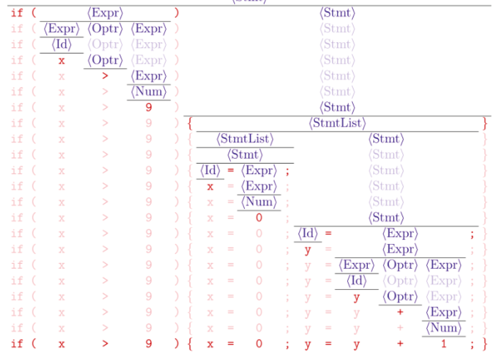

Lecture3-Parser
---

1. **输入**:程序文本/字符串s & **词法单元(token) 的规约**

2. **输出**:词法单元流

# 1. 语法分析距离

# 2. 语法分析阶段的主题

## 2.1. 上下文无关文法

1. 我们需要递归来提升我们语言的能力。

## 2.2. 构建语法分析树

1. 自顶向上构造：比较符合直观，但是能力有限
2. 自底向下构造：Knuth算法

## 2.3. 错误恢复
1. 报错
2. **恢复**：现在的程序是比较大的，如果直接停止编译则导致有多少错误就需要编译多少次，不合适。
3. 继续分析

# 3. 上下文无关文法(CFG, Context-Free Grammer, 上下文无关文法)
1. 上下文无关文法$G$是一个四元组$G=(T,N,P,S)$:
2. T是**终结符号(Terminal)**集合, 对应于词法分析器产生的词法单元;
3. N是**非终结符号(Non-terminal)**集合;
4. P是**产生式(Production)**集合;

$$
A \in N \rightarrow \alpha \in (T \cup N)*
$$

- 头部/左部(Head)$A$: **单个**非终结符，必须只有一个，这就是为什么我们称其为上下文无关文法，如果有多个则不符合上下文无关文法，会被成为上下文有关文法，但是几乎无法处理。
- 体部/右部(Body)$\alpha$: 终结符与非终结符构成的串, 也可以是空串$\epsilon$
5. S为开始(Start)符号。要求$S \in N$且唯一。

1. 一个符号要么是终结符号，要么是非终结符号
2. 终结符号表示到此为止，无法再进行替换

$$
G = (\{S\}, \{(, )\}, P, S) \\
S \rightarrow SS \\
S \rightarrow (S) \\
S \rightarrow () \\
$$

> 任意嵌套的所有匹配好的括号串

$$
G = (\{S\}, \{(a, b)\}, P, S) \\
S \rightarrow aSb \\
S \rightarrow \epsilon \\
$$

1. **条件语句**文法
2. **悬空(Dangling)-else**文法

3. **约定**: 如果没有明确指定, 第一个产生式的头部就是开始符号

## 3.1. 关于**终结符号**的约定
1. 下述符号是终结符号:
  1. 在字母表里排在前面的小写字母，比如a、b、c。
  2. 运算符号，比如+、*等。
  3. 标点符号，比如括号、逗号等。
  4. 数字0、1、.... 9。
  5. **黑体字符串**，比如id或if。每个这样的字符串表示一个终结符号。
  
## 3.2. 关于**非终结符号**的约定
1. 下述符号是非终结符号:
  1. 在字母表中排在前面的大写字母，比如A、B、C。
  2. **字母S**。它出现时通常表示开始符号。
  3. 小写、斜体的名字，比如expr或stmt.

## 3.3. **推导**(Derivation)
$$
E \rightarrow E + E | E ∗ E | (E) | id
$$

1. 推导即是将某个产生式的左边**替换**成它的右边
2. 每一步推导需要选择替换哪个非终结符号, 以及使用哪个产生式

$$
E \Rightarrow -E \Rightarrow −(E) \Rightarrow −(E+E) \Rightarrow −(id+E) \Rightarrow −(id+id)
$$

$$
E \Rightarrow −E : 经过一步推导得出
E \xRightarrow{+} −(id + E):经过一步或多步推导得出
E \xRightarrow{*} −(id +E):经过零步或多步推导得出
$$

$$
E \Rightarrow -E \Rightarrow −(E) \Rightarrow −(E+E) \Rightarrow −(E+id) \Rightarrow −(id+id)
$$

## 3.4. Definition (Sentential Form;句型)
1. 如果$S \xRightarrow{*} \alpha$，且$\alpha \in ( T \cup N)^*$，则称$\alpha$是文法G的一个句型

$$
E \rightarrow E + E | E ∗ E | (E) | id \\
E \Rightarrow -E \Rightarrow −(E) \Rightarrow −(E+E) \Rightarrow −(id+E) \Rightarrow −(id+id)
$$

## 3.5. Definition (Sentence; 句子)
1. 如果$S \xRightarrow{*} w$，且$w \in T^*$，则称w是文法G的一个**句子**

## 3.6. Definition (文法G 生成的语言L(G))
1. 文法F的**语言**L(G)是它能推导出的**所有句子**构成的集合。

$$
w \in L(G) \Leftrightarrow S \xRightarrow{*} w
$$

## 3.7. 关于文法G的**两个基本问题**
1. Membership问题:给定字符串$x \in T^*, x \in L(G)$？
2. L(G)究竟是什么？
3. 给定字符串$x \in T^*, x \in L(G)$，(即, 检查x 是否符合文法G)
5. 这就是语法分析器的任务:为输入的词法单元流寻找推导、**构建语法分析树**, 或者报错

1. 根节点是文法G的起始符号
2. 叶子节点是输入的词法单元流
3. 常用的语法分析器以**自顶向下**或**自底向上**的方式构建中间部分

## 3.8. L(G) 是什么?
1. 这是程序设计语言设计者需要考虑的问题

$$
S \rightarrow SS \\
S \rightarrow (S) \\
S \rightarrow () \\
S \rightarrow \epsilon \\
L(G) = {良匹配括号串} \\
$$

$$
S \rightarrow aSb
S \rightarrow \epsilon
L(G) = {a^nb^n|n \geq 0 }
$$

2. 字母表$\sum = {a, b}$上的所有**回文串**(Palindrome)构成的语言

$$
S \rightarrow aSa \\
S \rightarrow bSb \\
S \rightarrow a \\
S \rightarrow b \\
S \rightarrow ϵ \\
S \rightarrow aSa|bSb|a|b|\epsilon \\
$$

$$
{b^na^mb^{2n}|n \geq 0, m \geq 0} \\
S \rightarrow bSbb|A \\
A \rightarrow aA|\epsilon \\
$$

$$
\{x\in \{a, b\}^* | x 中a,b个数相同 \} \\
V \rightarrow aVbV | bVaV | \epsilon \\
$$

$$
\{x\in \{a, b\}^* | x 中a,b个数不同 \} \\
S \rightarrow T | U \\
T \rightarrow VaT |VaV \\
U \rightarrow VbU | VbV \\
V \rightarrow aVbV | bVaV | \epsilon \\
$$

<a href = "https://en.wikipedia.org/wiki/L-system">L-System</a>:这不是上下文无关文法, 但精神高度一致

$$
variables: A B
constants: + -
start: A
rules:(A \rightarrow B-A-B),(B \rightarrow A+B+A)
angles:60'
$$

1. $A,B$:向前移动并画线
2. +:左转
3. -:右转
4. 每一步都**并行地**应用**所有**规则

$$
variables: X Y
constants: F + -
start: FX
rules:(X \rightarrow X+YF+),(Y \rightarrow -FX-Y)
angles:90'
$$

1. $F$:向前移动并画线
2. +:右转
3. -:左转
4. 每一步都**并行地**应用**所有**规则

## 3.9. 最左(leftmost) 推导与最右(rightmost) 推导
$$
E \rightarrow E + E | E * E | (E) | id \\
E \xRightarrow[lm]{} -E \xRightarrow[lm]{} -(E) \xRightarrow[lm]{} -(E+E) \xRightarrow[lm]{} -(id + E) \xRightarrow[lm]{} -(id+id)
$$

1. $E \xRightarrow[lm]{} -E$:经过一步最左推导得出
2. $E \xRightarrow[lm]{+} -(id + E)$:经过一步或多步最左推导得出
3. $E \xRightarrow[lm]{*} -(id + E)$:经过零步或多步最左推导得出

$$
E \xRightarrow[rm]{} -E \xRightarrow[rm]{} -(E) \xRightarrow[rm]{} -(E+E) \xRightarrow[rm]{} -(id + E) \xRightarrow[rm]{} -(id+id)
$$

## 3.10. Definition (Left-sen
1. 如果$S \xRightarrow[lm]{*} \alpha$, 并且$\alpha \in (T \cup N)^*$，则称$\alpha$是文法G的一个**最左句型**。

$$
E \xRightarrow[lm]{} -E \xRightarrow[lm]{} -(E) \xRightarrow[lm]{} -(E+E) \xRightarrow[lm]{} -(id + E) \xRightarrow[lm]{} -(id+id)
$$

## 3.11. Definition (Right-sentential Form; 最右句型)
1. 如果$S \xRightarrow[rm]{*} \alpha$, 并且$\alpha \in (T \cup N)^*$，则称$\alpha$是文法G的一个**最右句型**。

$$
E \xRightarrow[rm]{} -E \xRightarrow[rm]{} -(E) \xRightarrow[rm]{} -(E+E) \xRightarrow[rm]{} -(id + E) \xRightarrow[rm]{} -(id+id)
$$

## 3.12. 语法分析树
1. 语法分析树是静态的, 它不关心动态的推导顺序
2. 一棵语法分析树对应多个推导
3. 但是, 一棵语法分析树与**最左(最右) 推导**一一对应

$$
E \rightarrow E + E|E - E|E*E|E/E|(E)|id|number
$$

4. 1−2−3的语法树

## 3.13. Definition (**二义性**(Ambiguous) 文法)
1. 如果L(G) 中的**某个**句子有**一个以上**语法树/最左推导/最右推导,则文法G 是二义性的。
2. 1 + 2 * 3的语法树

## 3.14. 二义性文法
1. 不同的语法分析树产生不同的语义
2. 所有语法分析器都要求文法是无二义性的

3. Q:如何识别二义性文法?这是**不可判定**的问题
4. Q:如何消除文法的二义性?
5. 四则运算均是左结合的
6. **优先级**: 括号最先, 先乘除后加减
7. 二义性表达式文法以**相同的方式**处理所有的算术运算符
8. 要消除二义性, 需要**区别对待**不同的运算符
9. 将运算的“先后” 顺序信息编码到语法树的“层次” 结构中

$$
E \rightarrow E + E | id \\
$$
$$
E \rightarrow E + T \\
T \rightarrow id \\
$$

- 左结合文法

$$
E \rightarrow T + E
T \rightarrow id
$$

- 右结合文法
- 使用**左(右) 递归**实现**左(右) 结合**

$$
E \rightarrow E + E|E*E|(E)|id \\
E \rightarrow E + T|T \\
T \rightarrow T * F | F\\
F \rightarrow (E)|id
$$

- **括号最先, 先乘后加**文法

$$
E \rightarrow E + E|E - E|E*E|E/E|(E)|id|number \\
E \rightarrow E + T | E - T|T \\
T \rightarrow T * F | T/F | F \\
F \rightarrow (E) | id | number \\
$$

- **无二义性**的表达式文法
- E:表达式(expression)
- T:项(term)
- F:因子(factor)
- 将运算的“先后” 顺序信息编码到语法树的“层次”结构中

- 每个else与**最近的尚未匹配的**then匹配

- 为什么不使用优雅、强大的**正则表达式**描述程序设计语言的语法?正则表达式的表达能力严格弱于上下文无关文法

- 每个正则表达式r对应的语言L(r) 都可以使用上下文无关文法来描述

$$
r=(a|b)^∗abb
$$

- 此外, 若$\delta(A_i,\epsilon) = A_j$，则添加$A_i \rightarrow A_j$

$$
S \rightarrow aSb \\
S \rightarrow \epsilon \\
L = {a^nb^n|n \geq 0}
$$

- 该语言无法使用正则表达式来描述
- 定理:$L = \{a^nb^n | n ≥ 0\} 无法使用正则表达式描述
- 反证法
  - 假设存在正则表达式r:$L(r) = L$
  - 则存在**有限**状态自动机D(r):$L(D(r)) = L$; 设其状态数为k
  - 考虑输入$a^m(m>k)$

- $D(r)$也能接受a^{i+j}b^i，**矛盾**！
- Pumping Lemma for Regular Languages：$L = {a^nb^n | n \geq 0}$
- Pumping Lemma for Context-free Languages:$L = {a^nb^nc^n | n \geq 0}$