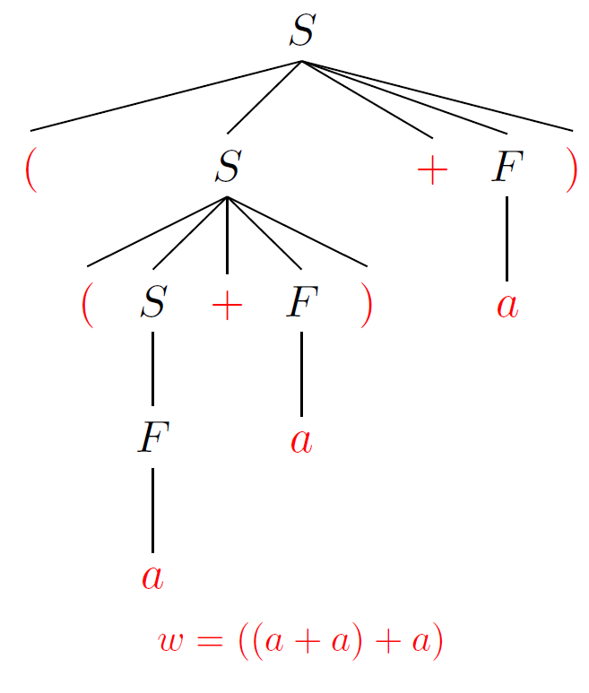
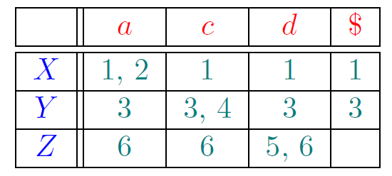
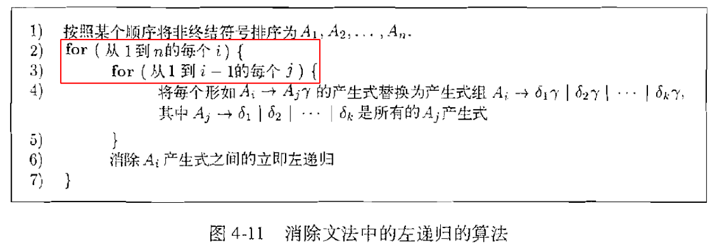

LL(1)语法分析器
---

# 1. 什么是LL(1)语法分析器
1. 自顶向下的、递归下降的、预测分析的、适用于**LL(1)文法**的LL(1)语法分析器
2. **自顶向下**构建语法分析树
   1. **根节点**是文法的起始符号$S$
   2. 每个**中间节点**表示**对某个非终结符应用于某个产生式进行推导**
   3. **叶节点**是词法单元流$w\$$
3. 仅包含终结符号与特殊的文件结束符$\$$
4. **递归下降算法**的实现框架


5. 为每个**非终结符**写一个**递归函数**：但是工作量会比较大
6. 内部按需调用其它非终结符对应的递归函数

## 1.1. 语法树生成例子
$$
\begin{array}{l}
   S \rightarrow F \\
   S \rightarrow (S+F) \\
   F \rightarrow a \\
\end{array}
$$

> 演示递归下降过程(指针移动)：针对结构$w=((a+a)+a)$
> 1. 首先进入S的递归函数，我们选择一条产生式(假设已经选择好)，我们选择的是$S \rightarrow (S + F)$
> 2. 然后我们发现还是非终结符，我们仍然选择$S \rightarrow (S + F)$
> 3. 然后我们发现还是非终结符，我们选择$S \rightarrow F$，
> 4. 然后我们发现是终结符，检查$F \rightarrow a$得到的结果是否和当前指针指向的位置的值，匹配则继续，否则报错。
> 5. 之后省略，注意右括号被匹配意味相应部分递归结束。
> 以上的过程在本质上是DFS的过程。



1. 每次都选择语法分析树**最左边**的**非终结符**进行展开，所以得到**最左推导**
2. Q：同样是展开非终结符S，为什么前两次选择了$S \rightarrow (S + F)$, 而第三次选择了$S \rightarrow F$?
3. A：因为只有选择$S \rightarrow (S + F)$才能生成一个左括号开头的式子，这个是由文法决定的，也就是因为它们面对的**当前词法单元**不同


## 1.2. 使用预测分析表确定产生式
1. 指明了每个**非终结符**在面对不同的**词法单元或文件结束符**时,该选择哪个产生式(按编号进行索引)或者**报错**
2. 预测分析表如下图所示


2. 例子：根据当前值选择使用不同的产生式
   1. `(`选择2号产生式
   2. `a且S`则选择1号产生式
   3. `a且F`则选择3号产生式
   4. 上表中的空白标记记为报错。
3. 问题：如何构造上面的表格？

## 1.3. Definition (LL(1) 文法)
1. 如果文法G的**预测分析表**是**无冲突**的, 则G是LL(1)文法。
2. **无冲突**: 每个单元格里只有一个生成式(编号)，不然就会出现选择问题。


3. 对于当前选择的**非终结符**,仅根据输入中**当前的词法单元**即可确定需要使用哪条产生式
4. **递归下降的、预测分析**实现方法


## 1.4. 实现LL(1)算法的具体代码

### 1.4.1. 解析$S()$

```
1: procedure S()
2:    if token = '(' then
3:       MATCH('(')
4:       S()
5:       MATCH('+')
6:       F()
7:       MATCH(')')
8:    else if token ='a' then
9:       F()
10:   else
11:      ERROR(token, {'(', 'a'})
```

### 1.4.2. 解析$F()$
```
1: procedure F()
2:    if token = 'a' then
3:       MATCH('a')
4:    else
5:       ERROR(token, {'a'})
```

### 1.4.3. 解析$MATCH()$
```
1: procedure MATCH(t)
2:    if token = t then
3:       token <- NEXT-TOKEN
4:    else 
5:       ERROR(token, t)
```
# 2. 如何计算给定文法G的预测分析表?
> 下文则会重点解释如何计算给定文法G的预测分析表

## 2.1. Definition($First(\alpha)$集合)
> 对于任意的(产生式的右部) $\alpha \in (N \cup T)^*$
$$
FIRST(\alpha) = {t \in T \cup {\epsilon} | \alpha \xRightarrow{*} t\beta \wedge \alpha \xRightarrow{*}\epsilon}
$$

1. $First(\alpha)$ 是可从$\alpha$推导得到的句型的**首终结符号**的集合
2. $T$是终结符集合，$t$可能是终结符，也可能是$\epsilon$
3. 考虑非终结符A的所有产生式$A \rightarrow \alpha_1,A \rightarrow \alpha_2, ... ,A \rightarrow \alpha_m$,如果它们对应的$First(\alpha_i)$ 集合互不相交，则只需查看**当前输入词法单元**, 即可确定选择哪个产生式(或**报错**)，如果相交，则不是LL(1)文法。


## 2.2. Definition($Follow(A)$集合)
> 对于任意的(产生式的左部) **非终结符**$A \in N$
$$
Follow(A) = \{t \in T \cup \{\$\} | \exist w.S \xRightarrow{*} w = \beta A t \gamma\}
$$

1. $Follow(A)$是可能在某些句型中**紧跟在A右边的终结符**的集合
2. $t$可以是终结符和文件终止符。
3. 考虑产生式:$A \rightarrow a$，如果从$\alpha$可能推导出空串($\alpha \xRightarrow{*} \epsilon$)，则只有当当前词法单元$t \in Follow(A)$, 才可以选择该产生式：因为$A$可能推导没了，然后就是$t$了，我们期望$t$能够匹配当前位置上的对应符号。

## 2.3. 计算$First$集合

### 2.3.1. 先计算每个符号X的$First(X)$集合


1. 如果$Y_1...Y_{i-1}$都可以推导成为空串，那么$Y_i$的首终结符应该也是X的首终结符。
2. 不断应用上面的规则, 直到每个$First(X)$都不再变化(**闭包**!!!)尤其注意递归。

### 2.3.2. 再计算每个符号串$\alpha$的$First(\alpha)$集合
$$
\begin{array}{l}
   \alpha = X \beta \\
   First(\alpha) = \begin{cases}
      First(X) & \epsilon \in L(X) \\
      Fitst(X)\cup First(\beta) & \epsilon \notin L(X) \\
   \end{cases}
\end{array}
$$

### 2.3.3. 求解$First(\alpha)$的例子
$$
\begin{array}{l}
   (1) & X \rightarrow Y \\
   (2) & X \rightarrow a \\
   (3) & Y \rightarrow \epsilon \\
   (4) & Y \rightarrow c \\
   (5) & Z \rightarrow d \\
   (6) & Z \rightarrow XYZ \\
\end{array}
$$

$$
\begin{array}{l}
   FIRST(X) = \{a,c,\epsilon\} \\
   FIRST(Y) = \{c, \epsilon\} \\
   FIRST(Z) = \{a, c, d\} \\
   FIRST(XYZ) = FIRST(X) \cup FISRT(YZ) \\
   = FIRST(X) \cup FIRST(Y) \cup FIRST(Z) = \{a, c, d\}\\
\end{array}
$$

> 注意不要忘记和$\epsilon$相关的操作。

TODO
## 2.4. 为每个非终结符X计算$Follow(X)$集合


1. 不断应用上面的规则, 直到每个Follow(X) 都不再变化(**闭包**!!!)
2. Follow例子：注意闭包，可以无限扩充

$$
\begin{array}{l}
   (1) & X \rightarrow Y \\
   (2) & X \rightarrow a \\
   (3) & Y \rightarrow \epsilon \\
   (4) & Y \rightarrow c \\
   (5) & Z \rightarrow d \\
   (6) & Z \rightarrow XYZ \\
\end{array}
$$

$$
\begin{array}{l}
   FOLLOW(X) = \{a, c, d, \$\} \\
   FOLLOW(Y) = \{a, c, d, \$\} \\
   FOLLOW(Z) = \emptyset \\
\end{array}
$$

## 2.5. 如何根据$First$与$Follow$集合计算给定文法G的预测分析表?
> 按照以下规则, 在表格[A, t] 中填入生成式$A \rightarrow \alpha(编号)$

$$
\begin{array}{l}
   t \in First(\alpha) & (1)\\
   \alpha \xRightarrow{*} \epsilon \wedge t \in Follow(A) & (2)\\
\end{array}
$$

> 对于每一个生成式只要满足上面一条规则即可(或关系)，首先，在下单元格中可以填写$A \rightarrow \alpha$，则可以推导出$\alpha \xRightarrow{*} \epsilon \wedge t \in Follow(A)$(必要条件)，但是由于是LL(1)文法的**唯一性**，那么必要条件等价于充分条件，也就是这是一个充要条件。

|     | $t$                    |
| --- | ---------------------- |
| $A$ | $A \rightarrow \alpha$ |


## 2.6. Definition (LL(1) 文法)
> 如果文法G的**预测分析表**是**无冲突**的, 则G是LL(1)文法。

$$
\begin{array}{l}
   (1) & X \rightarrow Y \\
   (2) & X \rightarrow a \\
   (3) & Y \rightarrow \epsilon \\
   (4) & Y \rightarrow c \\
   (5) & Z \rightarrow d \\
   (6) & Z \rightarrow XYZ \\
\end{array}
$$
$$
\begin{array}{l}
   FIRST(X) = \{a,c,\epsilon\} \\
   FIRST(Y) = \{c, \epsilon\} \\
   FIRST(Z) = \{a, c, d\} \\
   FIRST(XYZ) = FIRST(X) \cup FISRT(YZ) \\
   = FIRST(X) \cup FIRST(Y) \cup FIRST(Z) = \{a, c, d\}\\
\end{array}
$$
$$
\begin{array}{l}
   FOLLOW(X) = \{a, c, d, \$\} \\
   FOLLOW(Y) = \{a, c, d, \$\} \\
   FOLLOW(Z) = \emptyset \\
\end{array}
$$




# 3. LL(1) 语法分析器
1. L:从左向右(left-to-right) 扫描输入
2. L:构建最左(leftmost) 推导
3. 1:只需向前看一个输入符号便可确定使用哪条产生式

## 3.1. 非递归的预测分析方法
> 非递归算法效率会高一些


## 3.2. 改造文法成为LL(1)文法
1. 改造它
   1. 消除左递归
   2. 提取左公因子
2. 有左递归，有左公因子，则必然不是LL(1)文法
3. 没有左递归，没有左公因子，则未必是LL(1)文法

### 3.2.1. 左递归
$$
\begin{array}{l}
   E \rightarrow E + T | E - T | T \\
   T \rightarrow T * F | T / F | F \\
   F \rightarrow (E) | id | num \\
\end{array}
$$

1. E 在**不消耗任何词法单元**的情况下, 直接递归调用E, 造成**死循环**，E左侧没有非终结符，不能消耗符号。
2. 存在$FIRST(E + T) \cap FIRST(T) \neq \emptyset$，不是LL(1)文法
3. 消除左递归

### 3.2.2. 消除左递归
1. 左递归：

$$
E \rightarrow E + T | T
$$

2. 消除左递归(至少会消耗一个+)
$$
\begin{array}{l}
   E \rightarrow TE' \\
   E' \rightarrow +TE' | \epsilon \\
\end{array}
$$

3. 将左递归转为**右递归**，注: 右递归对应右结合; 需要在后续阶段进行额外处理，至少语法分析可以通过。

### 3.2.3. 左递归例子
$$
\begin{array}{l}
   A \rightarrow A\alpha_1 | A\alpha_2 |...A\alpha_m|\beta_1|\beta_2|...\beta_n \\
\end{array}
$$

- $\beta_i$都不以A开发

$$
\begin{array}{l}
   A \rightarrow \beta_1A' | \beta_2A' | ... | \beta_nA' \\
   A' \rightarrow \alpha_1A'|\alpha_2A'|...|\alpha_mA'|\epsilon \\
\end{array}
$$

### 3.2.4. 左递归例子II
$$
\begin{array}{l}
   E \rightarrow E + T|T \\
   T \rightarrow T * F|F \\
   F \rightarrow (E) | id \\
\end{array}
$$

- 消除左递归

$$
\begin{array}{l}
   E \rightarrow TE' \\
   E' \rightarrow +TE' | \epsilon \\
   T \rightarrow FT' \\
   T' \rightarrow *FT' | \epsilon \\
   F \rightarrow (E)|id|num \\
\end{array}
$$

### 3.2.5. 非直接左递归
$$
\begin{array}{l}
   S \rightarrow Aa|b \\
   A \rightarrow Ac|Sb|\epsilon\\
   S \Rightarrow Aa \Rightarrow Sda \\
\end{array}
$$

### 3.2.6. 消除左递归算法


$$
A_k \rightarrow A_l\alpha \Rightarrow l > k
$$

1. 不会出现左递归，也不会出现间接左递归：因为不会回到自己
2. 例子：

$$
\begin{array}{l}
   S \rightarrow Aa|b \\
   A \rightarrow Ac|Sb|\epsilon \\
\end{array}
$$

> 考虑1号非终结符S，替换掉A中的S

$$
A \rightarrow Ac|Aad|bd|\epsilon
$$

> 考虑2号非终结符A，使用A'进行替换，首先找不含A的生成A'，然后交换包含A的位置

$$
\begin{array}{l}
   S \rightarrow Aa|b \\
   A \rightarrow bdA'|A' \\
   A' \rightarrow cA'|adA'|\epsilon \\
\end{array}
$$

### 3.2.7. 消除左递归的例子
> 注意"("等部分首终结符，最好选择一个顺序：比如从下往上算。

$$
\begin{array}{l}
   E \rightarrow TE' \\
   E' \rightarrow +TE' | \epsilon \\
   T \rightarrow FT' \\
   T' \rightarrow *FT' | \epsilon \\
   F \rightarrow (E)|id|num \\
\end{array}
$$


$$
\begin{array}{l}
   First从左侧开始找 \\
   First(F) = \{(,id\} \\
   First(T') = \{*,\epsilon\} \\
   First(T) = \{(,id\} \\
   First(E) = \{(,id\} \\
   First(E') =  \{+ , \epsilon\} \\
   Follow从右侧开始找 \\
   Follow(E) = \{), \$\} \\
   Follow(E') = \{), \$\} \\
   Follow(T) = \{+, ), \$\} \\
   Follow(T') = \{+, ), \$\} \\
   Follow(F) = \{+, ∗, ), \$\} \\
\end{array}
$$

### 3.2.8. 提取左公因子
> 包含左公因子
$$
\begin{array}{l}
   S \rightarrow iEtS|iEtSeS|a \\
   E \rightarrow b
\end{array}
$$

> 提取左公因子
$$
\begin{array}{l}
   S \rightarrow iEtSS'|a \\
   S' \rightarrow eS|\epsilon \\
   E \rightarrow b \\
\end{array}
$$


> 解决二义性(人为解决): 选择$S' \rightarrow eS$, 将else与前面最近的then关联起来

### 3.2.9. $\$$符号的必要性

