LR语法分析器
---
1. 自顶向下的、不断归约的、基于句柄识别自动机的、适用于LR(∗) 文法的、LR(∗) 语法分析器
2. 只考虑无二义性的文法

# 1. 构建语法树过程
1. **自底向上**构建语法分析树
2. **根节点**是文法的起始符号$S$
3. 每个中间**非终结符节点**表示**使用它的某条产生式进行归约**
4. **叶节点**是词法单元$w\$$
5. 仅包含终结符号与特殊的**文件结束符$\$$**

## 1.1. 自顶向下的"推导"与自底向上的"归约"
$$
E \xRightarrow[rm]{} T \xRightarrow[rm]{} T * F \xRightarrow[rm]{} T * id \xRightarrow[rm]{} F * id \xRightarrow[rm]{} id * id
$$

$$
E \Leftarrow T \Leftarrow T * F \Leftarrow T * id \Leftarrow F * id \Leftarrow id * id
$$

> 第一个生成式的左侧是开始符号

## 1.2. 推导与归约
1. 从**产生式**的角度看，是**推导**：$A \rightarrow \alpha$
2. 从**输入**的角度看，是**规约**：$A \leftarrow \alpha$

$$
\begin{array}{l}
   A \triangleq \gamma_{0} \Rightarrow ... \gamma_{i-1} \Rightarrow \gamma_i \Rightarrow \gamma_{r+1} \Rightarrow ... \Rightarrow r_n = w \\
   A \triangleq \gamma_{0} \Leftarrow ... \gamma_{i-1} \Leftarrow \gamma_i \Leftarrow \gamma_{r+1} \Leftarrow ... \Leftarrow r_n = w \\
\end{array}
$$

3. 自底向上语法分析器为输入构造**反向推导**

## 1.3. LR(∗)语法分析器
1. L:**从左向右**(left-to-right) 扫描输入
2. R:构建**反向**(reverse)**最右**(leftmost)推导

3. 在最右推导中, 最左叶节点最后才被处理
4. 在反向最右推导中, 最左叶节点最先被处理(与从左到右扫描一致)

### 1.3.1. LR语法分析器的状态
1. 在任意时刻, 语法分析树的**上边缘**与**剩余的输入**构成当前句型，也就是LR语法分析器的状态。

$$
E \Leftarrow T \Leftarrow T * F \Leftarrow T * id \Leftarrow F * id \Leftarrow id * id
$$

2. LR语法分析器使用**栈**存储语法分析树的**上边缘**

### 1.3.2. 栈上操作

> 栈操作如下图所示：标号不是状态，仅表示顺序

| 时间序号 | 0   | 1   | 2   | 3   | 4   | 5   | 6   | 7   | 8   | 9   | 10  | 11  | 12  | 13  |
| -------- | --- | --- | --- | --- | --- | --- | --- | --- | --- | --- | --- | --- | --- | --- |
| 栈顶     |     |     |     |     |     |     |     | id  |     | F   |     |     |     |     |
|          |     |     |     |     |     |     | *   | *   | *   | *   |     |     |     |     |
| 栈底     |     | id  |     | F   |     | T   | T   | T   | T   | T   |     | T   |     | E   |

1. 两大操作: **移入输入符号**与**按产生式归约**
2. 直到栈中仅剩开始符号S, 且输入已结束, 则成功停止

# 2. 基于栈的LR语法分析器
1. Q1:何时归约? (何时移入?)：要么是移入，要么是归约，而并不允许可以选择，不然是文法上的冲突。
2. Q2:按哪条产生式进行归约?

1. Q：为什么第二个F以 T ∗ F 整体被归约为T?
2. A：这与**栈**的当前状态T ∗ F相关

## 2.1. LR分析表指导LR语法分析器
|                      |                      |
| -------------------- | -------------------- |
|  |  |

1. 在**当前状态(编号)**下, 面对**当前文法符号**时, 该采取什么**动作**
2. **ACTION**表指明动作, **GOTO**表仅用于归约时的状态转换
3. LR(0)、SLR(1)、LR(1)、LALR(1)的分析表会略有差异，加强规则会使其可以处理更多的文法。

## 2.2. Definition (LR(0)文法)
1. 如果文法G的**LR(0)分析表**是**无冲突**的, 则G是LR(0)文法。
2. **无冲突**: ACTION表中每个单元格最多只有一种动作

3. **两类可能的冲突**: "移入/归约" 冲突、"归约/归约" 冲突

## 2.3. 再次板书演示"栈" 上操作: 移入与规约
|                      |                      |
| -------------------- | -------------------- |
| 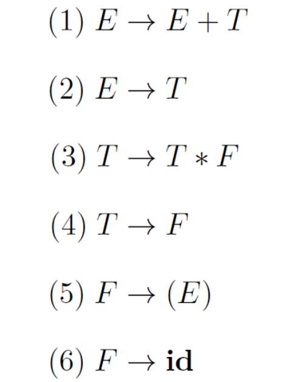 |  |

> 1. 状态只和栈之中的元素有关，如果弹出了，则重置状态为当前栈内状态，上面的序号只表示顺序，当前栈的状态，如()所示。
> 2. 在5时刻遇到了$符号，进行操作

| 时间序号 | 0   | 1   | 2   | 3   | 4   | 5   | 6   | 7   | 8   | 9   | 10  | 11  | 12  | 13  |
| -------- | --- | --- | --- | --- | --- | --- | --- | --- | --- | --- | --- | --- | --- | --- |
| 状态     | 0   | 5   | 0   | 3   | 0   | 2   | 7   | 5   | 7   | 10  | 0   | 2   | 0   | 1   |
| 栈顶     |     |     |     |     |     |     |     | id  |     | F   |     |     |     |     |
|          |     |     |     |     |     |     | *   | *   | *   | *   |     |     |     |     |
| 栈底     |     | id  |     | F   |     | T   | T   | T   | T   | T   |     | T   |     | E   |

- $w = id * id\$$
- 栈中存储语法分析器的状态(编号), "编码"了语法分析树的上边缘

## 2.4. 如何构造LR分析表?

1. LR(0)分析表指导LR(0)语法分析器
2. 在**当前状态(编号)**下, 面对**当前文法符号**时,该采取什么动作

### 2.4.1. 状态是什么? 如何跟踪状态?

1. 状态是语法分析树的上边缘, 存储在栈中
2. 可以用**自动机**跟踪状态变化(**自动机中的路径 $\Leftrightarrow$栈中符号/状态编号**)

### 2.4.2. 何时归约? 使用哪条产生式进行归约?

1. **必要条件**: 当前状态中, 已观察到**某个产生式的完整右部**
2. 对于LR(0) 文法, 这是当前**唯一**的选择

### 2.4.3. Definition(句柄(Handle))
> 在输入串的(唯一)反向最右推导中, **如果**下一步是逆用产生式$A \rightarrow \alpha$将$\alpha$规约为$A$, 则称$\alpha$是**当前句型的句柄**。

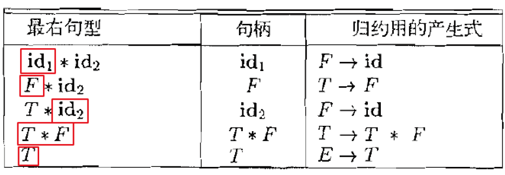

2. LR语法分析器的关键就是高效**寻找每个归约步骤所使用的句柄**。

### 2.4.4. 句柄可能在哪里？
> Theorem：**存在**一种LR语法分析方法，保证句柄总是出现在栈顶

1. 句柄出现在栈顶极大程度上方便了我们进行分析。

$$
\begin{array}{l}
   S \xRightarrow[rm]{*} \alpha Az  \xRightarrow[rm]{*} \alpha\beta Byz  \xRightarrow[rm]{*} \alpha\beta\gamma yz \\
   S \xRightarrow[rm]{*} \alpha BxAz  \xRightarrow[rm]{*} \alpha Bxyz  \xRightarrow[rm]{*} \alpha\gamma xy \\
\end{array}
$$

2. 对于最右推导，任何推导都只有如上两种情况(注意是两次连续推导)
   1. A是B的父亲(等价于B是A的父亲)
   2. 或者A和B平级
3. 情况2中的x必然为终结符(最右推导)，每次规约后我们都可以在栈顶找到终结符。
4. 可以用**自动机**跟踪状态变化(**自动机中的路径 $\Leftrightarrow$ 栈中符号/状态编号**)

> Theorem:**存在**一种LR语法分析方法, 保证**句柄总是出现在栈顶**。
5. 在自动机的当前状态识别可能的句柄(观察到的完整右部)(自动机的当前状态 $\Leftrightarrow$ 栈顶)
6. LR(0) 句柄识别有穷状态自动机(Handle-Finding Automaton)

> 红色框出来的就是接受状态。

## 2.5. 状态刻画了"当前观察到的针对所有产生式的右部的前缀"

### 2.5.1. Definition (LR(0) 项(Item))
1. 一个文法G的一个**LR(0)项**是G的一个产生式再加上一个位于体部某处的**点**。

$$
\begin{array}{l}
   A \rightarrow XYZ \\
   [A \rightarrow ·XYZ] \\
   [A \rightarrow X·YZ]\\
   [A \rightarrow XY·Z] \\
   [A \rightarrow XYZ·] \\
\end{array}
$$

2. 产生式$A \rightarrow \epsilon$只有一个项$[A \rightarrow ·]$
3. **项**指明了语法分析器已经看到了一个产生式的哪些部分
4. **点**指示了栈顶, 左边(与路径) 是栈中内容, 右边是期望看到的文法符号

### 2.5.2. Definition (项集)
1. **项集**就是若干**项**构成的集合。
2. 因此, 句柄识别自动机的一个**状态**可以表示为一个**项集**

### 2.5.3. Definition (项集族)
1. **项集族**就是若干**项**集构成的集合。
2. 因此, 句柄识别自动机的**状态集**可以表示为一个**项集族**

### 2.5.4. 示例

### 2.5.5. Definition (增广文法(Augmented Grammar))
1. 文法G 的增广文法是在G 中加入产生式$S' \rightarrow S$得到的文法。
2. 目的: 告诉语法分析器何时停止分析并接受输入符号串
3. 当语法分析器面对$\$$且要使用$S' \rightarrow S$进行归约时, 输入符号串被接受
4. 注: 此"接受" (输入串) 非彼"接受" (句柄识别自动机)

# 3. LR(0) 句柄识别自动机
1. 初始状态是什么?
2. 状态之间如何转移?

## 3.1. 初始状态
1. **点**指示了**栈顶**, 左边(与路径) 是栈中内容, 右边是期望看到的文法符号
2. $S' \rightarrow S$是增广语法添加的。
3. 红色部分：$S' \rightarrow ·S$中的点表示栈顶，整句话表示栈是空的，我们找到E。
4. 黑色部分：通过迭代的方式在其中添加栈顶的位置，然后计算闭包得到。

## 3.2. 构造LR(0)句柄识别自动机的构造过程

> 只有红色框中的状态为接受状态，$I_5$状态也是接受状态

1. 闭包等于自身，则终止，比如左上角接受状态，那么如果当前为E，则移动一下栈顶得到结果
2. 对于会首先遇到一个非终结符，那么需要展开对应非终结符以获取闭包
3. 然后对每一个状态进行递归：箭头上是看到的符号(下一个符号)，找到产生式右侧中包含的项。
4. 伪代码描述如下图：

$$
\begin{array}{l}
   J = GOTO(I, X) = CLOSURE(\{[A \rightarrow \alpha X ·\beta ] | [A \rightarrow · X \beta] \in I \}) \\
   (X \in N \cup T \cup \{\$\})\\
\end{array}
$$

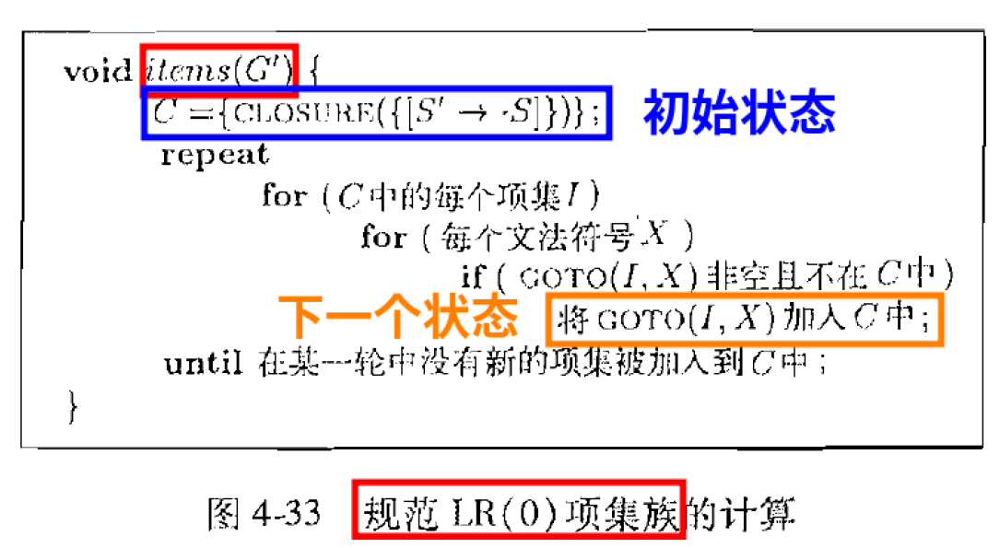

> C表示的是所有的状态的集合。

接受状态$F = \{I \in C | \exist k.[k:A \rightarrow \alpha ·] \in I\}$

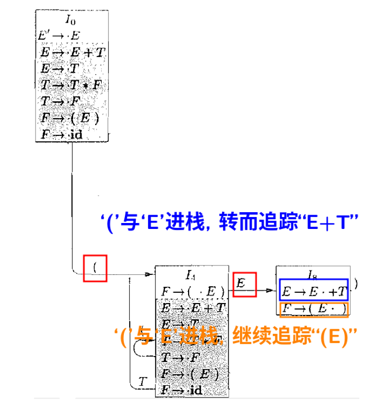

> **点**指示了**栈顶**，左边(与路径)是栈中内容，右边是期望看到的文法符号串

## 3.3. LR(0)分析表
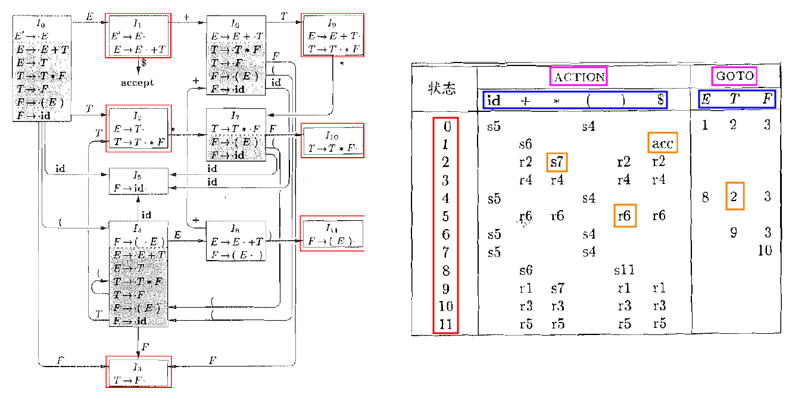

1. GOTO函数被拆分成ACTION表(针对终结符)与GOTO表(针对非终结符)

> 终结符，转换状态(s)：$(1) GOTO(I_i, a) = I_j \wedge a \in T \Rightarrow ACTION[i, a] \leftarrow sj$

> 非终结符，调整状态(goto)：$(2) GOTO(I_i, A) = I_j \wedge A \in N \Rightarrow ACTION[i, A] \leftarrow gj$

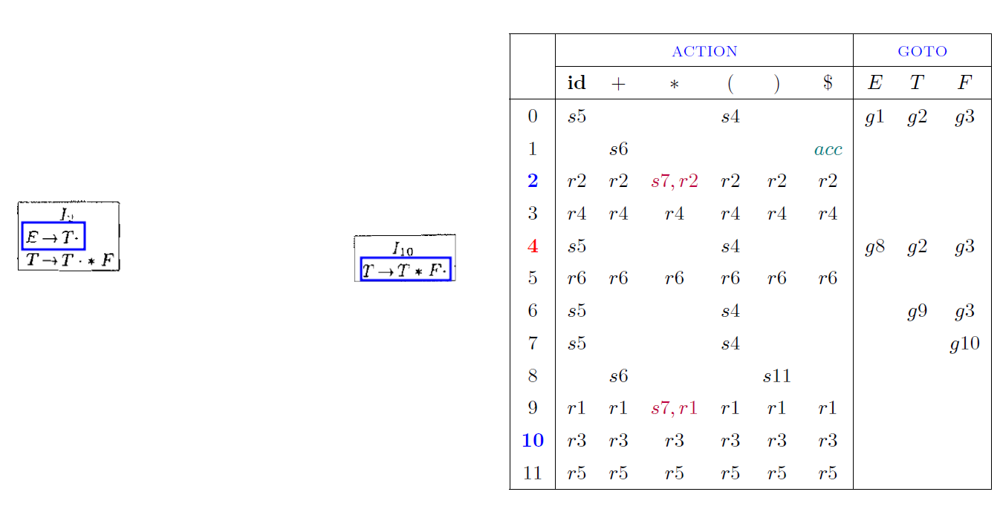

> $(3) [k:A \rightarrow \alpha·] \in I_i \wedge A \neq S' \Rightarrow \forall t \in T \cup {\$}. ACTION[i, t] = rk$，假设产生式编号为k，并且不是S'开头的

> $(4) [S' \rightarrow S·] \in I_i \Rightarrow ACTION[i, \$] \leftarrow acc$
> 接受不等于自动机中的接受状态，判断输入是否可以被接受。

## 3.4. LR(0)分析表构造规则
$$
\begin{array}{l}
   (1) & GOTO(I_i, a) = I_j \wedge a \in T \Rightarrow ACTION[i, a] \leftarrow sj \\
   (2) & GOTO(I_i, A) = I_j \wedge A \in N \Rightarrow ACTION[i, A] \leftarrow gj \\
   (3) & [k:A \rightarrow \alpha·] \in I_i \wedge A \neq S' \Rightarrow \forall t \in T \cup {\$}. ACTION[i, t] = rk \\
   (4) & [S' \rightarrow S·] \in I_i \Rightarrow ACTION[i, \$] \leftarrow acc \\
\end{array}
$$

## 3.5. Definition (LR(0) 文法)
1. 如果文法G的**LR(0)分析表**是**无冲突**的, 则G是LR(0) 文法。

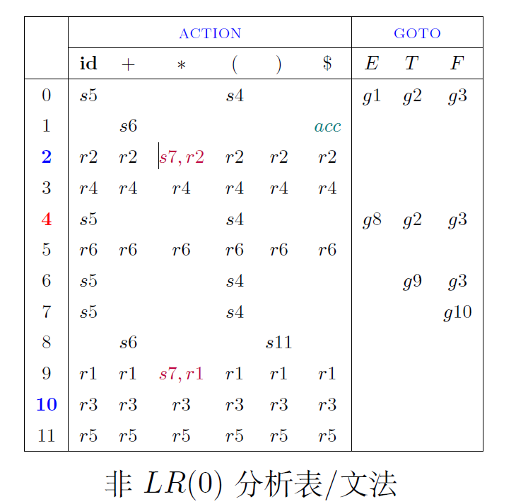

2. LR(0)分析表每一行(状态)**所选用的归约产生式是相同的**

3. **归约**时不需要向前看, 这就是**0**的含义

## 3.6. LR(0) 语法分析器
1. L:**从左向右**(Left-to-right) 扫描输入
2. R:构建**反向**(Reverse)**最右推导**
3. 0:**归约**时无需向前看
4. LR(0) 自动机与栈之间的互动关系
   1. 向前走 $\Leftrightarrow$ 移入
   2. 回溯 $\Leftrightarrow$ 归约
5. **自动机才是本质, 栈是实现方式**，用栈记住"来时的路", 以便回溯

# 4. SLR(1)分析表
> 1. 规约:$(3) [k:A \rightarrow \alpha·] \in I_i \wedge A \neq S' \Rightarrow \forall t \in Follow(A) \cup {\$}. ACTION[i, t] = rk$，要规约就是我们发现了完整的右部($A \rightarrow \alpha$，并且当前符号为$t$)，如果t不在Follow(A)中，那么不可能有一个句型包含t。
> 2. 处理的时候还是要看一下当前的符号来判断是否需要规约，根据当前的分析，我们可以发现下图中的被圈起来的s7是不必要的。

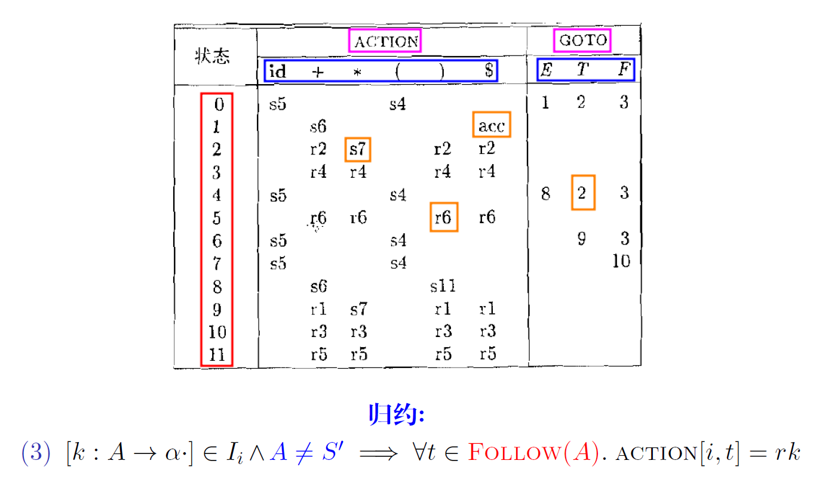

## 4.1. Definition (SLR(1)文法)
1. 如果文法G 的SLR(1) 分析表是无冲突的, 则G是SLR(1) 文法。

2. **无冲突**: action 表中每个单元格最多只有一种动作
3. **两类可能的冲突**: "移入/归约" 冲突、"归约/归约" 冲突

## 4.2. 非SLR(1)文法举例
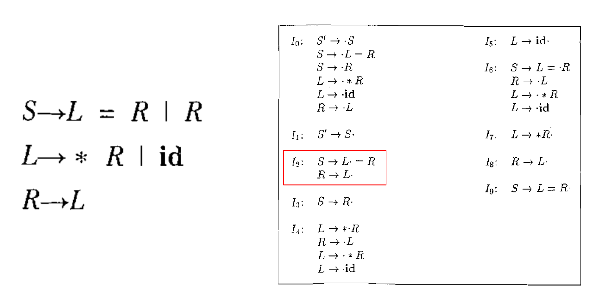

$$
\begin{array}{l}
   [S \rightarrow L·=R] \in I_2 \Rightarrow ACTION(I_2, =) \leftarrow s6 \\
   \\
   = \in Follow(R) \Rightarrow ACTION(I_2, =) \leftarrow L_5
\end{array}
$$

1. 即使考虑$= \in Follow(A)$, 对该文法来说仍然不够，这个仅仅意味有一个句型满足推导出原式子，但不是所有句型都满足原式子。
2. 该文法没有以`R=···`开头的最右句型

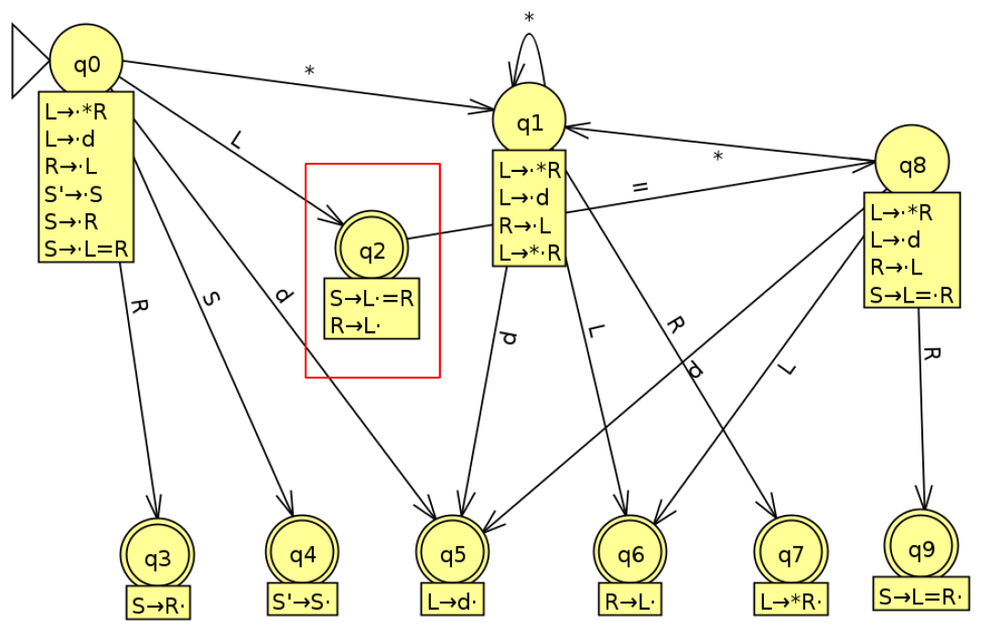

> 符号是不一定一致的，仅供参考。

1. 希望LR语法分析器的每个状态能**尽可能精确**地指明**哪些输入符号可以跟在句柄$A \rightarrow \alpha$的后面**
2. 在LR(0) 自动机中, 某个项集$I_j$中包含$[A \rightarrow α·]$，则在之前的某个项集$I_i$中包含$[B \rightarrow \beta · A\gamma]$，只有这样子才是可以的。
3. 解决方案：这表明只有$a \in First(\gamma)$时, 才可以进行$A \rightarrow \alpha$归约，$t \in Follow(A)$，并且是包含$t \in First(\gamma)$，后者条件更强。
4. 但是, 对$I_i$求闭包时, 仅得到$[A \rightarrow ·\alpha]$, 丢失了$First(\gamma)$信息，这个就是LR(0)的问题，接下来的目标就是保留下$\gamma$的信息。

# 5. Definition (LR(1) 项(Item))
1. $[A \rightarrow \alpha·\beta, a] (a \in T \cup {\$})$，此处, a是向前看符号, 数量为1，使用a来记住$\gamma$
2. 思想: $\alpha$在栈顶, 且输入中开头的是可以从$\beta\alpha$推导出的符号串

## 5.1. LR(1)句柄识别自动机
> 计算闭包：$[A \rightarrow \alpha · B \beta, a] \in I (a \in T \cup \{\$\})$

> 处理GOTO：$\forall b \in First(\beta a).[B \rightarrow ·\gamma, b] \in I$

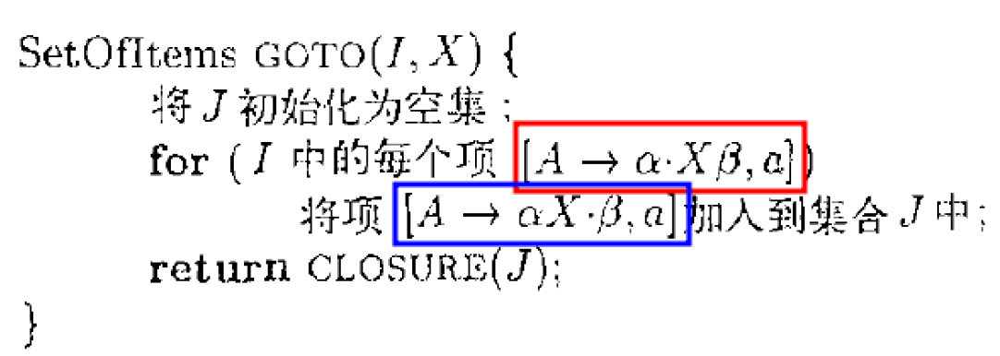

> 处理项：$J = GOTO(I, X) = CLOSURE(\{[A \rightarrow \alpha X ·\beta]|[A \rightarrow \alpha · X \beta] \in I\}) (X \in N \cup T)$

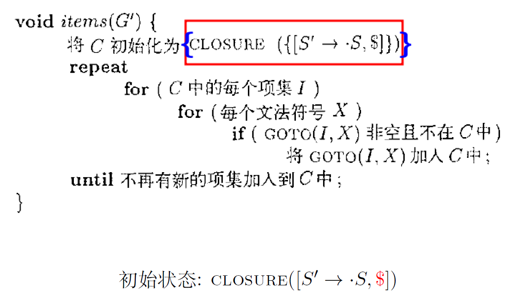

## 5.2. LR(1)自动机的构造过程

1. 构造First和Follow不要出错
2. 注意计算First($\beta a$)

## 5.3. LR(1) 自动机构建LR(1) 分析表
$$
\begin{array}{l}
   (1) & GOTO(I_i, a) = I_j \wedge a \in T \Rightarrow ACTION[i, a] \leftarrow sj \\
   (2) & GOTO(I_i, A) = I_j \wedge A \in N \Rightarrow ACTION[i, A] \leftarrow gj \\
   (3) & [k:A \rightarrow \alpha·, a] \in I_i \wedge A \neq S' \Rightarrow ACTION[i, a] = rk \\
   (4) & [S' \rightarrow S·, \$] \in I_i \Rightarrow ACTION[i, \$] \leftarrow acc \\
\end{array}
$$

## 5.4. Definition (LR(1)文法)
1. 如果文法G的LR(1)分析表是**无冲突**的, 则G是LR(1)文法。

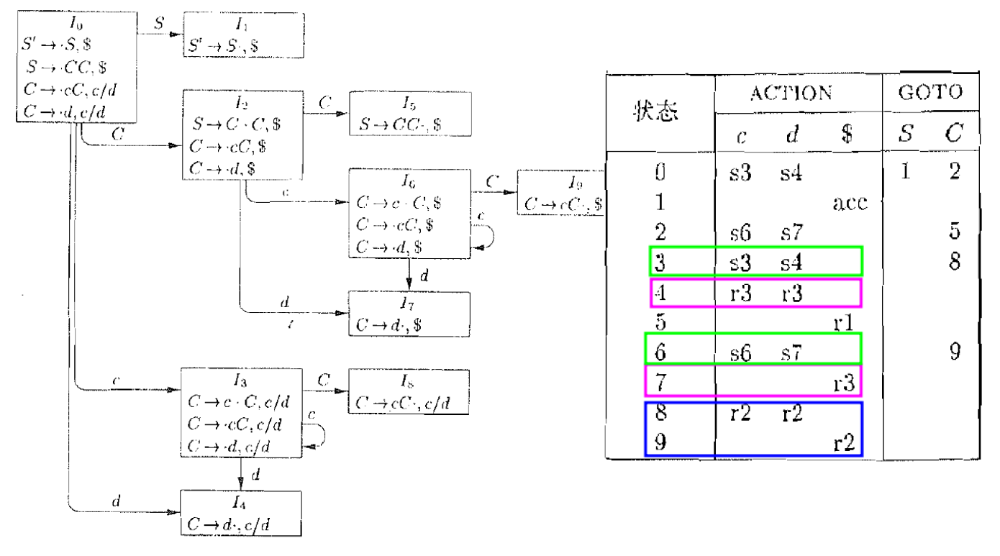

2. LR(1) 通过**不同的向前看符号**, 区分了状态对(3, 6), (4, 7) 与(8, 9)
3. **状态数可能会变多**：将LR(0)中的一个项分裂成为两个项(根据后一个字符)

# 6. LR(0)、SLR(1)、LR(1)的归约条件对比
$$
\begin{array}{l}
   LR(0) & [k:A \rightarrow \alpha·] \in I_i \wedge A \neq S' \Rightarrow \forall t \in T \cup \{\$\}. ACTION[i, t] = rk \\
   SLR(1) & [k:A \rightarrow \alpha·] \in I_i \wedge A \neq S' \Rightarrow \forall t \in Follow(A). ACTION[i, t] = rk \\
   LR(1) & [k:A \rightarrow \alpha·, a] \in I_i \wedge A \neq S' \Rightarrow ACTION[i, a] = rk \\
\end{array}
$$

# 7. LALR(1)文法
> LR(1) 虽然强大, 但是生成的LR(1)分析表可能过大, 状态过多

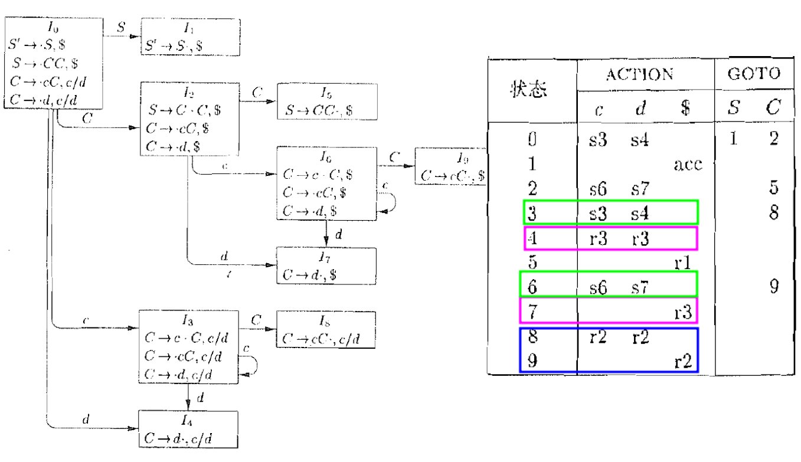

> LALR(1):Look Ahead合并具有相同核心LR(0)项的状态(忽略不同的向前看符号)

## 7.1. 自动机合并问题

1. Q：合并$I_4$与$I_7$为$I_{47}$($\{[C \rightarrow d·, c/d/\$]\}$), 会怎样?会不会出现原来自动机可以识别的但是现在不可以识别，或者原来自动机不可以识别但是现在可以识别。

### 7.1.1. 定理
> 如果合并后的语法分析器**无冲突**, 则它的行为与原分析器一致。

1. **接受**原分析器所接受的句子, 且状态转移相同
2. **拒绝**原分析器所拒绝的句子, 但可能多一些不必要的**归约**动作(“实际上, 这个错误会在移入任何新的输入符号之前就被发现”)

### 7.1.2. 继续执行合并

> 继续合并($I_8$, $I_9$) 以及($I_3$, $I_6$)

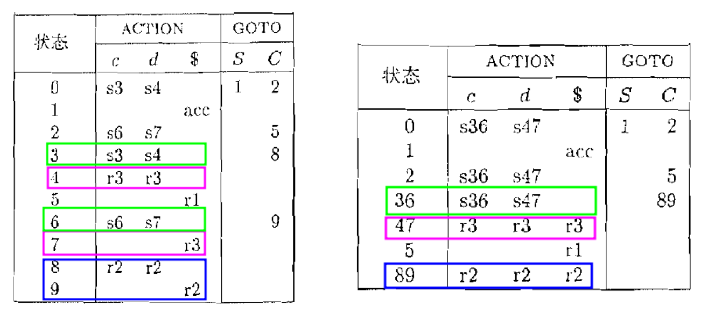

### 7.1.3. GOTO 函数怎么办?
可以合并的状态的GOTO目标(状态)一定也是可以合并的

### 7.1.4. 对于LR(1)文法, 合并得到的LALR(1)分析表是否会引入冲突?
1. Theorem:LALR(1)分析表不会引入**移入/归约**冲突。
2. 反证法:
   1. 假设合并后出现$[A \rightarrow \alpha·, a]$与$[B \rightarrow ·\alpha \gamma, b]$，
   2. 则在LR(1)自动机中,存在某状态同时包含$[A \rightarrow \alpha·, a]$ 与$[B \rightarrow ·\alpha \gamma, c]$(需要有一个相同的第一个分量)
3. Q:对于LR(1)文法, 合并得到的LALR(1)分析表是否会引入冲突?
4. Theorem：LALR(1)分析表可能会引入**归约/归约**冲突

$$
\begin{array}{l}
   L(G) = \{ acd, ace, bcd, bce\} \\
   S' \rightarrow S \\S
   S \rightarrow a A d | b B d | a B e | b A e \\
   A \rightarrow c \\
   B \rightarrow c \\
   \{[A \rightarrow c·, d], [B \rightarrow c·, e]\} \\
   \{[A \rightarrow c·, e], [B \rightarrow c·, d]\} \\
   \{[A \rightarrow c·, d/e], [B \rightarrow c·, e/e]\} \\
\end{array}
$$

1. LALR(1) 语法分析器的优点
   1. 状态数量与SLR(1)语法分析器的状态数量相同
   2. 对于LR(1) 文法, 不会产生移入/归约冲突
2. 好消息: 善用LR 语法分析器, 处理二义性文法
3. 从CFG来看:$LR(1) \subset LR(2)$
4. 从语言角度来看:$LR(1) = LR(2) = ... = LR(k)$

# 8. 表达式文法
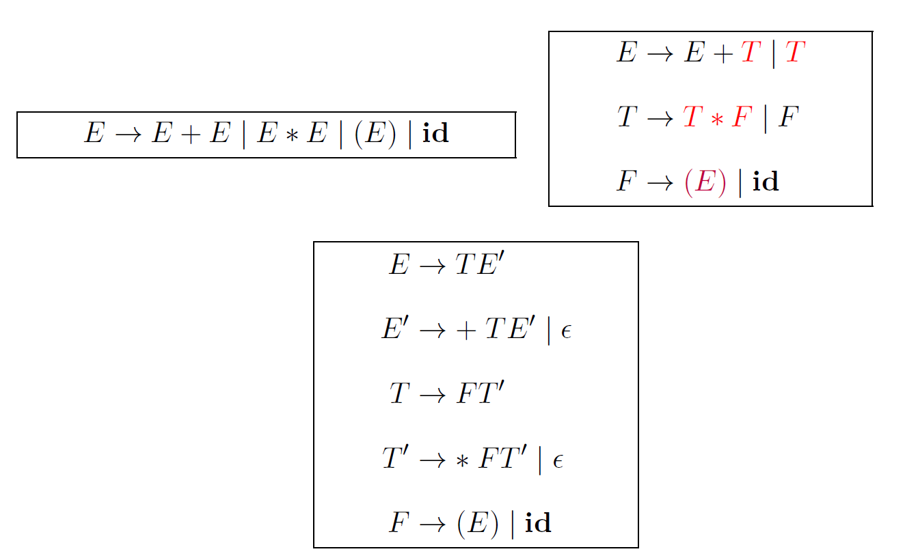

## 8.1. 使用SLR(1) 语法分析方法
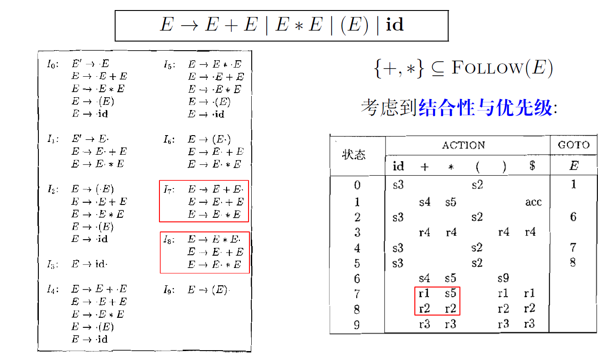

> 我们利用结合性和优先级来避开二义性，比如$E+E·*E$这时，我们需要将乘法移入。

## 8.2. 条件语句文法

## 8.3. 条件语句文法: 使用SLR(1) 语法分析方法
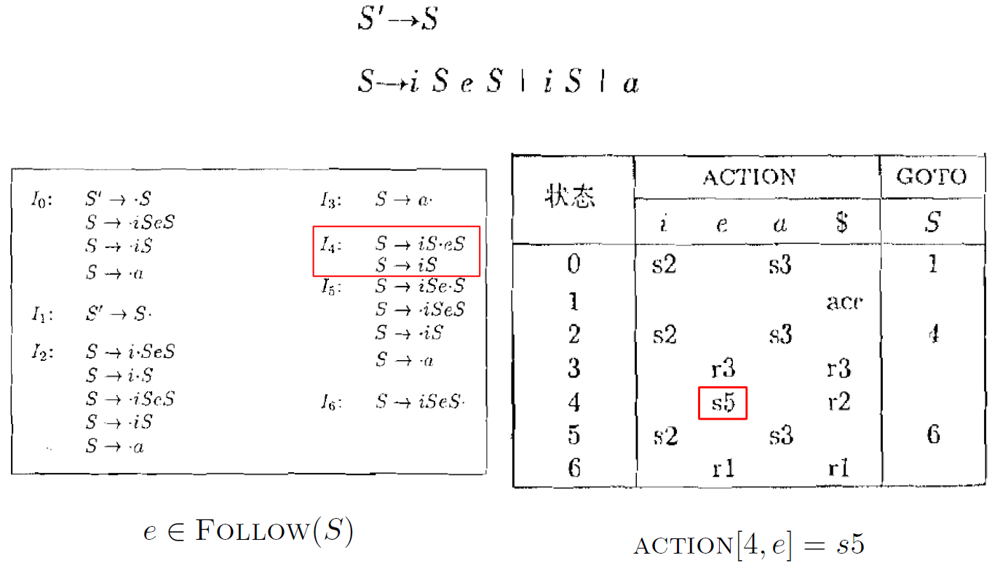