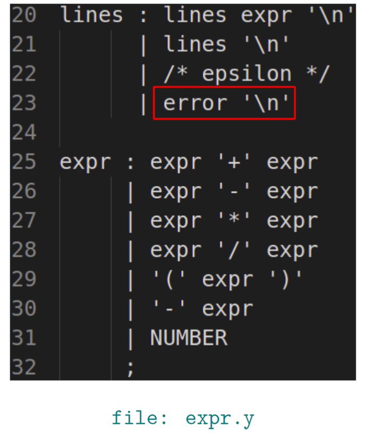
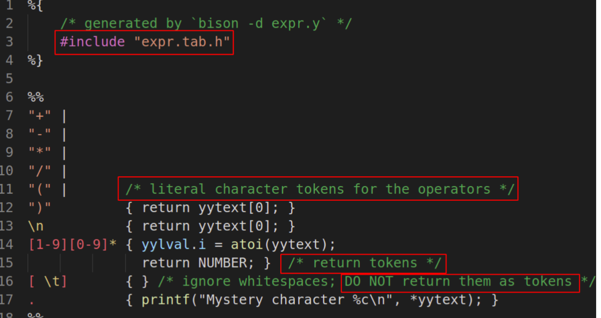
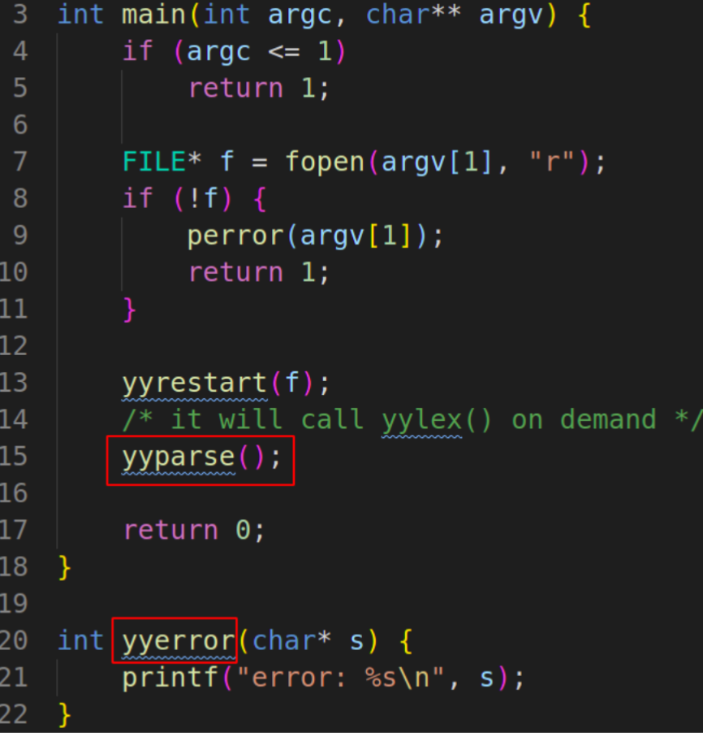

# 1. Bison:语法分析器的生成器

1. 多行表达式文法:每行都以换行符结束;允许有空行



2. 产生式+动作:LALR(1)使用该产生式归约时执行动作


3. 类型:为每个文法符号的属性值指定合适的类型


## 1.1. 使用
```
bison -d -v expr.y
-d: (definition)产生expr.tab.h与expr.tab.c
-v: “warning: 20shift/reduceconflicts”(expr.output)
```

## 1.2. 使用结合性/优先级解决移入/归约冲突
1. 原则上,可以为每个终结符以及每条产生式赋予适当的结合性与优先级


2. 产生式的结合性与优先级被设定为它的最右终结符号的结合性与优先级


3. 冲突: “移入a”vs.“按A→α归约”
4. 产生式的优先级高于a的优先级或者优先级相同但产生式是左结合的,则选择归约




```
bison -d -v expr.y
flex expr.l
gcc main.c lex.yy.c expr.tab.c -lfl -o expr
./expr expr.cmm
```

## 1.3. 错误恢复
1. 使用错误产生式(Error Production)进行错误恢复
2. A→errorαα∈N∗
3. 调整状态：不断出栈,直到碰到某状态包含形如A→·errorα的项;移入error
4. 丢弃输入：不断调用词法分析器,寻找终结符号串α并移入
5. 假装成功：此时栈顶为errorα,归约为A;恢复正常
