Semantics1-概述
---

# 1. 属性文法(Attribute Grammar)
1. 一对概念
2. 两类属性定义
3. 三种实现方式
4. 四大应用

## 1.1. 表达式求值
1. 类型系统(语义分析)
2. 抽象语法树
3. 后缀表达式(中间代码生成)

## 1.2. 语法指导定义(Syntax-Directed Definition; SDD)
1. SDD是一个上下文无关文法和属性及规则的结合。
2. 每个文法符号都可以关联多个属性

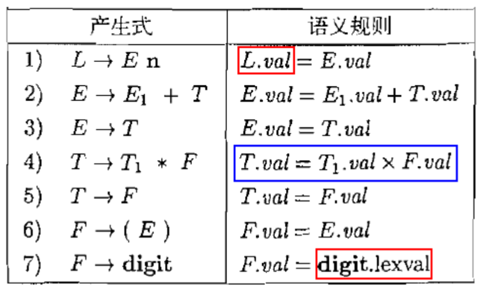

3. 每个产生式都可以关联一组规则
4. SDD唯一确定了语法分析树上每个非终结符节点的属性值
5. SDD没有规定以什么方式、什么顺序计算这些属性值

## 1.3. 注释(annotated)语法分析树:
1. 显示了各个属性值的语法分析树3∗5+4

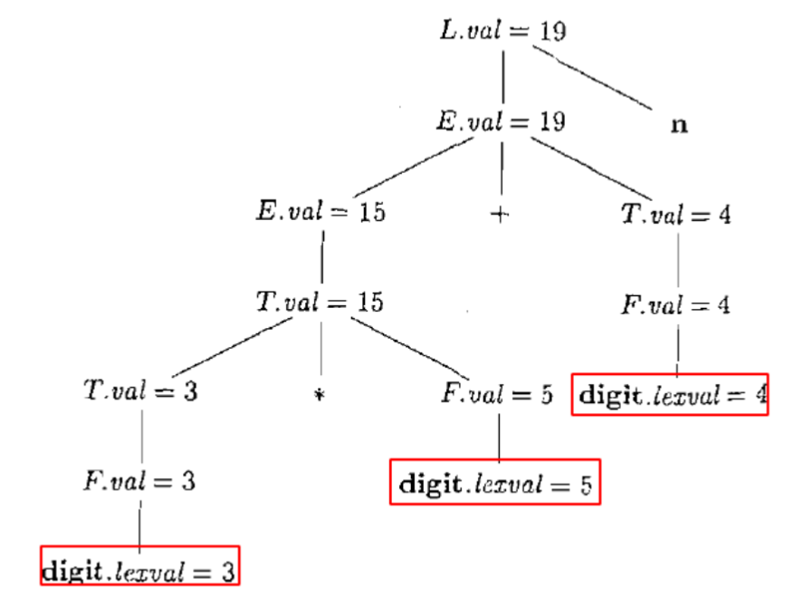

## 1.4. Definition (综合属性(Synthesized Attribute))
1. 节点N上的综合属性只能通过**N的子节点或N本身**的属性来定义。

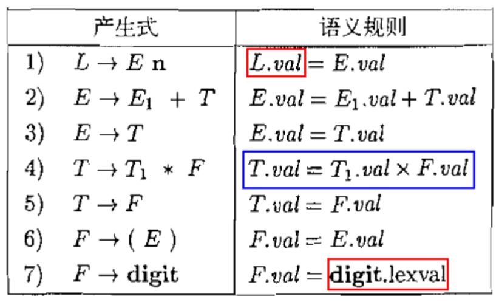

## 1.5. Definition (S属性定义(S-Attributed Definition))
1. 如果一个SDD的每个属性都是综合属性,则它是S属性定义。

## 1.6. 依赖图用于确定一棵给定的语法分析树中各个属性实例之间的依赖关系

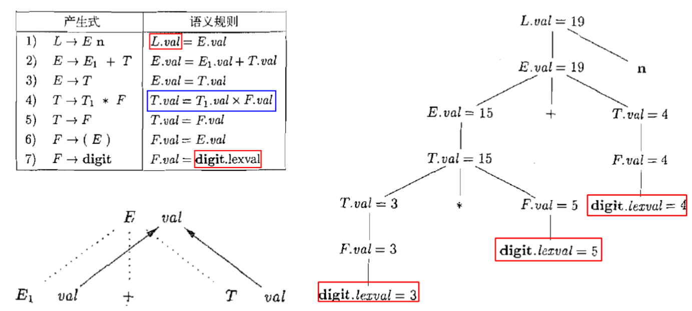

- S属性定义的依赖图描述了属性实例之间自底向上的信息流。
- 因此,此类属性值的计算可以自然地在自底向上的语法分析过程中实现
- 当LR语法分析器进行归约时,计算相应节点的综合属性值
- 此类属性值的计算也可以在自顶向下的语法分析过程中实现
- 在LL语法分析器中,递归下降函数A返回时,计算相应节点A的综合属性值

## 1.7. T'有一个综合属性syn与一个继承属性inh
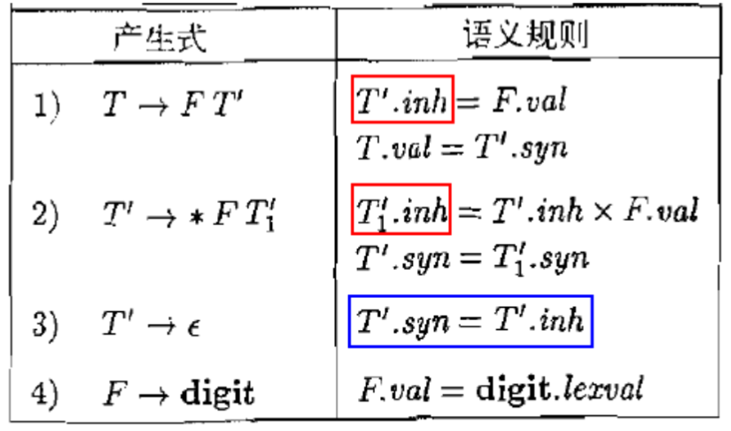

## 1.8. Definition (继承属性(Inherited Attribute))
1. 节点N上的继承属性只能通过N的父节点、N本身和N的兄弟节点上的属性来定义。

## 1.9. 继承属性T'.inh用于从左向右传递中间计算结果
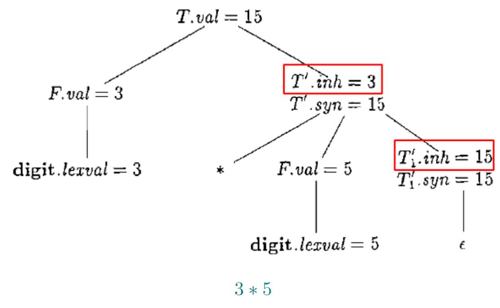

1. 在右递归文法下实现了左结合

## 1.10. 依赖图用于确定一棵给定的语法分析树中各个属性实例之间的依赖关系
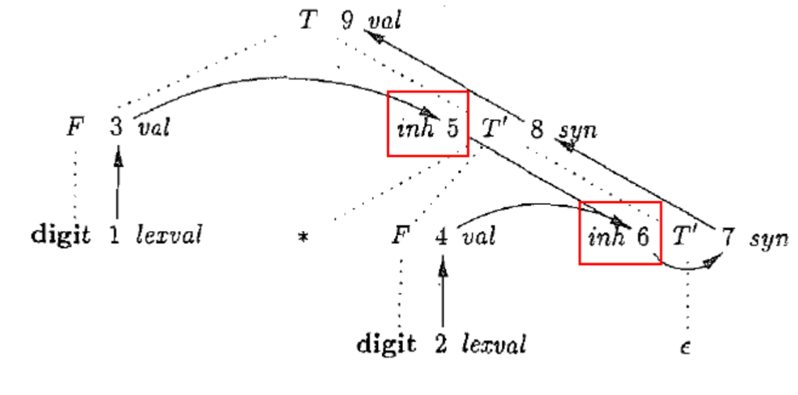

1. 信息流向:先从左向右、从上到下传递信息,再从下到上传递信息

## 1.11. Definition (L属性定义(L-Attributed Definition))
1. 如果一个SDD的每个属性
   1. 要么是综合属性
   2. 要么是继承属性,但是它的规则满足如下限制:对于产生式$A \rightarrow X_1X_2...X_n$及其对应规则定义的继承属性$X_i.a$,则这个规则只能使用
      1. 和产生式头A关联的继承属性;
      2. 位于Xi左边的文法符号实例$X_1、X_2、...、X_{i−1}$相关的继承属性或综合属性;
      3. 和这个$X_i$的实例本身相关的继承属性或综合属性,但是在由这个$X_i$的全部属性组成的依赖图中不存在环。
2. 则它是L属性定义。

## 1.12. 非L属性定义
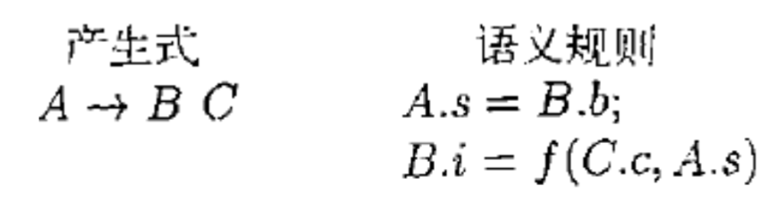

- 作为继承属性,B.i依赖了右边的C.c属性与头部A.s综合属性

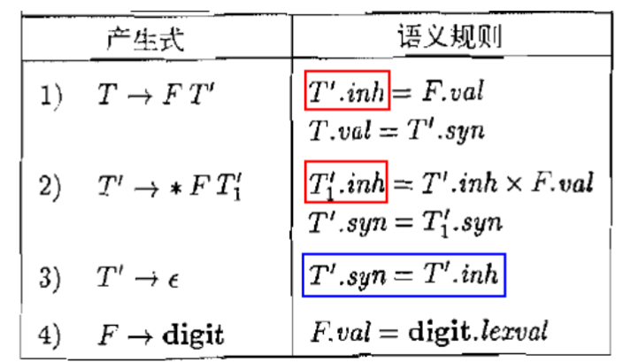

- L属性文法:依赖图是无环的

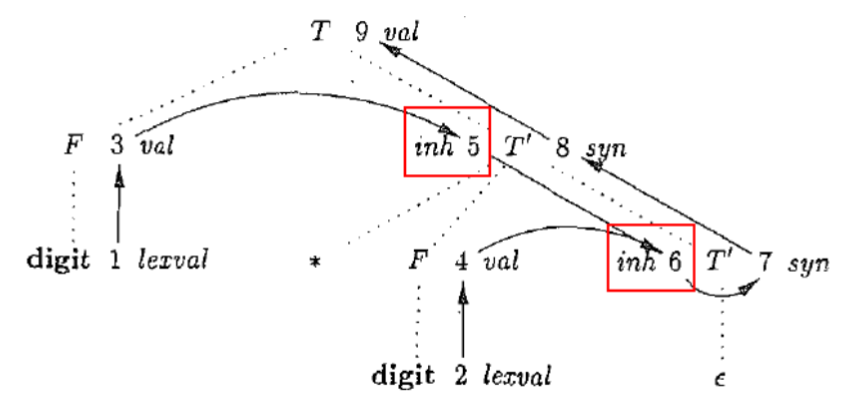

- (左递归)S属性文法$\Rightarrow$(右递归)L属性文法

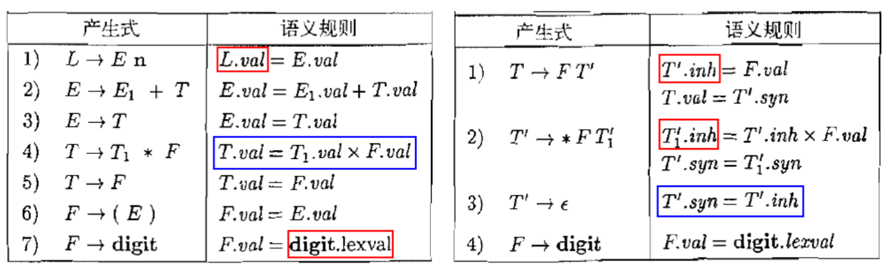

- 仍保持了操作的左结合性
- (左递归)S属性文法

$$
\begin{cases}
  A \rightarrow A_1Y & A.a = g(A_1.a, Y.y) \\
  A \rightarrow X & A.a = f(X.x) \\
\end{cases}
$$

- (右递归)L属性文法

$$
\begin{cases}
  A \rightarrow XR & R.i = f(X.x); & A.a = R.s \\
  R \rightarrow YR_1 & R_1.i = g(R.i, Y.y); & R.s = R_1.s \\
  R \rightarrow \epsilon & R.s = R.i \\
\end{cases}
$$

## 1.13. 类型声明文法举例
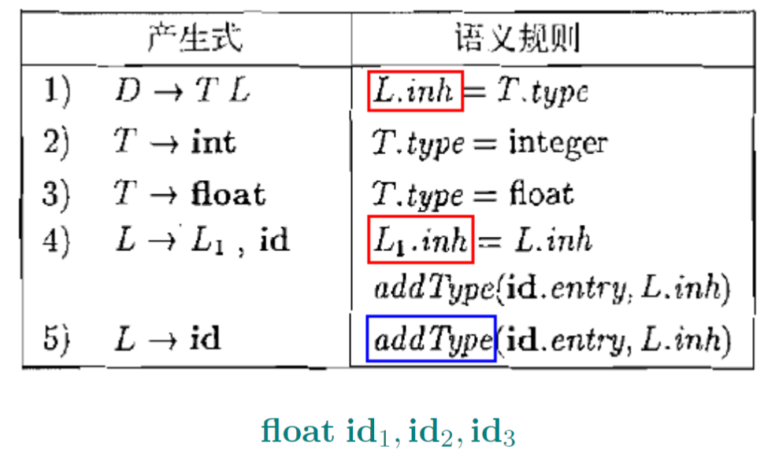

- L.inh将声明的类型沿着标识符列表向下传递,并被加入到相应的符号表条目中

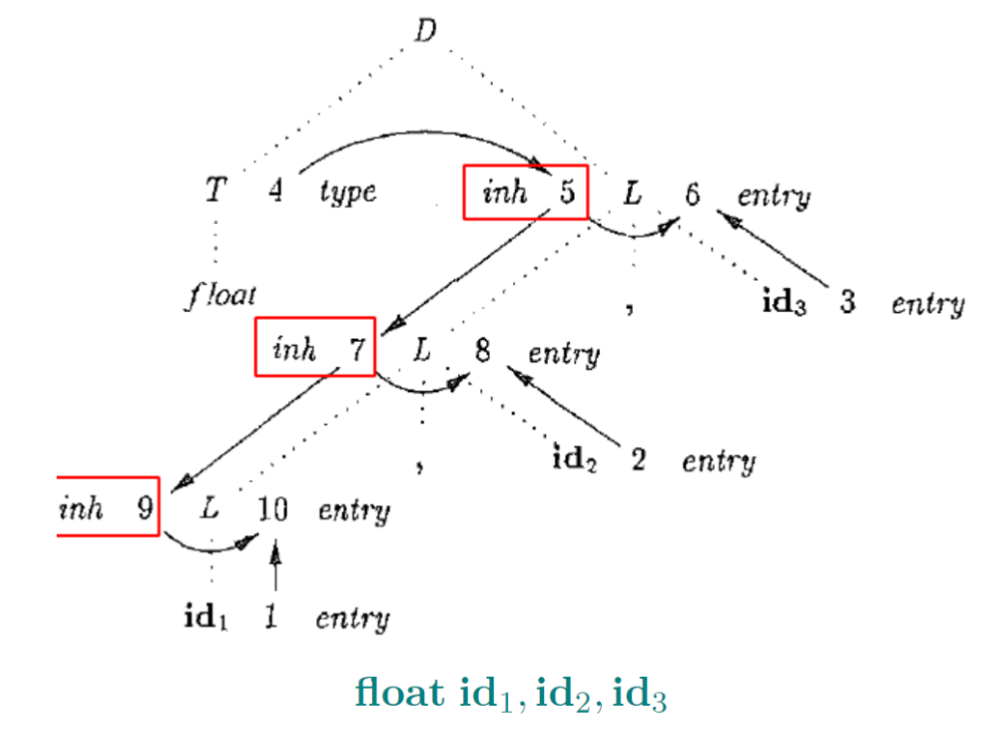
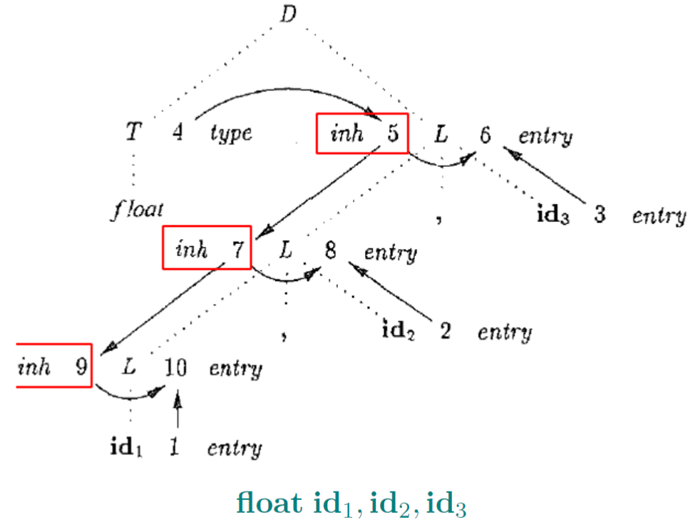

## 1.14. 数组类型文法举例
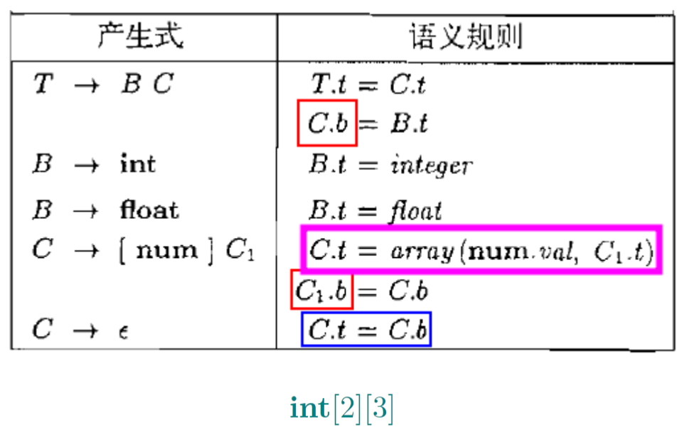

1. 语义规则用以生成类型表达式array(2, array(3, integer))
2. []是右结合的

## 1.15. 继承属性C.b将一个基本类型沿着树向下传播
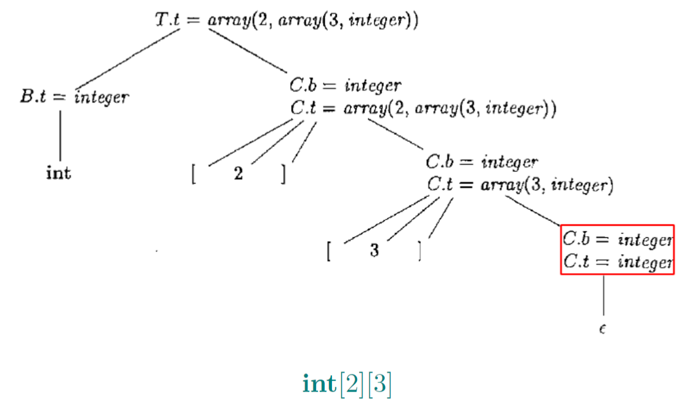

1. 综合属性C.t收集最终得到的类型表达式

## 1.16. 表达式的抽象语法树S属性定义
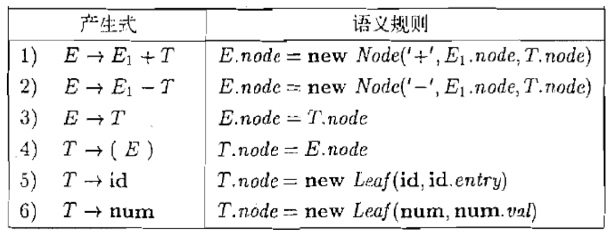

## 1.17. 抽象语法树:丢弃非本质的东西,仅保留重要结构信息
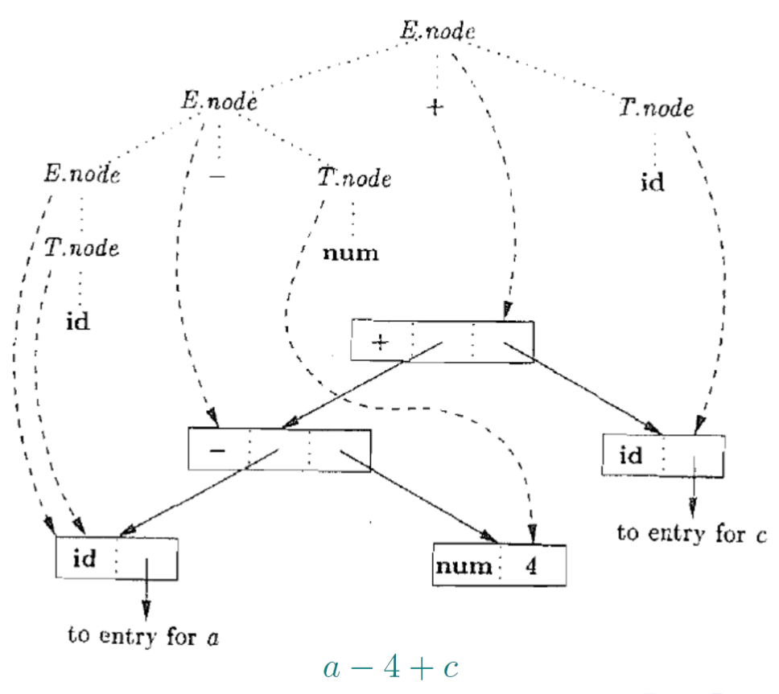

## 1.18. 表达式的抽象语法树L属性定义
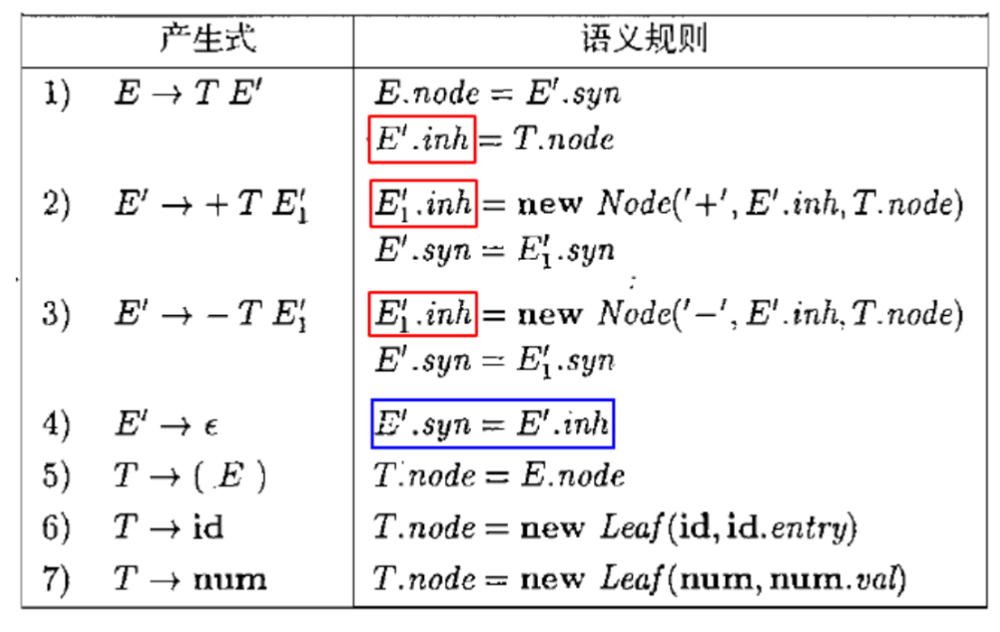
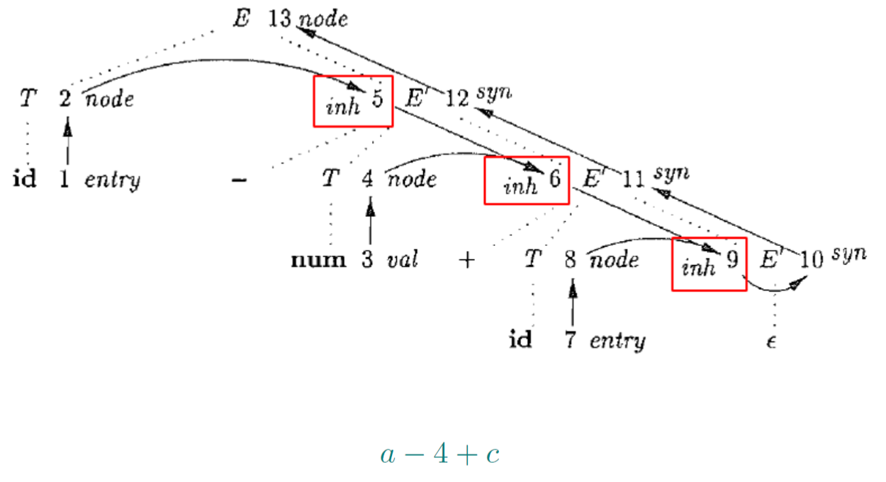

## 1.19. Definition (后缀表示(Postfix Notation))
1. 如果E是一个变量或常量,则E的后缀表示是E本身;
2. 如果E是形如E1opE2的表达式,则E的后缀表示是E′1E′2op,这里E′1和E′2分别是E1与E2的后缀表达式;
3. 如果E是形如(E1)的表达式,则E的后缀表示是E1的后缀表示。

$$
(9−5)+2 \Rightarrow 95−2+ \\
9−(5+2) \Rightarrow 952+− \\
952+−3∗ \Rightarrow (9−(5+2))∗3 \\ 
$$

## 1.20. 后缀表达式S属性文法
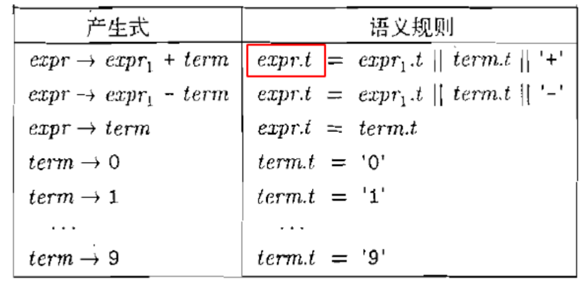

> “||”表示字符串的连接

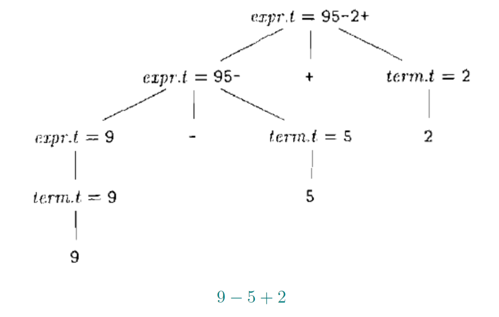
