Sematics2-SDT
---

# 1. Definition (语法制导的翻译方案(Syntax-Directed Translation Scheme;SDT))
> SDT是在其产生式体中嵌入语义动作的上下文无关文法。

1. 语义动作可以嵌入在产生式体中的任何地方

> 上图中表示满足生成式后执行操作

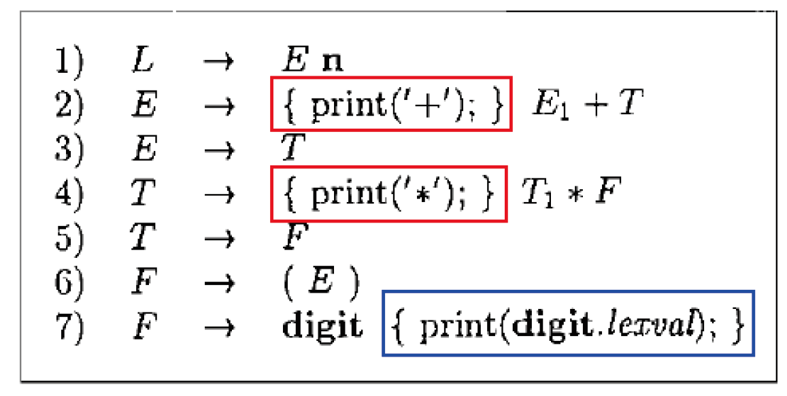

1. 上图中第2和4条表示先打印再匹配
2. 前缀表达式SDT
   1. 语义动作嵌入的位置决定了**何时**执行该动作
   2. 基本思想: 一个动作在它**左边的**所有文法符号都**处理**过之后立刻执行

## 1.1. 时机
1. Q:如何将SDD中的**语义规则**转换为带有**语义动作**的SDT

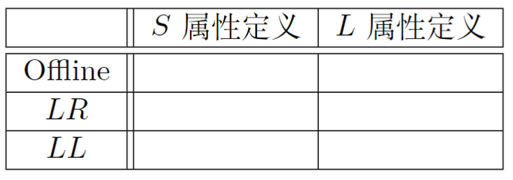

2. Q:如何以三种方式实现SDT?

### 1.1.1. Offline 方式: 已有语法分析树
1. 按照**从左到右**的**深度优先**顺序遍历语法分析树
2. **基本思想**: 一个动作在它**左边的**所有文法符号都**处理**过之后立刻执行

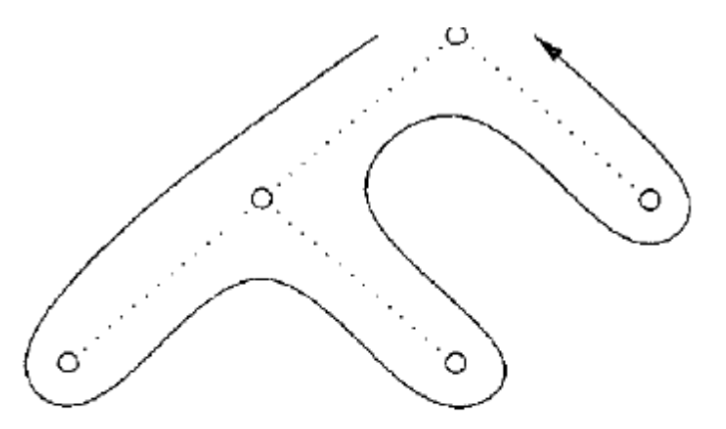

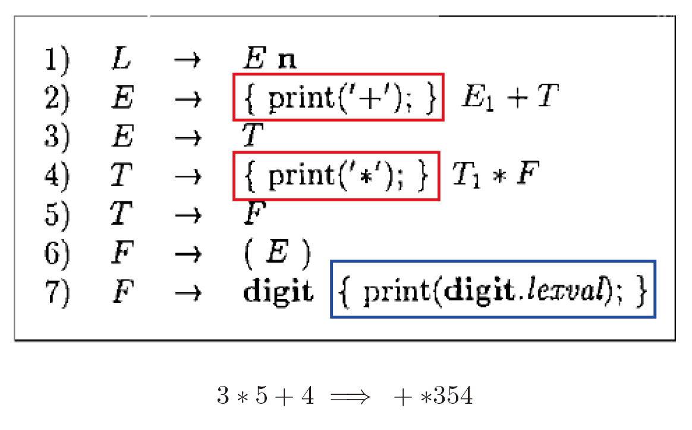

### 1.1.2. 嵌入语义动作虚拟节点的语法分析树
> 语义动作也可以作为一个节点

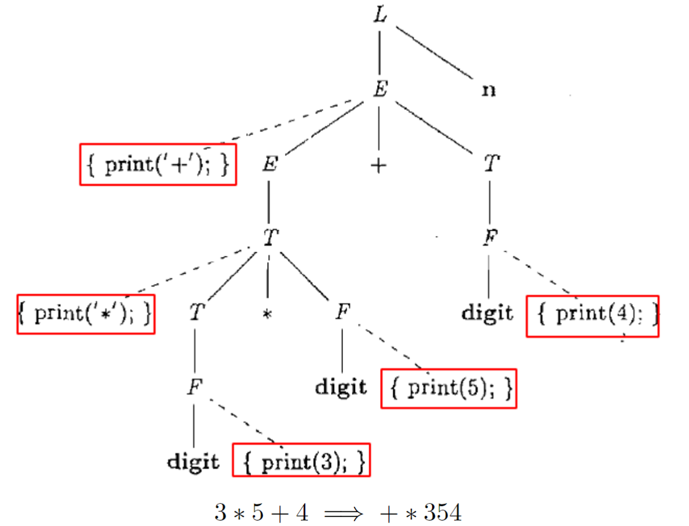
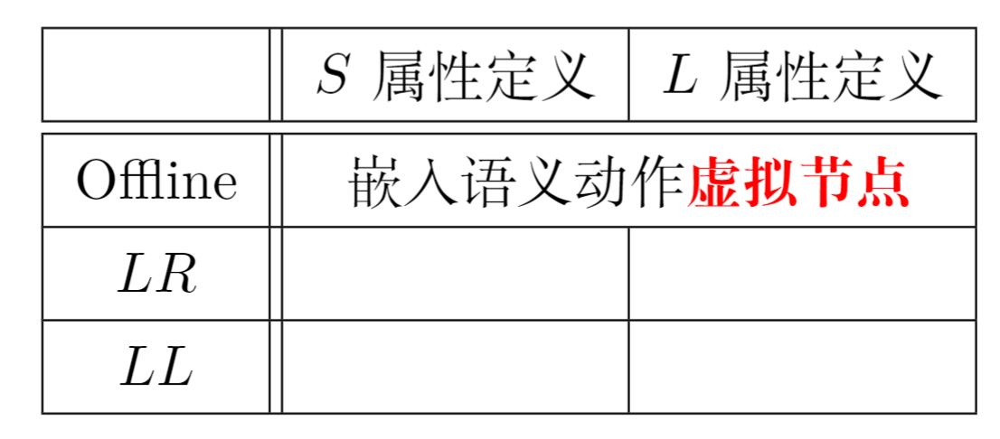

1. 基本思想:一个动作在它左边的所有文法符号都处理过之后立刻执行
2. Q:是否所有的SDT都可以在LL/LR语法分析过程中实现

### 1.1.3. 该SDT无法在LL(1)/LR(1)中实现
1. 前缀表达式SDT它需要在还不知道出现在输入中的运算符号是∗还是+时,就执行打印这些符号的操作

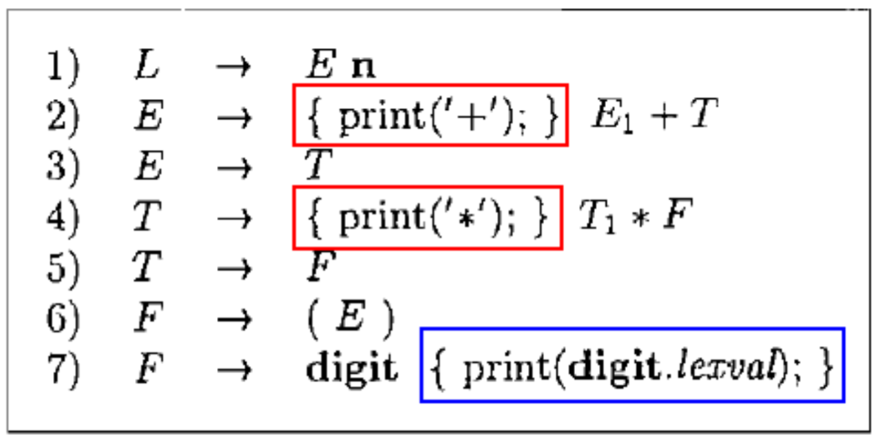

2. Q：:如何判断某SDT是否可以在LL/LR语法分析过程中实现?
3. 将每个内嵌的语义动作A替换为一个独有的非终结符M，添加新产生式M→ε，判断新产生的文法是否可用LL/LR进行分析

## 1.2. 前缀表达式SDT
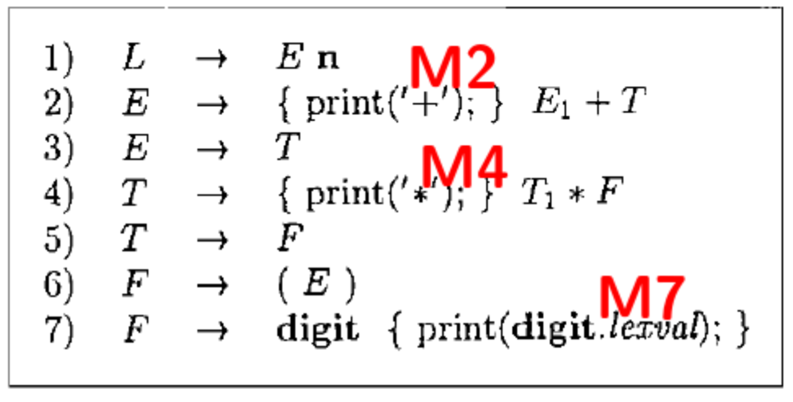

$$
\begin{array}{l}
   M2 \rightarrow \epsilon \\
   M4 \rightarrow \epsilon \\
   M7 \rightarrow \epsilon \\
\end{array}
$$

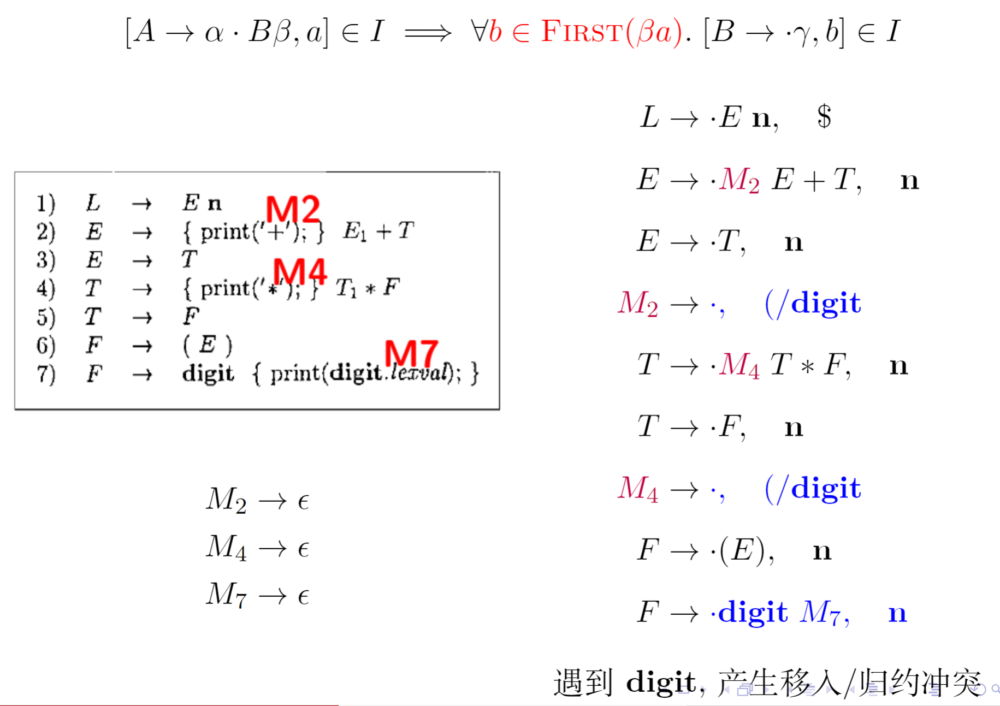

> $M2 \rightarrow ·,(/digit$是通过计算$First(E)$得到的

# 2. SDT

## 2.1. 后缀翻译方案
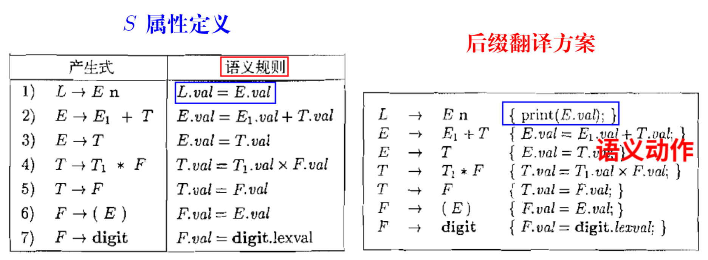

1. **后缀翻译方案**:所有动作都在产生式的最后在LR中,按某个产生式归约时,执行相应动作

1. **移入**时,携带终结符的属性
2. **归约**时,计算A的属性值并入栈

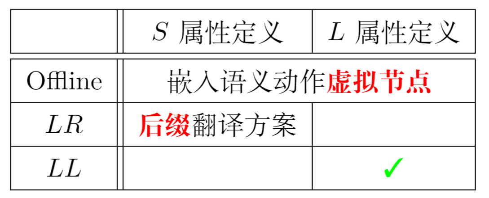

## 2.2. L属性定义与LL语法分析

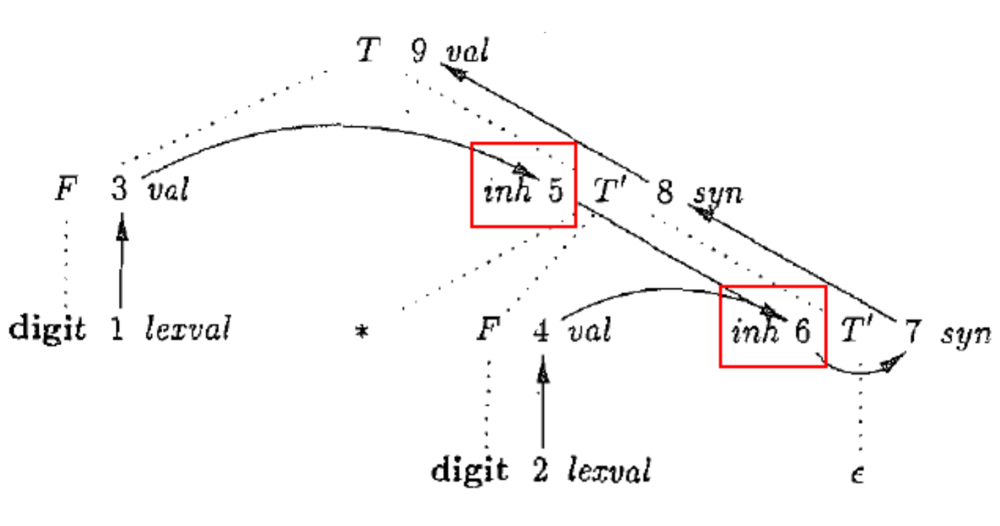

$$
A \rightarrow X_1···X_i···X_n
$$
1. 原则:从左到右处理各个Xi符号对每个Xi,先计算继承属性,后计算综合属性

## 2.3. 递归下降子过程$A \rightarrow X_1···X_i···X_n$
1. 在调用$X_i$子过程之前,计算$X_i$的继承属性
2. 以$X_i$的继承属性为参数调用$X_i$子过程
3. 在$X_i$子过程返回之前,计算$X_i$的综合属性
4. 在$X_i$子过程中返回$X_i$的综合属性

> $X.x$表示的是$X$的综合属性，以此类推

## 2.4. 继承属性R.i用于计算并传递中间结果
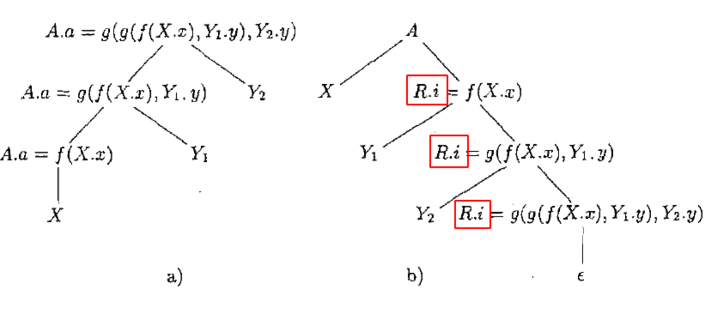

1. 先计算继承属性,再计算综合属性

> 原则:继承属性在处理文法符号之前,综合属性在处理文法符号之后

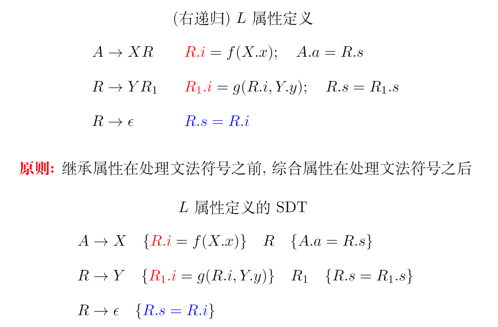

> 开始节点不可能有继承属性

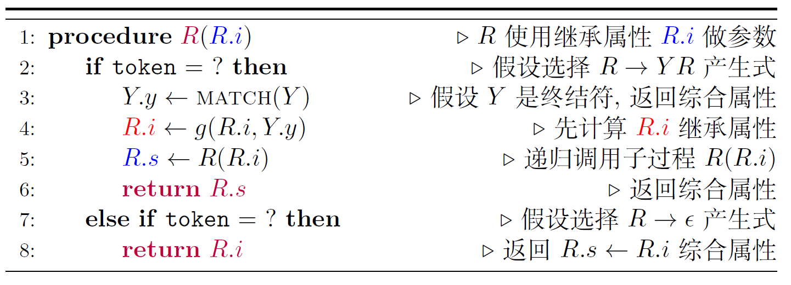

# 3. L属性定义转换为SDT

$$
A \rightarrow X_1···X_i···X_n
$$

1. 计算$X_i$继承属性的动作放在产生式体中$X_i$的**左边**
2. 计算产生式头部$A$综合属性的动作放在产生式体的**最右边**

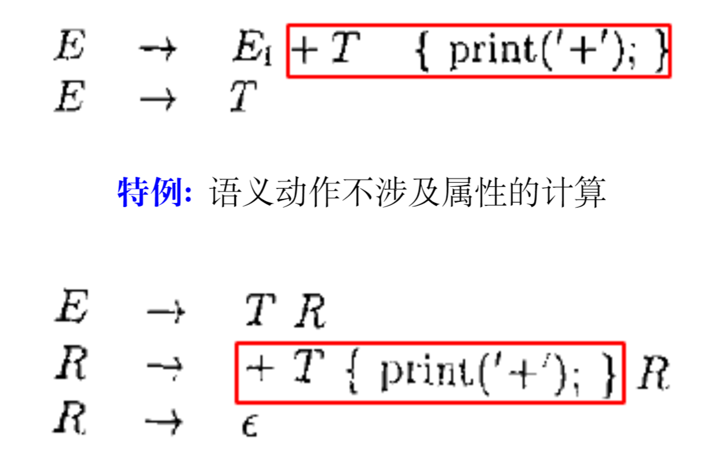

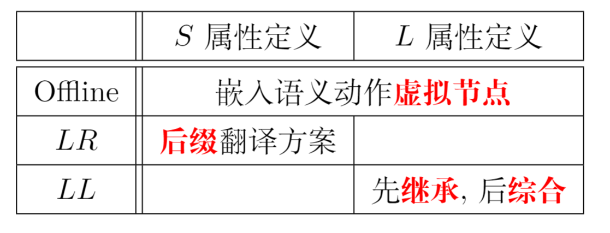

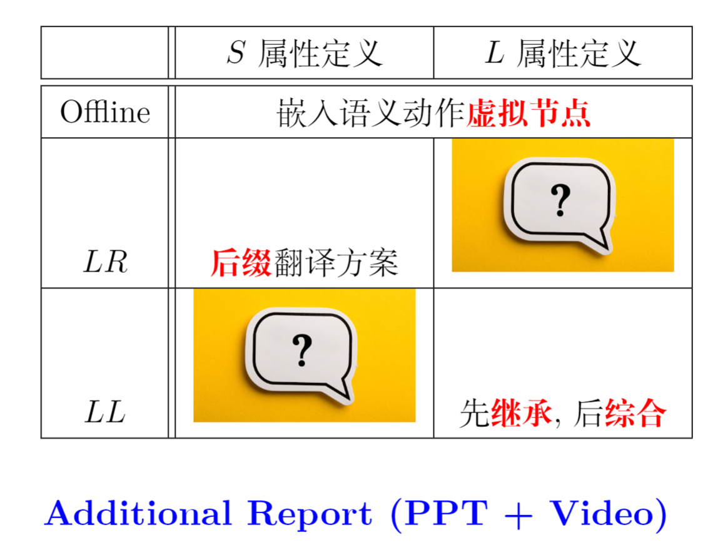
