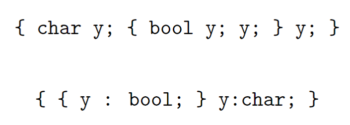
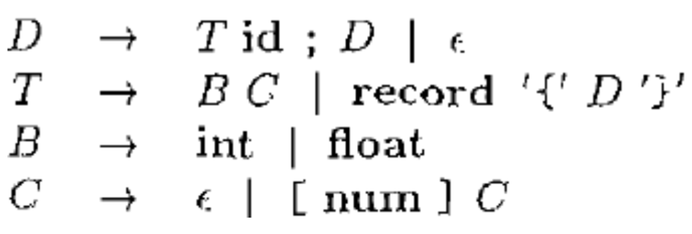

Sematics3-实验代码示例
---

# 1. while语句的翻译
1. 类型声明与使用(符号表)
2. 类型检查

## 1.1. While语句的SDD


1. 中间代码生成,要有大局观
2. 认清“你”在语法分析树中所处的位置

## 1.2. while语句的SDT


## 1.3. 用一个递归下降语法分析器实现while语句的翻译


# 2. Definition (符号表(Symbol Table))
> 符号表是用于保存各种信息的数据结构。

1. 标识符:词素、类型、大小、存储位置等


2. 通常使用HashTable

## 2.1. 为每个作用域建立单独的符号表
> 可以使用符号表栈实现树形的嵌套关系


> 翻译任务:忽略声明部分,为每个标识符标明类型


## 2.2. Definition (类型表达式(Type Expressions))
1. 基本类型是类型表达式;
   1. char, bool, int, float, double, void,. . .
2. 类名是类型表达式;
3. 如果t是类型表达式,则array(num, t)是类型表达式;
4. record(⟨id : t, . . .⟩)是类型表达式;
5. 如果s和t是类型表达式,则s×t是类型表达式;
6. 如果s和t是类型表达式,则s→t是类型表达式;
7. 类型表达式可以包含取值为类型表达式的变量。





## 2.3. 类型声明
1. 符号表中记录标识符的类型、宽度(width)、偏移地址(offset)


## 2.4. 需要为每个record生成单独的符号表


1. 全局变量t与w将B的类型与宽度信息递给产生式C→ε
2. float x


## 2.5. 数组类型的语法制导


> int[2][3]

1. 全局变量offset表示变量的相对地址
2. 全局变量top表示当前的符号表


3. float x; float y;


4. record类型表达式:record(top)
5. 全局变量top表示当前的符号表
6. 全局变量Env表示符号表栈
7. record { float x; float y; } p;


## 2.6. 类型检查的常见形式


## 2.7. 结构等价和名等价
1. Definition (结构等价(Structurally Equivalent))两种类型结构等价当且仅当以下任一条件为真:
   1. 它们是相同的基本类型;
   2. 它们是将相同的类型构造算子应用于结构等价的类型而构造得到;
   3. 一个类型是另一个类型表达式的名字。
2. Definition (名等价(Name Equivalent))两种类型名等价当且仅当以下任一条件为真:
   1. 它们是相同的基本类型;
   2. 它们是将相同的类型构造算子应用于结构等价的类型而构造得到。

## 2.8. 结构等价中的“结构”又是什么意思?
```
array(n, t)   array(m, t)
record(⟨a: int⟩)   record(⟨b: int⟩)
```

1. 取决于语言设计者的"大局观"

## 2.9. 类型综合:根据子表达式的类型确定表达式的类型


1. E1+E2


1. 重载函数的类型综合规则


## 2.10. 类型推导:根据某语言结构的使用方式确定表达式的类型
- null(x) :x是一个列表,它的元素类型未知


## 2.11. 类型转换


